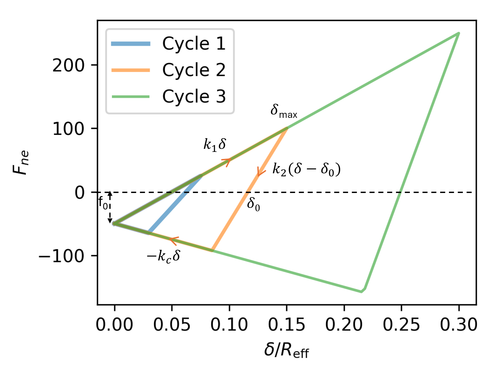
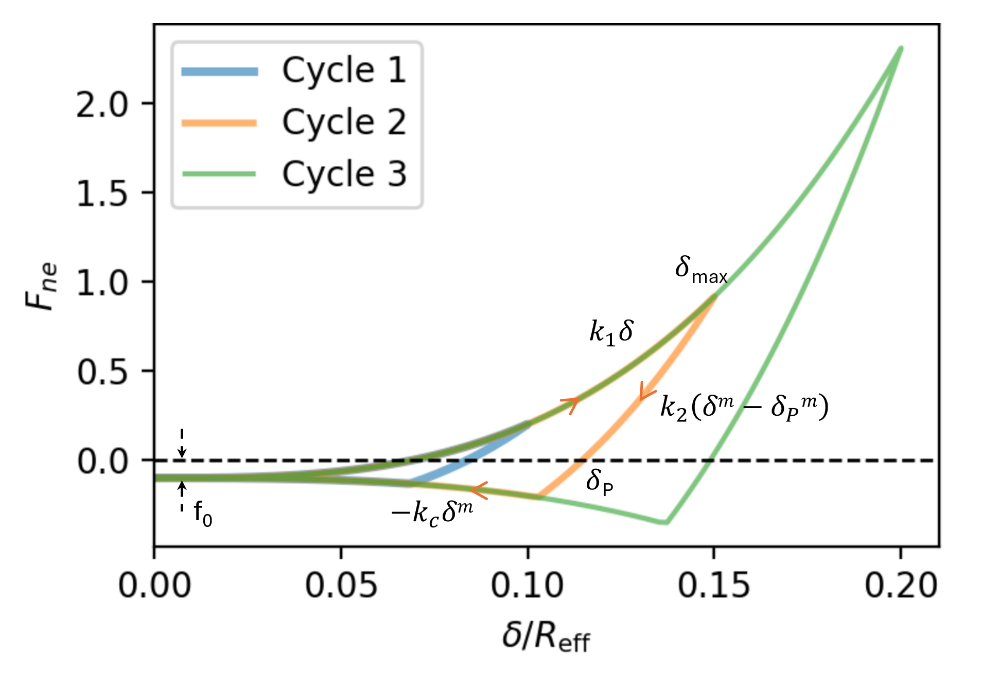

Models for normal contact in granular interactions
==================================================

.. _normal_models_preamble:

The normal force acts along the vector connecting the center of two particles,
i.e. normal to the plane of contact between particles.
In all cases, the normal force is modeled as a function of overlap :math:`\delta_{ij}`.
The following quantities are common to normal models:

* :math:`\delta_{ij} = R_i + R_j - \|\mathbf{r}_{ij}\|` is the particle overlap,
* :math:`R_i, R_j` are the particle radii,
* :math:`\mathbf{r}_{ij} = \mathbf{r}_i - \mathbf{r}_j` is the vector separating the two particle centers (note the i-j ordering so that the force is positive for repulsion), and
* :math:`\mathbf{n} = \frac{\mathbf{r}_{ij}}{\|\mathbf{r}_{ij}\|}` is the unit vector along the direction connecting the two particle centers.
* :math:`R_\text{eff} = \frac{R_iR_j}{R_i+R_j}` is the effective radius for particles *i* and *j*, or set to the radius of the particle in a wall-particle contact.

Unless otherwise specified, the radius of the contact region
is given by :math:`\sqrt{\delta R_\text{eff}}` for all models.
Notable exceptions are *jkr* and *epa_nonlinear*.

.. _hooke_normal_model:

`hooke` normal model
--------------------

*Parameters:* :math:`k_n`, :math:`\eta_{n0}` (or :math:`e`)

Example:

.. code-block:: LAMMPS

   pair_style granular
   pair_coeff * * hooke 1000.0 50.0 tangential linear_nohistory 1.0 0.4 damping mass_velocity

For the *hooke* model, the normal component of force acting
on particle *i* due to contact with particle *j* is given by:

.. math::

   \mathbf{F}_{ne, Hooke} = k_n \delta_{ij} \mathbf{n}

The units of the spring constant :math:`k_n` are
*force*\ /\ *distance*, or equivalently *mass*\ /*time*:sup:`2`.

.. _hertz_normal_model:

`hertz` normal model
--------------------

*Parameters:* :math:`k_n`, :math:`\eta_{n0}` (or :math:`e`)

Example:

.. code-block:: LAMMPS

   pair_style granular
   pair_coeff * * hertz 1000.0 50.0 tangential mindlin 1000.0 1.0 0.4 limit_damping

For the *hertz* model, the normal force is given by:

.. math::

   \mathbf{F}_{ne, Hertz} = k_n R_{eff}^{1/2}\delta_{ij}^{3/2} \mathbf{n}

The units of the spring constant :math:`k_n` are *force*\ /\ *length*\ \^2, or
equivalently *pressure*\ .

.. _hertz_material_normal_model:

`hertz/material` normal model
-----------------------------

*Parameters:* :math:`E`, :math:`\eta_{n0}` (or :math:`e`), :math:`\nu`

Example:

.. code-block:: LAMMPS

   pair_style granular
   pair_coeff * * hertz/material 1.0e8 50.0 0.3 tangential mindlin NULL 1.0 0.4 damping viscoelastic

For the *hertz/material* model, the normal force is given by:

.. math::

   \mathbf{F}_{ne, Hertz/material} = \frac{4}{3} E_{eff} R_{eff}^{1/2}\delta_{ij}^{3/2} \mathbf{n}

Here, :math:`E_{eff} = E = \left(\frac{1-\nu_i^2}{E_i} + \frac{1-\nu_j^2}{E_j}\right)^{-1}` is the effective Young's
modulus, with :math:`\nu_i, \nu_j` the Poisson ratios of the particles of
types *i* and *j*\ . Note that if the elastic modulus and the shear
modulus of the two particles are the same, the *hertz/material* model
is equivalent to the *hertz* model with :math:`k_n = 4/3 E_{eff}`

.. _dmt_normal_model:

`dmt` normal model
----------------------
*Parameters:* :math:`E`, :math:`\eta_{n0}` (or :math:`e`), :math:`\nu`, :math:`\gamma`

Example:

.. code-block:: LAMMPS

   pair_style granular
   pair_coeff * * dmt 1.0e8 50.0 0.3 0.1 tangential mindlin NULL 1.0 0.4 damping viscoelastic

The *dmt* model corresponds to the
:ref:`(Derjaguin-Muller-Toporov) <DMT1975>` cohesive model, where the force
is simply Hertz with an additional attractive cohesion term:

.. math::

   \mathbf{F}_{ne, dmt} = \left(\frac{4}{3} E R^{1/2}\delta_{ij}^{3/2} - 4\pi\gamma R\right)\mathbf{n}

.. _jkr_normal_model:

`jkr` normal model
----------------------

*Parameters:* :math:`E`, :math:`\eta_{n0}` (or :math:`e`), :math:`\nu`, :math:`\gamma`

Example:

.. code-block:: LAMMPS

   pair_style granular
   pair_coeff * * jkr 1.0e8 50.0 0.3 0.1 tangential mindlin NULL 1.0 0.4 damping viscoelastic

The *jkr* model is the :ref:`(Johnson-Kendall-Roberts) <JKR1971>` model,
where the force is computed as:

.. math::

   \mathbf{F}_{ne, jkr} = \left(\frac{4Ea^3}{3R} - 2\pi a^2\sqrt{\frac{4\gamma E}{\pi a}}\right)\mathbf{n}

Here, :math:`a` is the radius of the contact zone, related to the overlap
:math:`\delta` according to:

.. math::

   \delta = a^2/R - 2\sqrt{\pi \gamma a/E}

LAMMPS internally inverts the equation above to solve for *a* in terms
of :math:`\delta`, then solves for the force in the previous
equation. Additionally, note that the JKR model allows for a tensile
force beyond contact (i.e. for :math:`\delta < 0`), up to a maximum of
:math:`3\pi\gamma R` (also known as the 'pull-off' force).  Note that this
is a hysteretic effect, where particles that are not contacting
initially will not experience force until they come into contact
:math:`\delta \geq 0`; as they move apart and (:math:`\delta < 0`), they
experience a tensile force up to :math:`3\pi\gamma R`, at which point they
lose contact.

.. _mdr_normal_model:

`mdr` normal model
-------------------

*Parameters:* :math:`k_1`, :math:`\eta_{n0}` (or :math:`e`),
:math:`\hat{k}_2`, :math:`k_c`, :math:`\phi_f`, :math:`f_0`

Example:

.. code-block:: LAMMPS

   pair_style granular
   pair_coeff * * mdr 5e6 0.4 1.9e5 2.0 0.5 0.5 tangential linear_history 940.0 1.0 0.7 rolling sds 2.7e5 0.0 0.6 damping mdr 1

The *mdr* model is a mechanically-derived contact model designed to
capture the contact response between adhesive elastic-plastic particles
under large deformation.  The theoretical foundations of the *mdr* model
are detailed in the two-part series :ref:`Zunker and Kamrin Part I
<Zunker2024I>` and :ref:`Zunker and Kamrin Part II <Zunker2024II>`.
Further development and demonstrations of its application to
industrially relevant powder compaction processes are presented in
:ref:`Zunker et al. <Zunker2025>`.  If you use the *mdr* normal model
the only supported damping option is the *mdr* damping class described
below.

The model requires the following inputs:

   1. *Young's modulus* :math:`E > 0` : The Young's modulus is commonly
   reported for various powders.

   2. *Poisson's ratio* :math:`0 \le \nu \le 0.5` : The Poisson's ratio
   is commonly reported for various powders.

   3. *Yield stress* :math:`Y \ge 0` : The yield stress is often known
   for powders composed of materials such as metals but may be
   unreported for ductile organic materials, in which case it can be
   treated as a free parameter.

   4. *Effective surface energy* :math:`\Delta\gamma \ge 0` : The
   effective surface energy for powder compaction applications is most
   easily determined through its relation to the more commonly reported
   critical stress intensity factor :math:`K_{Ic} = \sqrt{2\Delta\gamma
   E/(1-\nu^2)}`.

   5. *Critical confinement ratio* :math:`0 \le \psi_b \le 1` : The
   critical confinement ratio is a tunable parameter that determines
   when the bulk elastic response is triggered.  Lower values of
   :math:`\psi_b` delay the onset of the bulk elastic response.

   6. *Damping coefficient* :math:`\eta_{n0} \ge 0` : The damping
   coefficient is a tunable parameter that controls damping in the
   normal direction.

.. note::

   The values for :math:`E`, :math:`\nu`, :math:`Y`, and
   :math:`\Delta\gamma` (i.e., :math:`K_{Ic}`) should be selected for
   zero porosity to reflect the intrinsic material property rather than
   the bulk powder property.

The *mdr* model produces a nonlinear force-displacement response,
therefore the critical timestep :math:`\Delta t` depends on the inputs
and level of deformation.  As a conservative starting point the timestep
can be assumed to be dictated by the bulk elastic response such that
:math:`\Delta t = 0.08\sqrt{m/k_\textrm{bulk}}`, where :math:`m` is the
mass of the smallest particle and :math:`k_\textrm{bulk} = \kappa
R_\textrm{min}` is an effective stiffness related to the bulk elastic
response.  Here, :math:`\kappa = E/(3(1-2\nu))` is the bulk modulus and
:math:`R_\textrm{min}` is the radius of the smallest particle.

The *atom_style* must be set to *sphere 1* to enable dynamic particle
radii.  The *mdr* model is designed to respect the incompressibility of
plastic deformation and inherently tracks free surface displacements
induced by all particle contacts.  In practice, this means that all
particles begin with an initial radius, however as compaction occurs and
plastic deformation is accumulated, a new enlarged apparent radius is
defined to ensure that volume change due to plastic deformation is
not lost.  This apparent radius is stored as the *atom radius* meaning
it is used for subsequent neighbor list builds and contact detection
checks.  The advantage of this is that multi-neighbor dependent effects
such as formation of secondary contacts caused by radial expansion are
captured by the *mdr* model.  Setting *atom_style sphere 1* ensures that
updates to the particle radii are properly reflected throughout the
simulation.

.. code-block:: LAMMPS

   atom_style sphere 1

Newton's third law must be set to *off*.  This ensures that the neighbor
lists are constructed properly for the topological penalty algorithm
used to screen for non-physical contacts occurring through obstructing
particles, an issue prevalent under large deformation conditions.  For
more information on this algorithm see :ref:`Zunker et
al. <Zunker2025>`.

.. code-block:: LAMMPS

   newton off

The definition of multiple *mdr* models in the *pair_style* is currently
not supported.  Similarly, the *mdr* model cannot be combined with a
different normal model in the *pair_style*.  Physically this means that
only one homogeneous collection of particles governed by a single *mdr*
model is allowed.

The *mdr* model currently only supports *fix wall/gran/region*, not *fix
wall/gran*.  If the *mdr* model is specified for the *pair_style* any
*fix wall/gran/region* commands must also use the *mdr* model.
Additionally, the following *mdr* inputs must match between the
*pair_style* and *fix wall/gran/region* definitions: :math:`E`,
:math:`\nu`, :math:`Y`, :math:`\psi_b`, and :math:`\eta_{n0}`.  The
exception is :math:`\Delta\gamma`, which may vary, permitting different
adhesive behaviors between particle-particle and particle-wall
interactions.

.. note::

   The *mdr* model has a number of custom *property/atom* and
   *pair/local* definitions that can be called in the input file. The
   useful properties for visualization and analysis are described below.

In addition to contact forces the *mdr* model also tracks the following
quantities for each particle: elastic volume change, average normal
stress components, total surface area involved in contact, and
individual contact areas.  In the input script, these quantities are
initialized by calling *run 0* and can then be accessed using subsequent
*compute* commands.  The last *compute* command uses *pair/local p13* to
calculate the pairwise contact areas for each active contact in the
*group-ID*.  Due to the use of an apparent radius in the *mdr* model,
the keyword/arg pair *cutoff radius* must be specified for *pair/local*
to properly detect existing contacts.

.. code-block:: LAMMPS

   run 0
   compute ID group-ID property/atom d_Velas
   compute ID group-ID property/atom d_sigmaxx
   compute ID group-ID property/atom d_sigmayy
   compute ID group-ID property/atom d_sigmazz
   compute ID group-ID property/atom d_Acon1
   compute ID group-ID pair/local p13 cutoff radius

.. note::

   The *mdr* model has two example input scripts within the
   *examples/granular* directory.  The first is a die compaction
   simulation involving 200 particles named *in.tableting.200*.  The
   second is a triaxial compaction simulation involving 12 particles
   named *in.triaxial.compaction.12*.

.. _epa_linear_normal_model:

`epa_linear` model
----------------------

*Parameters:* :math:`k_1`, :math:`\eta_{n0}` (or :math:`e`),
:math:`\hat{k}_2`, :math:`k_c`, :math:`\phi_f`, :math:`f_0`

Example:

.. code-block:: LAMMPS

   pair_style granular
   pair_coeff * * epa_linear 1000.0 50.0 5000.0 200.0 0.5 0.0 tangential linear_history 500.0 1.0 0.4 damping mass_velocity

The *epa_linear* model is the linear elastic-plastic-adhesive model proposed
by :ref:`(Luding) <Luding2008>`, where the force is computed according to:

.. math::

   F_{ne}(\delta) = \begin{cases}
    k_1\delta & \text{if } k_2(\delta-\delta_0) \ge k_1\delta \\
    k_2(\delta-\delta_0) & \text{if } k_1\delta > k_2(\delta-\delta_0) > -k_c\delta \\
    -k_c\delta & \text{if } -k_c\delta \ge k_2(\delta-\delta_0)
   \end{cases}

where

.. math::

   k_2(\delta_{\text{max}}) = \begin{cases}
    \hat{k_2} & \text{if } \delta_\text{max} \ge \delta_\text{max}^* \\
    k_1 + (\hat{k_2}-k_1)\frac{\delta_\text{max}}{\delta_{\text{max}}^*} & \ \text{if } \delta_\text{max} < \delta_\text{max}^*
   \end{cases}

and

.. math::

   \delta_\text{max}^* = \frac{\hat{k_2}}{\hat{k_2}-k_1}\phi_f \frac{2R_1R_2}{R_1+R_2}

Initial loading proceeds along the elastic branch with stiffness :math:`k_1`. The maximum overlap
:math:`\delta_\text{max}` is stored and updated throughout the duration of
the contact. Unloading takes place with stiffness :math:`k_2`, which increases with
the maximum overlap :math:`\delta_\text{max}`, up to a maximum value of :math:`\hat{k_2}`.
Re-loading proceeds along the same line of slope :math:`k_2`, until the overlap :math:`\delta_\text{max}`
is reached, at which point further loading takes place with slope :math:`k_1`. Unloading below
:math:`\delta_\text{min} = (k_2-k_1)\delta_\text{max}(k_2+k_c)` leads to the adhesive branch, where
unloading proceeds with stiffness :math:`k_c`. A constant cohesive force :math:`f_0` can optionally also
be specified. The overlap at which :math:`k_2` reaches its maximum value :math:`\hat{k_2}` is determined
by a plastic overlap range, specified as a user input :math:`\phi_f`, with typical values :math:`0<\phi_f<1`.

The critical force for purposes of computing friction is given by
:math:`F_\text{ne} + f_0` if not on the adhesive branch, or
:math:`F_\text{ne} + f_0 + k_c\delta` if on the adhesive branch.

.. _epa_nonlinear_normal_model:

`epa_nonlinear` model
----------------------

Example:

.. code-block:: LAMMPS

   pair_style granular
   pair_coeff * * epa_nonlinear 1.0e8 50.0 0.3 0.5 0.0 1000.0 1.5 1.0 tangential mindlin NULL 1.0 0.4 damping viscoelastic

*Parameters*: :math:`E`, :math:`\eta_{n0}` (or :math:`e`), :math:`\nu`,
   :math:`\lambda_p`, :math:`f_0`, :math:`k_{c}`, :math:`m`, :math:`n`

The *epa_nonlinear* model is very similar to the nonlinear elastic-plastic-adhesive model proposed
by :ref:`Thakur et al <Thakur2014>`, also known as the Edinburgh elasto-plastic adhesive (EEPA) model.
The force is computed according to:

.. math::

   F_{ne}(\delta) =
   \begin{cases}
   -f_0+k_1\delta^m & \text{if } k_2(\delta^m-\delta_p^m) \ge k_1\delta^m \\
   -f_0+k_2(\delta^m-\delta_p^m) & \text{if } k_1\delta^m > k_2(\delta^m-\delta_p^m) > -k_c\delta^n \\
   -f0-k_c\delta^n & \text{if } -k_c\delta^n \ge k_2(\delta^m-\delta_p^m)
   \end{cases}

where the stiffness can be related to the elastic modulus according to:

.. math::

   k_1 = \frac{4E_\text{eff}}{3}R_\text{eff}^{2-m}
   k_2 = \frac{k_1}{(1-\lambda_p)}

Here, :math:`E_{eff} = E = \left(\frac{1-\nu_i^2}{E_i} + \frac{1-\nu_j^2}{E_j}\right)^{-1}` is
the effective Young's modulus, with :math:`\nu_i, \nu_j` the Poisson ratios of the particles of
types *i* and *j*, and :math:`R_\text{eff}` is the effective radius.
The inclusion of the :math:`R_\text{eff}` term in the definitions of :math:`k_1` and :math:`k_c`
is not found in the original  :ref:`(Thakur et al) <Thakur2014>` paper, but appears
in other formulations of the EEPA model (e.g. :ref:`(Morrisey thesis) <Morrisey2013>`).
The exponent :math:`2-m` ensures dimensional consistency for varying :math:`m`
values, while retaining particle radius dependence. For :math:`m=3/2`, the model recovers the
Hertzian limit; for other values of :math:`m`, the modulus should be treated as a calibrated
parameter, since such models do not have a direct connection to material properties.

Initial loading proceeds along the :math:`k_1\delta^m` branch. The maximum overlap
:math:`\delta_\text{max}` is stored and updated throughout the duration of
the contact. The overlap reference plastic deformation :math:`\delta_p` is then
given by:

.. math::

   \delta_p = \lambda_p^{1/m}\delta_\text{max}

Unloading proceeds along :math:`k_2(\delta^m-\delta_p^m)`, and
re-loading proceeds along the same branch, until :math:`\delta_\text{max}` is
reached, at which point further loading resumes along :math:`k_1\delta^m`. If unloading
continues such that :math:`-k_c\delta^n \ge k_2(\delta^m-\delta_p)`, the adhesive branch
is activated, where unloading proceeds along :math:`-k_c\delta^n`.  A constant cohesive
contact force :math:`f_0` can optionally also
be specified.

The contact radius is given by :math:`\sqrt{(\delta_pR_\text{eff})}` for purposes
of tangential friction or heat conduction calculations.

The critical force for purposes of computing friction is given by
:math:`F_\text{ne} + f_0` if not on the adhesive branch, or
:math:`F_\text{ne} + f_0 + k_c\delta^n` if on the adhesive branch.

-------------

References
""""""""""

.. _JKR1971:

**(Johnson et al, 1971)** Johnson, K. L., Kendall, K., & Roberts,
A. D. (1971).  Surface energy and the contact of elastic
solids. Proc. R. Soc. Lond. A, 324(1558), 301-313.

.. _DMT1975:

**(Derjaguin et al, 1975)** Derjaguin, B. V., Muller, V. M., & Toporov,
Y. P. (1975). Effect of contact deformations on the adhesion of
particles. Journal of Colloid and interface science, 53(2), 314-326.

.. _Luding2008:

**(Luding, 2008)** Luding, S. (2008). Cohesive, frictional powders:
contact models for tension. Granular matter, 10(4), 235.

.. _Thakur2014:

**(Thakur et al, 2014)** Thakur, Subhash C., et al. (2014).
Micromechanical analysis of cohesive granular materials using
the discrete element method with an adhesive  elasto-plastic contact
model. Granular Matter 16, 383-400.

.. _Morrisey2013:

**(Morrisey thesis)** Morrisey, J. P. (2013). Discrete Element Modelling of
Iron Ore Pellets to Include the Effects of Moisture and Fines.
PhD thesis, Edinburgh, Scotland: University of Edinburgh.

.. _Zunker2024I:

**(Zunker and Kamrin, 2024)** Zunker, W., & Kamrin, K. (2024).
A mechanically-derived contact model for adhesive elastic-perfectly
plastic particles, Part I: Utilizing the method of dimensionality
reduction. Journal of the Mechanics and Physics of Solids, 183, 105492.

.. _Zunker2024II:

**(Zunker and Kamrin, 2024)** Zunker, W., & Kamrin, K. (2024).
A mechanically-derived contact model for adhesive elastic-perfectly
plastic particles, Part II: Contact under high compaction-modeling
a bulk elastic response. Journal of the Mechanics and Physics of Solids,
183, 105493.

.. _Zunker2025:

**(Zunker et al, 2025)** Zunker, W., Dunatunga, S., Thakur, S.,
Tang, P., & Kamrin, K. (2025). Experimentally validated DEM for large
deformation powder compaction: Mechanically-derived contact model and
screening of non-physical contacts. Powder Technology, 120972.
