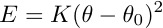

.. index:: improper\_style inversion/harmonic

improper\_style inversion/harmonic command
==========================================

Syntax
""""""

.. parsed-literal::

   improper_style inversion/harmonic

Examples
""""""""

.. parsed-literal::

   improper_style inversion/harmonic
   improper_coeff 1 18.776340 0.000000

Description
"""""""""""

The *inversion/harmonic* improper style follows the Wilson-Decius
out-of-plane angle definition and uses an harmonic potential:

where K is the force constant and omega is the angle evaluated for
all three axis-plane combinations centered around the atom I.  For
the IL axis and the IJK plane omega looks as follows:

.. image:: JPG/umbrella.jpg
   :align: center

Note that the *inversion/harmonic* angle term evaluation differs to
the :doc:`improper_umbrella <improper_umbrella>` due to the cyclic
evaluation of all possible angles omega.

The following coefficients must be defined for each improper type via
the :doc:`improper_coeff <improper_coeff>` command as in the example
above, or in the data file or restart files read by the
:doc:`read_data <read_data>` or :doc:`read_restart <read_restart>`
commands:

* K (energy)
* omega0 (degrees)

If omega0 = 0 the potential term has a minimum for the planar
structure.  Otherwise it has two minima at +/- omega0, with a barrier
in between.

----------

Restrictions
""""""""""""

This improper style can only be used if LAMMPS was built with the
USER-MOFFF package.  See the :doc:`Build package <Build_package>` doc
page for more info.

Related commands
""""""""""""""""

:doc:`improper_coeff <improper_coeff>`

**Default:** none

----------

