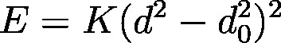

.. index:: improper\_style sqdistharm

improper\_style sqdistharm command
==================================

Syntax
""""""

improper\_style sqdistharm

Examples
""""""""

.. parsed-literal::

   improper_style sqdistharm
   improper_coeff 1 50.0 0.1

Description
"""""""""""

The *sqdistharm* improper style uses the potential

where d is the distance between the central atom and the plane formed
by the other three atoms.  If the 4 atoms in an improper quadruplet
(listed in the data file read by the :doc:`read_data <read_data>`
command) are ordered I,J,K,L then the L-atom is assumed to be the
central atom. Note that this is different from the convention used
in the improper\_style distance.

The following coefficients must be defined for each improper type via
the improper\_coeff command as in the example above, or in the data
file or restart files read by the read\_data or read\_restart commands:

* K (energy/distance\^4)
* d0\^2 (distance\^2)

Note that d0\^2 (in units distance\^2) has be provided and not d0.

----------

Restrictions
""""""""""""

This improper style can only be used if LAMMPS was built with the
USER-MISC package.  See the :doc:`Build package <Build_package>` doc
page for more info.

Related commands
""""""""""""""""

:doc:`improper_coeff <improper_coeff>`

**Default:** none

