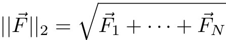
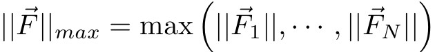
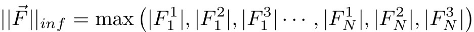

.. index:: min\_modify

min\_modify command
===================

Syntax
""""""

.. parsed-literal::

   min_modify keyword values ...

* one or more keyword/value pairs may be listed
  
  .. parsed-literal::
  
     keyword = *dmax* or *line* or *norm* or *alpha_damp* or *discrete_factor* or *integrator* or *tmax*
       *dmax* value = max
         max = maximum distance for line search to move (distance units)
       *line* value = *backtrack* or *quadratic* or *forcezero* or *spin_cubic* or *spin_none*
         backtrack,quadratic,forcezero,spin_cubic,spin_none = style of linesearch to use 
       *norm* value = *two* or *max*
         two = Euclidean two-norm (length of 3N vector)
         inf = max force component across all 3-vectors
         max = max force norm across all 3-vectors
       *alpha_damp* value = damping
         damping = fictitious Gilbert damping for spin minimization (adim)
       *discrete_factor* value = factor
         factor = discretization factor for adaptive spin timestep (adim)
       *integrator* value = *eulerimplicit* or *verlet*
         time integration scheme for fire minimization
       *tmax* value = factor
         factor = maximum adaptive timestep for fire minimization (adim)

Examples
""""""""

.. parsed-literal::

   min_modify dmax 0.2
   min_modify integrator verlet tmax 4

Description
"""""""""""

This command sets parameters that affect the energy minimization
algorithms selected by the :doc:`min\_style <min_style>` command.  The
various settings may affect the convergence rate and overall number of
force evaluations required by a minimization, so users can experiment
with these parameters to tune their minimizations.

The *cg* and *sd* minimization styles have an outer iteration and an
inner iteration which is steps along a one-dimensional line search in
a particular search direction.  The *dmax* parameter is how far any
atom can move in a single line search in any dimension (x, y, or z).
For the *quickmin* and *fire* minimization styles, the *dmax* setting
is how far any atom can move in a single iteration (timestep).  Thus a
value of 0.1 in real :doc:`units <units>` means no atom will move
further than 0.1 Angstroms in a single outer iteration.  This prevents
highly overlapped atoms from being moved long distances (e.g. through
another atom) due to large forces.

The choice of line search algorithm for the *cg* and *sd* minimization
styles can be selected via the *line* keyword.  The default
*quadratic* line search algorithm starts out using the robust
backtracking method described below. However, once the system gets
close to a local minimum and the linesearch steps get small, so that
the energy is approximately quadratic in the step length, it uses the
estimated location of zero gradient as the linesearch step, provided
the energy change is downhill.  This becomes more efficient than
backtracking for highly-converged relaxations. The *forcezero* line
search algorithm is similar to *quadratic*\ .  It may be more
efficient than *quadratic* on some systems.

The backtracking search is robust and should always find a local
energy minimum.  However, it will "converge" when it can no longer
reduce the energy of the system.  Individual atom forces may still be
larger than desired at this point, because the energy change is
measured as the difference of two large values (energy before and
energy after) and that difference may be smaller than machine epsilon
even if atoms could move in the gradient direction to reduce forces
further.

The choice of a norm can be modified for the min styles *cg*\ , *sd*\
, *quickmin*\ , *fire*\ , *fire/old*\ , *spin*\ , *spin/cg* and 
*spin/lbfgs* using the *norm* keyword.  The default *two* norm computes 
the 2-norm (Euclidean length) of the global force vector:

The *max* norm computes the length of the 3-vector force 
for each atom  (2-norm), and takes the maximum value of those across 
all atoms

The *inf* norm takes the maximum component across the forces of
all atoms in the system:

For the min styles *spin*\ , *spin/cg* and *spin/lbfgs*\ , the force
norm is replaced by the spin-torque norm.

Keywords *alpha\_damp* and *discrete\_factor* only make sense when
a :doc:`min_spin <min_spin>` command is declared.
Keyword *alpha\_damp* defines an analog of a magnetic Gilbert
damping. It defines a relaxation rate toward an equilibrium for
a given magnetic system.
Keyword *discrete\_factor* defines a discretization factor for the
adaptive timestep used in the *spin* minimization.
See :doc:`min_spin <min_spin>` for more information about those
quantities.

The choice of a line search algorithm for the *spin/cg* and
*spin/lbfgs* styles can be specified via the *line* keyword.  The
*spin\_cubic* and *spin\_none* only make sense when one of those two
minimization styles is declared.  The *spin\_cubic* performs the line
search based on a cubic interpolation of the energy along the search
direction. The *spin\_none* keyword deactivates the line search
procedure.  The *spin\_none* is a default value for *line* keyword for
both *spin/lbfgs* and *spin/cg*\ . Convergence of *spin/lbfgs* can be
more robust if *spin\_cubic* line search is used.

The Newton *integrator* used for *fire* minimization can be selected
to be either the symplectic Euler (\ *eulerimplicit*\ ) or velocity
Verlet (\ *verlet*\ ).  *tmax* define the maximum value for the
adaptive timestep during a *fire* minimization. It is a multiplication
factor applied to the current :doc:`timestep <timestep>` (not in time
unit). For example, *tmax* = 4.0 with a :doc:`timestep <timestep>` of
2fs, means that the maximum value the timestep can reach during a *fire*
minimization is 4fs. 
Note that parameter defaults has been chosen to be reliable in most cases, 
but one should consider adjusting :doc:`timestep <timestep>` and *tmax* to
optimize the minimization for large or complex systems.  Other
parameters of the *fire* minimization can be tuned (\ *tmin*\ ,
*delaystep*\ , *dtgrow*\ , *dtshrink*\ , *alpha0*\ , and
*alphashrink*\ ). Please refer to the references describing the
:doc:`min\_style <min_style>` *fire*.
An additional stopping criteria *vdfmax* is used by *fire* in order to avoid
unnecessary looping when it is reasonable to think the system will not
be relaxed further.  Note that in this case the system will NOT have
reached your minimization criteria. This could happen when the system 
comes to be stuck in a local basin of the phase space.  *vdfmax* is 
the maximum number of consecutive iterations with P(t) < 0.

The :doc:`min\_style <min_style>` *fire* is an optimized implementation of
:doc:`min\_style <min_style>` *fire/old*. It can however behave similarly 
to the *fire/old* style by using the following set of parameters:

.. parsed-literal::
  min_modify integrator eulerexplicit tmax 10.0 tmin 0.0 delaystep 5 &
             dtgrow 1.1 dtshrink 0.5 alpha0 0.1 alphashrink 0.99 &
             vdfmax 100000 halfstepback no initialdelay no

Restrictions
""""""""""""

For magnetic GNEB calculations, only *spin\_none* value for *line*
keyword can be used when styles *spin/cg* and *spin/lbfgs* are
employed.  See :doc:`neb/spin <neb_spin>` for more explanation.

Related commands
""""""""""""""""

:doc:`min\_style <min_style>`, :doc:`minimize <minimize>`

Default
"""""""

The option defaults are dmax = 0.1, line = quadratic and norm = two.

For the *spin*\ , *spin/cg* and *spin/lbfgs* styles, the option
defaults are alpha\_damp = 1.0, discrete\_factor = 10.0, line =
spin\_none, and norm = euclidean.

For the *fire* style, the option defaults are integrator =
eulerimplicit, tmax = 10.0, tmin = 0.02, delaystep = 20, dtgrow = 1.1,
dtshrink = 0.5, alpha0 = 0.25, alphashrink = 0.99, vdfmax = 2000,
halfstepback = yes and initialdelay = yes.
