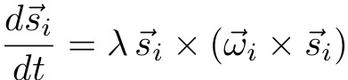
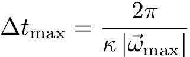

.. index:: min\_style spin

min\_style spin command
=======================

min\_style spin/cg command
==========================

min\_style spin/lbfgs command
=============================

Syntax
""""""

.. parsed-literal::

   min_style spin 
   min_style spin/cg 
   min_style spin/lbfgs

Examples
""""""""

.. parsed-literal::

   min_style  spin/lbfgs
   min_modify line spin_cubic discrete_factor 10.0

Description
"""""""""""

Apply a minimization algorithm to use when a :doc:`minimize <minimize>`
command is performed.

Style *spin* defines a damped spin dynamics with an adaptive
timestep, according to:

with lambda a damping coefficient (similar to a Gilbert
damping).
Lambda can be defined by setting the *alpha\_damp* keyword with the
:doc:`min_modify <min_modify>` command.

The minimization procedure solves this equation using an
adaptive timestep. The value of this timestep is defined
by the largest precession frequency that has to be solved in the
system:

with *\|omega\|\_\ *max*\ * the norm of the largest precession frequency
in the system (across all processes, and across all replicas if a
spin/neb calculation is performed).

Kappa defines a discretization factor *discrete\_factor* for the
definition of this timestep.
*discrete\_factor* can be defined with the :doc:`min_modify <min_modify>`
command.

Style *spin/cg* defines an orthogonal spin optimization
(OSO) combined to a conjugate gradient (CG) algorithm. 
The :doc:`min_modify <min_modify>` command can be used to
couple the *spin/cg* to a line search procedure, and to modify the 
discretization factor *discrete\_factor*.
By default, style *spin/cg* does not employ the line search procedure 
and uses the adaptive time-step technique in the same way as style *spin*\ .

Style *spin/lbfgs* defines an orthogonal spin optimization (OSO)
combined to a limited-memory Broyden-Fletcher-Goldfarb-Shanno (L-BFGS)
algorithm.  By default, style *spin/lbfgs* does not employ line search
procedure.  If the line search procedure is not used then the discrete
factor defines the maximum root mean squared rotation angle of spins by
equation *pi/(5\*Kappa)*.  The default value for Kappa is 10.  The
*spin\_cubic* line search option can improve the convergence of the
*spin/lbfgs* algorithm.

The :doc:`min_modify <min_modify>` command can be used to
activate the line search procedure, and to modify the
discretization factor *discrete\_factor*.

For more information about styles *spin/cg* and *spin/lbfgs*\ , 
see their implementation reported in :ref:`(Ivanov) <Ivanov1>`.

.. note::

   All the *spin* styles replace the force tolerance by a torque
   tolerance. See :doc:`minimize <minimize>` for more explanation.

.. note::

   The *spin/cg* and *spin/lbfgs* styles can be used
   for magnetic NEB calculations only if the line search procedure
   is deactivated. See :doc:`neb/spin <neb_spin>` for more explanation.

Restrictions
""""""""""""

This minimization procedure is only applied to spin degrees of
freedom for a frozen lattice configuration.

Related commands
""""""""""""""""

:doc:`min_style <min_style>`, :doc:`minimize <minimize>`,
:doc:`min_modify <min_modify>`

Default
"""""""

The option defaults are *alpha\_damp* = 1.0, *discrete\_factor* =
10.0, *line* = spin\_none and *norm* = euclidean.

----------

.. _Ivanov1:

**(Ivanov)** Ivanov, Uzdin, Jonsson. arXiv preprint arXiv:1904.02669, (2019).
