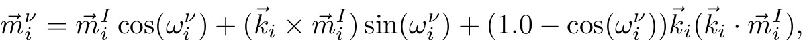
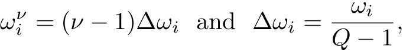
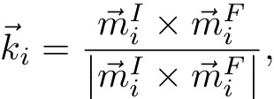

.. index:: neb/spin

neb/spin command
================

Syntax
""""""

.. parsed-literal::

   neb/spin etol ttol N1 N2 Nevery file-style arg keyword

* etol = stopping tolerance for energy (energy units)
* ttol = stopping tolerance for torque ( units)
* N1 = max # of iterations (timesteps) to run initial NEB
* N2 = max # of iterations (timesteps) to run barrier-climbing NEB
* Nevery = print replica energies and reaction coordinates every this many timesteps
* file-style = *final* or *each* or *none*
  
  .. parsed-literal::
  
       *final* arg = filename
         filename = file with initial coords for final replica
           coords for intermediate replicas are linearly interpolated
           between first and last replica
       *each* arg = filename
         filename = unique filename for each replica (except first)
           with its initial coords
       *none* arg = no argument all replicas assumed to already have
           their initial coords

keyword = *verbose*

Examples
""""""""

.. parsed-literal::

   neb/spin 0.1 0.0 1000 500 50 final coords.final
   neb/spin 0.0 0.001 1000 500 50 each coords.initial.$i
   neb/spin 0.0 0.001 1000 500 50 none verbose

Description
"""""""""""

Perform a geodesic nudged elastic band (GNEB) calculation using multiple
replicas of a system.  Two or more replicas must be used; the first
and last are the end points of the transition path.

GNEB is a method for finding both the spin configurations and height
of the energy barrier associated with a transition state, e.g.
spins to perform a collective rotation from one energy basin to
another.
The implementation in LAMMPS follows the discussion in the
following paper: :ref:`(BessarabA) <BessarabA>`.

Each replica runs on a partition of one or more processors.  Processor
partitions are defined at run-time using the :doc:`-partition command-line switch <Run_options>`.  Note that if you have MPI installed, you
can run a multi-replica simulation with more replicas (partitions)
than you have physical processors, e.g you can run a 10-replica
simulation on just one or two processors.  You will simply not get the
performance speed-up you would see with one or more physical
processors per replica.  See the :doc:`Howto replica <Howto_replica>`
doc page for further discussion.

.. note::

   As explained below, a GNEB calculation performs a
   minimization across all the replicas. One of the :doc:`spin <min_spin>`
   style minimizers has to be defined in your input script.

When a GNEB calculation is performed, it is assumed that each replica
is running the same system, though LAMMPS does not check for this.
I.e. the simulation domain, the number of magnetic atoms, the
interaction potentials, and the starting configuration when the neb
command is issued should be the same for every replica.

In a GNEB calculation each replica is connected to other replicas by
inter-replica nudging forces.  These forces are imposed by the :doc:`fix neb/spin <fix_neb_spin>` command, which must be used in conjunction
with the neb command.
The group used to define the fix neb/spin command defines the
GNEB magnetic atoms which are the only ones that inter-replica springs
are applied to.
If the group does not include all magnetic atoms, then non-GNEB
magnetic atoms have no inter-replica springs and the torques they feel
and their precession motion is computed in the usual way due only
to other magnetic atoms within their replica.
Conceptually, the non-GNEB atoms provide a background force field for
the GNEB atoms.
Their magnetic spins can be allowed to evolve during the GNEB
minimization procedure.

The initial spin configuration for each of the replicas can be
specified in different manners via the *file-style* setting, as
discussed below.  Only atomic spins whose initial coordinates should
differ from the current configuration need to be specified.

Conceptually, the initial and final configurations for the first
replica should be states on either side of an energy barrier.

As explained below, the initial configurations of intermediate
replicas can be spin coordinates interpolated in a linear fashion
between the first and last replicas.  This is often adequate for
simple transitions.  For more complex transitions, it may lead to slow
convergence or even bad results if the minimum energy path (MEP, see
below) of states over the barrier cannot be correctly converged to
from such an initial path.  In this case, you will want to generate
initial states for the intermediate replicas that are geometrically
closer to the MEP and read them in.

----------

For a *file-style* setting of *final*\ , a filename is specified which
contains atomic and spin coordinates for zero or more atoms, in the
format described below.
For each atom that appears in the file, the new coordinates are
assigned to that atom in the final replica.  Each intermediate replica
also assigns a new spin to that atom in an interpolated manner.
This is done by using the current direction of the spin at the starting
point and the read-in direction as the final point.
The "angular distance" between them is calculated, and the new direction
is assigned to be a fraction of the angular distance.

.. note::

   The "angular distance" between the starting and final point is
   evaluated in the geodesic sense, as described in
   :ref:`(BessarabA) <BessarabA>`.

.. note::

   The angular interpolation between the starting and final point
   is achieved using Rodrigues formula:

where m\_i\^I is the initial spin configuration for the spin i,
omega\_i\^nu is a rotation angle defined as:

with nu the image number, Q the total number of images, and
omega\_i the total rotation between the initial and final spins.
k\_i defines a rotation axis such as:

if the initial and final spins are not aligned.
If the initial and final spins are aligned, then their cross
product is null, and the expression above does not apply.
If they point toward the same direction, the intermediate images
conserve the same orientation.
If the initial and final spins are aligned, but point toward
opposite directions, an arbitrary rotation vector belonging to
the plane perpendicular to initial and final spins is chosen.
In this case, a warning message is displayed.

For a *file-style* setting of *each*\ , a filename is specified which is
assumed to be unique to each replica.
See the :doc:`neb <neb>` documentation page for more information about this
option.

For a *file-style* setting of *none*\ , no filename is specified.  Each
replica is assumed to already be in its initial configuration at the
time the neb command is issued.  This allows each replica to define
its own configuration by reading a replica-specific data or restart or
dump file, via the :doc:`read_data <read_data>`,
:doc:`read_restart <read_restart>`, or :doc:`read_dump <read_dump>`
commands.  The replica-specific names of these files can be specified
as in the discussion above for the *each* file-style.  Also see the
section below for how a NEB calculation can produce restart files, so
that a long calculation can be restarted if needed.

.. note::

   None of the *file-style* settings change the initial
   configuration of any atom in the first replica.  The first replica
   must thus be in the correct initial configuration at the time the neb
   command is issued.

----------

A NEB calculation proceeds in two stages, each of which is a
minimization procedure.  To enable
this, you must first define a
:doc:`min_style <min_style>`, using either the *spin*\ ,
*spin/cg*\ , or *spin/lbfgs* style (see
:doc:`min_spin <min_spin>` for more information).  
The other styles cannot be used, since they relax the lattice
degrees of freedom instead of the spins.

The minimizer tolerances for energy and force are set by *etol* and
*ttol*\ , the same as for the :doc:`minimize <minimize>` command.

A non-zero *etol* means that the GNEB calculation will terminate if the
energy criterion is met by every replica.  The energies being compared
to *etol* do not include any contribution from the inter-replica
nudging forces, since these are non-conservative.  A non-zero *ttol*
means that the GNEB calculation will terminate if the torque criterion
is met by every replica.  The torques being compared to *ttol* include
the inter-replica nudging forces.

The maximum number of iterations in each stage is set by *N1* and
*N2*\ .  These are effectively timestep counts since each iteration of
damped dynamics is like a single timestep in a dynamics
:doc:`run <run>`.  During both stages, the potential energy of each
replica and its normalized distance along the reaction path (reaction
coordinate RD) will be printed to the screen and log file every
*Nevery* timesteps.  The RD is 0 and 1 for the first and last replica.
For intermediate replicas, it is the cumulative angular distance
(normalized by the total cumulative angular distance) between adjacent
replicas, where "distance" is defined as the length of the 3N-vector of
the geodesic distances in spin coordinates, with N the number of
GNEB spins involved (see equation (13) in :ref:`(BessarabA) <BessarabA>`).
These outputs allow you to monitor NEB's progress in
finding a good energy barrier.  *N1* and *N2* must both be multiples
of *Nevery*\ .

In the first stage of GNEB, the set of replicas should converge toward
a minimum energy path (MEP) of conformational states that transition
over a barrier.  The MEP for a transition is defined as a sequence of
3N-dimensional spin states, each of which has a potential energy
gradient parallel to the MEP itself.
The configuration of highest energy along a MEP corresponds to a saddle
point.  The replica states will also be roughly equally spaced along
the MEP due to the inter-replica nudging force added by the
:doc:`fix neb <fix_neb>` command.

In the second stage of GNEB, the replica with the highest energy is
selected and the inter-replica forces on it are converted to a force
that drives its spin coordinates to the top or saddle point of the
barrier, via the barrier-climbing calculation described in
:ref:`(BessarabA) <BessarabA>`.  As before, the other replicas rearrange
themselves along the MEP so as to be roughly equally spaced.

When both stages are complete, if the GNEB calculation was successful,
the configurations of the replicas should be along (close to) the MEP
and the replica with the highest energy should be a spin
configuration at (close to) the saddle point of the transition. The
potential energies for the set of replicas represents the energy
profile of the transition along the MEP.

----------

An atom map must be defined which it is not by default for :doc:`atom_style atomic <atom_style>` problems.  The :doc:`atom_modify map <atom_modify>` command can be used to do this.

An initial value can be defined for the timestep. Although, the *spin*
minimization algorithm is an adaptive timestep methodology, so that
this timestep is likely to evolve during the calculation.

The minimizers in LAMMPS operate on all spins in your system, even
non-GNEB atoms, as defined above.

----------

Each file read by the neb/spin command containing spin coordinates used
to initialize one or more replicas must be formatted as follows.

The file can be ASCII text or a gzipped text file (detected by a .gz
suffix).  The file can contain initial blank lines or comment lines
starting with "#" which are ignored.  The first non-blank, non-comment
line should list N = the number of lines to follow.  The N successive
lines contain the following information:

.. parsed-literal::

   ID1 g1 x1 y1 z1 sx1 sy1 sz1
   ID2 g2 x2 y2 z2 sx2 sy2 sz2
   ...
   IDN gN yN zN sxN syN szN

The fields are the atom ID, the norm of the associated magnetic spin,
followed by the *x,y,z* coordinates and the *sx,sy,sz* spin coordinates.
The lines can be listed in any order.  Additional trailing information on
the line is OK, such as a comment.

Note that for a typical GNEB calculation you do not need to specify
initial spin coordinates for very many atoms to produce differing starting
and final replicas whose intermediate replicas will converge to the
energy barrier.  Typically only new spin coordinates for atoms
geometrically near the barrier need be specified.

Also note there is no requirement that the atoms in the file
correspond to the GNEB atoms in the group defined by the :doc:`fix neb <fix_neb>` command.  Not every GNEB atom need be in the file,
and non-GNEB atoms can be listed in the file.

----------

Four kinds of output can be generated during a GNEB calculation: energy
barrier statistics, thermodynamic output by each replica, dump files,
and restart files.

When running with multiple partitions (each of which is a replica in
this case), the print-out to the screen and master log.lammps file
contains a line of output, printed once every *Nevery* timesteps.  It
contains the timestep, the maximum torque per replica, the maximum
torque per atom (in any replica), potential gradients in the initial,
final, and climbing replicas, the forward and backward energy
barriers, the total reaction coordinate (RDT), and the normalized
reaction coordinate and potential energy of each replica.

The "maximum torque per replica" is the two-norm of the
3N-length vector given by the cross product of a spin by its
precession vector omega, in each replica, maximized across replicas,
which is what the *ttol* setting is checking against.  In this case, N is
all the atoms in each replica.  The "maximum torque per atom" is the
maximum torque component of any atom in any replica.  The potential
gradients are the two-norm of the 3N-length magnetic precession vector
solely due to the interaction potential i.e. without adding in
inter-replica forces, and projected along the path tangent (as detailed
in Appendix D of :ref:`(BessarabA) <BessarabA>`).

The "reaction coordinate" (RD) for each replica is the two-norm of the
3N-length vector of geodesic distances between its spins and the preceding
replica's spins (see equation (13) of :ref:`(BessarabA) <BessarabA>`), added to
the RD of the preceding replica. The RD of the first replica RD1 = 0.0;
the RD of the final replica RDN = RDT, the total reaction coordinate.
The normalized RDs are divided by RDT, so that they form a monotonically
increasing sequence from zero to one. When computing RD, N only includes
the spins being operated on by the fix neb/spin command.

The forward (reverse) energy barrier is the potential energy of the
highest replica minus the energy of the first (last) replica.

Supplementary information for all replicas can be printed out to the
screen and master log.lammps file by adding the verbose keyword. This
information include the following.
The "GradVidottan" are the projections of the potential gradient for
the replica i on its tangent vector (as detailed in Appendix D of
:ref:`(BessarabA) <BessarabA>`).
The "DNi" are the non normalized geodesic distances (see equation (13)
of :ref:`(BessarabA) <BessarabA>`), between a replica i and the next replica
i+1. For the last replica, this distance is not defined and a "NAN"
value is the corresponding output.

When a NEB calculation does not converge properly, the supplementary
information can help understanding what is going wrong.

When running on multiple partitions, LAMMPS produces additional log
files for each partition, e.g. log.lammps.0, log.lammps.1, etc.  For a
GNEB calculation, these contain the thermodynamic output for each
replica.

If :doc:`dump <dump>` commands in the input script define a filename
that includes a *universe* or *uloop* style :doc:`variable <variable>`,
then one dump file (per dump command) will be created for each
replica.  At the end of the GNEB calculation, the final snapshot in
each file will contain the sequence of snapshots that transition the
system over the energy barrier.  Earlier snapshots will show the
convergence of the replicas to the MEP.

Likewise, :doc:`restart <restart>` filenames can be specified with a
*universe* or *uloop* style :doc:`variable <variable>`, to generate
restart files for each replica.  These may be useful if the GNEB
calculation fails to converge properly to the MEP, and you wish to
restart the calculation from an intermediate point with altered
parameters.

A c file script in provided in the tool/spin/interpolate\_gneb
directory, that interpolates the MEP given the information provided
by the verbose output option (as detailed in Appendix D of
:ref:`(BessarabA) <BessarabA>`).

----------

Restrictions
""""""""""""

This command can only be used if LAMMPS was built with the SPIN
package.  See the :doc:`Build package <Build_package>` doc
page for more info.

For magnetic GNEB calculations, only the *spin\_none* value for the
*line* keyword can be used when minimization styles *spin/cg* and
*spin/lbfgs* are employed.

----------

Related commands
""""""""""""""""

:doc:`min/spin <min_spin>`, :doc:`fix neb/spin <fix_neb_spin>`

Default
"""""""

none

----------

.. _BessarabA:

**(BessarabA)** Bessarab, Uzdin, Jonsson, Comp Phys Comm, 196,
335-347 (2015).

.. _lws: http://lammps.sandia.gov
.. _ld: Manual.html
.. _lc: Commands_all.html
