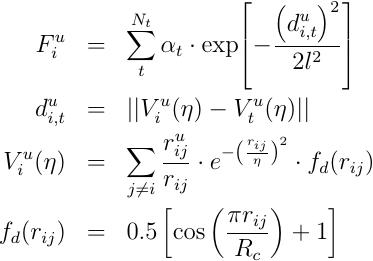

.. index:: pair\_style agni

pair\_style agni command
========================

pair\_style agni/omp command
============================

Syntax
""""""

.. parsed-literal::

   pair_style agni

Examples
""""""""
pair\_style      agni
pair\_coeff      \* \* Al.agni Al

Description
"""""""""""

Style *agni* style computes the many-body vectorial force components for
an atom as

*u* labels the individual components, i.e. x, y or z, and *V* is the
corresponding atomic fingerprint. *d* is the Euclidean distance between
any two atomic fingerprints. A total of N\_t reference atomic
environments are considered to construct the force field file. *alpha\_t*
and *l* are the weight coefficients and length scale parameter of the
non-linear regression model.

The method implements the recently proposed machine learning access to
atomic forces as discussed extensively in the following publications -
:ref:`(Botu1) <Botu2015adaptive>` and :ref:`(Botu2) <Botu2015learning>`. The premise
of the method is to map the atomic environment numerically into a
fingerprint, and use machine learning methods to create a mapping to the
vectorial atomic forces.

Only a single pair\_coeff command is used with the *agni* style which
specifies an AGNI potential file containing the parameters of the
force field for the needed elements. These are mapped to LAMMPS atom
types by specifying N additional arguments after the filename in the
pair\_coeff command, where N is the number of LAMMPS atom types:

* filename
* N element names = mapping of AGNI elements to atom types

See the :doc:`pair\_coeff <pair_coeff>` doc page for alternate ways
to specify the path for the force field file.

An AGNI force field is fully specified by the filename which contains the
parameters of the force field, i.e., the reference training environments
used to construct the machine learning force field. Example force field
and input files are provided in the examples/USER/misc/agni directory.

----------

Styles with *omp* suffix is functionally the same as the corresponding
style without the suffix. They have been optimized to run faster,
depending on your available hardware, as discussed on the :doc:`Speed packages <Speed_packages>` doc page.  The accelerated style takes
the same arguments and should produce the same results, except for
round-off and precision issues.

The accelerated style is part of the USER-OMP.  They are only enabled
if LAMMPS was built with those packages.  See the :doc:`Build package <Build_package>` doc page for more info.

You can specify the accelerated style explicitly in your input script
by including their suffix, or you can use the :doc:`-suffix command-line switch <Run_options>` when you invoke LAMMPS, or you can use the
:doc:`suffix <suffix>` command in your input script.

See the :doc:`Speed packages <Speed_packages>` doc page for more
instructions on how to use the accelerated styles effectively.

----------

**Mixing, shift, table, tail correction, restart, rRESPA info**\ :

This pair style does not support the :doc:`pair\_modify <pair_modify>`
shift, table, and tail options.

This pair style does not write its information to :doc:`binary restart files <restart>`, since it is stored in potential files.  Thus, you
need to re-specify the pair\_style and pair\_coeff commands in an input
script that reads a restart file.

This pair style can only be used via the *pair* keyword of the
:doc:`run\_style respa <run_style>` command.  It does not support the
*inner*\ , *middle*\ , *outer* keywords.

----------

Restrictions
""""""""""""

Currently, only elemental systems are implemented. Also, the method
only provides access to the forces and not energies or stresses.
The lack of potential energy data makes this pair style incompatible with
several of the :doc:`minimizer algorthms <min_style>` like *cg* or *sd*\ .
It should work with damped dynamics based minimizers like *fire* or
*quickmin*\ .  However, one can access the energy via thermodynamic
integration of the forces as discussed in
:ref:`(Botu3) <Botu2016construct>`.  This pair style is part of the
USER-MISC package. It is only enabled if LAMMPS was built with that
package. See the :doc:`Build package <Build_package>` doc page for more
info.

The AGNI force field files provided with LAMMPS (see the
potentials directory) are parameterized for metal :doc:`units <units>`.
You can use the AGNI potential with any LAMMPS units, but you would need
to create your own AGNI potential file with coefficients listed in the
appropriate units if your simulation doesn't use "metal" units.

Related commands
""""""""""""""""

:doc:`pair\_coeff <pair_coeff>`

**Default:** none

----------

.. _Botu2015adaptive:

**(Botu1)** V. Botu and R. Ramprasad, Int. J. Quant. Chem., 115(16), 1074 (2015).

.. _Botu2015learning:

**(Botu2)** V. Botu and R. Ramprasad, Phys. Rev. B, 92(9), 094306 (2015).

.. _Botu2016construct:

**(Botu3)** V. Botu, R. Batra, J. Chapman and R. Ramprasad, https://arxiv.org/abs/1610.02098 (2016).

.. _lws: http://lammps.sandia.gov
.. _ld: Manual.html
.. _lc: Commands_all.html
