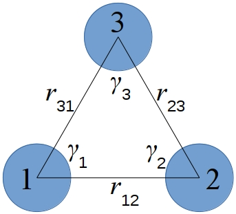

.. index:: pair_style atm

pair_style atm command
======================

Syntax
""""""

.. code-block:: LAMMPS

   pair_style atm cutoff cutoff_triple

* cutoff = cutoff for each pair in 3-body interaction (distance units)
* cutoff_triple = additional cutoff applied to product of 3 pairwise distances (distance units)

Examples
""""""""

.. code-block:: LAMMPS

   pair_style atm 4.5 2.5
   pair_coeff * * * 0.072

   pair_style hybrid/overlay lj/cut 6.5 atm 4.5 2.5
   pair_coeff * * lj/cut 1.0 1.0
   pair_coeff 1 1 atm 1 0.064
   pair_coeff 1 1 atm 2 0.080
   pair_coeff 1 2 atm 2 0.100
   pair_coeff 2 2 atm 2 0.125

Description
"""""""""""

The *atm* style computes a 3-body :ref:`Axilrod-Teller-Muto <Axilrod>`
potential for the energy E of a system of atoms as

.. math::

   E & = \nu\frac{1+3\cos\gamma_1\cos\gamma_2\cos\gamma_3}{r_{12}^3r_{23}^3r_{31}^3} \\

where :math:`\nu` is the three-body interaction strength.  The distances
between pairs of atoms :math:`r_{12}`, :math:`r_{23}`, :math:`r_{31}` and the angles :math:`\gamma_1`, :math:`\gamma_2`,
:math:`\gamma_3` are as shown in this diagram:

Note that for the interaction between a triplet of atoms :math:`I,J,K`, there
is no "central" atom.  The interaction is symmetric with respect to
permutation of the three atoms. Thus the :math:`\nu` value is
the same for all those permutations of the atom types of :math:`I,J,K`
and needs to be specified only once, as discussed below.

The *atm* potential is typically used in combination with a two-body
potential using the :doc:`pair_style hybrid/overlay <pair_hybrid>`
command as in the example above.

The potential for a triplet of atom is calculated only if all 3 distances
:math:`r_{12}`, :math:`r_{23}`, :math:`r_{31}` between the 3 atoms satisfy
:math:`r_{IJ} < \text{cutoff}`.  In addition, the product of the 3 distances
:math:`r_{12} r_{23} r_{31}` < cutoff_triple :math:`^3` is required, which
excludes from calculation the triplets with small contribution to the
interaction.

The following coefficients must be defined for each pair of atoms
types via the :doc:`pair_coeff <pair_coeff>` command as in the examples
above, or in the restart files read by the
:doc:`read_restart <read_restart>` commands:

* :math:`K` = atom type of the third atom (1 to :math:`N_{\text{types}}`)
* :math:`\nu` = prefactor (energy/distance\^9 units)

:math:`K` can be specified in one of two ways.  An explicit numeric value can
be used, as in the second example above.  :math:`J \leq K` is required.  LAMMPS
sets the coefficients for the other 5 symmetric interactions to the same
values.  E.g. if :math:`I = 1`, :math:`J = 2`, :math:`K = 3`, then these 6
values are set to the specified :math:`\nu`: :math:`\nu_{123}`,
:math:`\nu_{132}`, :math:`\nu_{213}`, :math:`\nu_{231}`, :math:`\nu_{312}`,
:math:`\nu_{321}`.  This enforces the symmetry discussed above.

A wildcard asterisk can be used for K to set the coefficients for
multiple triplets of atom types.  This takes the form "\*" or "\*n" or
"n\*" or "m\*n".  If :math:`N` equals the number of atom types, then an asterisk with
no numeric values means all types from 1 to :math:`N`.  A leading asterisk
means all types from 1 to :math:`n` (inclusive).  A trailing asterisk means
all types from :math:`n` to :math:`N` (inclusive).  A middle asterisk means all types
from :math:`m` to :math:`n` (inclusive).  Note that only type triplets with :math:`J \leq K` are
considered; if asterisks imply type triplets where :math:`K < J`, they are
ignored.

Note that a pair_coeff command can override a previous setting for the
same :math:`I,J,K` triplet.  For example, these commands set :math:`\nu` for all :math:`I,J.K`
triplets, then overwrite nu for just the :math:`I,J,K = 2,3,4` triplet:

.. code-block:: LAMMPS

   pair_coeff * * * 0.25
   pair_coeff 2 3 4 0.1

Note that for a simulation with a single atom type, only a single
entry is required, e.g.

.. code-block:: LAMMPS

   pair_coeff 1 1 1 0.25

For a simulation with two atom types, four pair_coeff commands will
specify all possible nu values:

.. code-block:: LAMMPS

   pair_coeff 1 1 1 nu1
   pair_coeff 1 1 2 nu2
   pair_coeff 1 2 2 nu3
   pair_coeff 2 2 2 nu4

For a simulation with three atom types, ten pair_coeff commands will
specify all possible nu values:

.. code-block:: LAMMPS

   pair_coeff 1 1 1 nu1
   pair_coeff 1 1 2 nu2
   pair_coeff 1 1 3 nu3
   pair_coeff 1 2 2 nu4
   pair_coeff 1 2 3 nu5
   pair_coeff 1 3 3 nu6
   pair_coeff 2 2 2 nu7
   pair_coeff 2 2 3 nu8
   pair_coeff 2 3 3 nu9
   pair_coeff 3 3 3 nu10

By default the :math:`\nu` value for all triplets is set to 0.0.  Thus it is
not required to provide pair_coeff commands that enumerate triplet
interactions for all :math:`K` types.  If some :math:`I,J,K` combination is not
specified, then there will be no 3-body ATM interactions for that
combination and all its permutations.  However, as with all pair
styles, it is required to specify a pair_coeff command for all :math:`I,J`
combinations, else an error will result.

----------

**Mixing, shift, table, tail correction, restart, rRESPA info**\ :

This pair styles do not support the :doc:`pair_modify <pair_modify>`
mix, shift, table, and tail options.

This pair style writes its information to :doc:`binary restart files
<restart>`, so pair_style and pair_coeff commands do not need to be specified
in an input script that reads a restart file.  However, if the *atm* potential
is used in combination with other potentials using the :doc:`pair_style
hybrid/overlay <pair_hybrid>` command then pair_coeff commands need to be
re-specified in the restart input script.

This pair style can only be used via the *pair* keyword of the
:doc:`run_style respa <run_style>` command.  It does not support the
*inner* , *middle* , *outer* keywords.

----------

Restrictions
""""""""""""

This pair style is part of the MANYBODY package.  It is only enabled
if LAMMPS was built with that package.  See the :doc:`Build package <Build_package>` doc page for more info.

Related commands
""""""""""""""""

:doc:`pair_coeff <pair_coeff>`

**Default:** none

----------

.. _Axilrod:

**(Axilrod)**
Axilrod and Teller, J Chem Phys, 11, 299 (1943);
Muto, Nippon Sugaku-Buturigakkwaishi 17, 629 (1943).
