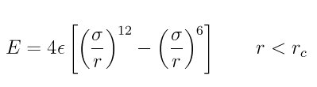

.. index:: pair\_style body/nparticle

pair\_style body/nparticle command
==================================

Syntax
""""""

.. parsed-literal::

   pair_style body/nparticle cutoff

cutoff = global cutoff for interactions (distance units)

Examples
""""""""

.. parsed-literal::

   pair_style body/nparticle 3.0
   pair_coeff \* \* 1.0 1.0
   pair_coeff 1 1 1.0 1.5 2.5

Description
"""""""""""

Style *body/nparticle* is for use with body particles and calculates
pairwise body/body interactions as well as interactions between body
and point-particles.  See the :doc:`Howto body <Howto_body>` doc page
for more details on using body particles.

This pair style is designed for use with the "nparticle" body style,
which is specified as an argument to the "atom-style body" command.
See the :doc:`Howto body <Howto_body>` doc page for more details about
the body styles LAMMPS supports.  The "nparticle" style treats a body
particle as a rigid body composed of N sub-particles.

The coordinates of a body particle are its center-of-mass (COM).  If
the COMs of a pair of body particles are within the cutoff (global or
type-specific, as specified above), then all interactions between
pairs of sub-particles in the two body particles are computed.
E.g. if the first body particle has 3 sub-particles, and the second
has 10, then 30 interactions are computed and summed to yield the
total force and torque on each body particle.

.. note::

   In the example just described, all 30 interactions are computed
   even if the distance between a particular pair of sub-particles is
   greater than the cutoff.  Likewise, no interaction between two body
   particles is computed if the two COMs are further apart than the
   cutoff, even if the distance between some pairs of their sub-particles
   is within the cutoff.  Thus care should be used in defining the cutoff
   distances for body particles, depending on their shape and size.

Similar rules apply for a body particle interacting with a point
particle.  The distance between the two particles is calculated using
the COM of the body particle and the position of the point particle.
If the distance is within the cutoff and the body particle has N
sub-particles, then N interactions with the point particle are
computed and summed.  If the distance is not within the cutoff, no
interactions between the body and point particle are computed.

The interaction between two sub-particles, or a sub-particle and point
particle, or between two point particles is computed as a Lennard-Jones
interaction, using the standard formula

where Rc is the cutoff.  As explained above, an interaction involving
one or two body sub-particles may be computed even for r > Rc.

For style *body*\ , the following coefficients must be defined for each
pair of atoms types via the :doc:`pair_coeff <pair_coeff>` command as in
the examples above, or in the data file or restart files read by the
:doc:`read_data <read_data>` or :doc:`read_restart <read_restart>`
commands:

* epsilon (energy units)
* sigma (distance units)
* cutoff (distance units)

The last coefficient is optional.  If not specified, the global cutoff
is used.

----------

**Mixing, shift, table, tail correction, restart, rRESPA info**\ :

For atom type pairs I,J and I != J, the epsilon and sigma coefficients
and cutoff distance for all of this pair style can be mixed.  The
default mix value is *geometric*\ .  See the "pair\_modify" command for
details.

This pair style does not support the :doc:`pair_modify <pair_modify>`
shift, table, and tail options.

This pair style does not write its information to :doc:`binary restart files <restart>`.

This pair style can only be used via the *pair* keyword of the
:doc:`run_style respa <run_style>` command.  It does not support the
*inner*\ , *middle*\ , *outer* keywords.

----------

Restrictions
""""""""""""

This style is part of the BODY package.  It is only enabled if LAMMPS
was built with that package.  See the :doc:`Build package <Build_package>` doc page for more info.

Defining particles to be bodies so they participate in body/body or
body/particle interactions requires the use of the :doc:`atom_style body <atom_style>` command.

Related commands
""""""""""""""""

:doc:`pair_coeff <pair_coeff>`, :doc:`fix rigid <fix_rigid>`

**Default:** none

.. _lws: http://lammps.sandia.gov
.. _ld: Manual.html
.. _lc: Commands_all.html
