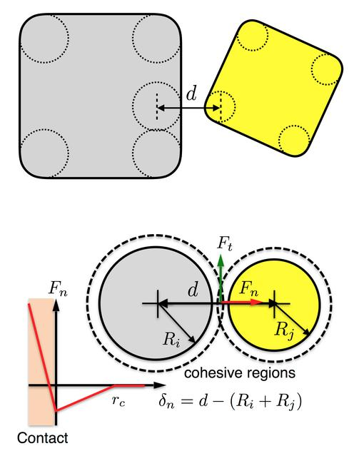

.. index:: pair_style body/rounded/polygon
.. index:: pair_style body/rounded/polygon/omp

pair_style body/rounded/polygon command
=======================================

Accelerator Variants: *body/rounded/polygon/omp*

Syntax
""""""

.. code-block:: LAMMPS

   pair_style body/rounded/polygon c_n c_t mu delta_ua cutoff

.. parsed-literal::

   c_n = normal damping coefficient
   c_t = tangential damping coefficient
   mu = normal friction coefficient during gross sliding
   delta_ua = multiple contact scaling factor
   cutoff = global separation cutoff for interactions (distance units), see below for definition

Examples
""""""""

.. code-block:: LAMMPS

   pair_style body/rounded/polygon 20.0 5.0 0.0 1.0 0.5
   pair_coeff * * 100.0 1.0
   pair_coeff 1 1 100.0 1.0

Description
"""""""""""

Style *body/rounded/polygon* is for use with 2d models of body
particles of style *rounded/polygon*\ .  It calculates pairwise
body/body interactions which can include body particles modeled as
1-vertex circular disks with a specified diameter.  See the
:doc:`Howto body <Howto_body>` page for more details on using body
rounded/polygon particles.

This pairwise interaction between rounded polygons is described in
:ref:`Fraige <pair-Fraige>`, where a polygon does not have sharp corners,
but is rounded at its vertices by circles centered on each vertex with
a specified diameter.  The edges of the polygon are defined between
pairs of adjacent vertices.  The circle diameter for each polygon is
specified in the data file read by the :doc:`read data <read_data>`
command.  This is a 2d discrete element model (DEM) which allows for
multiple contact points.

Note that when two particles interact, the effective surface of each
polygon particle is displaced outward from each of its vertices and
edges by half its circle diameter (as in the diagram below of a gray
and yellow square particle).  The interaction forces and energies
between two particles are defined with respect to the separation of
their respective rounded surfaces, not by the separation of the
vertices and edges themselves.

This means that the specified cutoff in the pair_style command is the
cutoff distance, :math:`r_c`, for the surface separation, :math:`\delta_n` (see figure
below).  This is the distance at which two particles no longer
interact.  If :math:`r_c` is specified as 0.0, then it is a contact-only
interaction.  I.e. the two particles must overlap in order to exert a
repulsive force on each other.  If :math:`r_c > 0.0`, then the force between
two particles will be attractive for surface separations from 0 to
:math:`r_c`, and repulsive once the particles overlap.

Note that unlike for other pair styles, the specified cutoff is not
the distance between the centers of two particles at which they stop
interacting.  This center-to-center distance depends on the shape and
size of the two particles and their relative orientation.  LAMMPS
takes that into account when computing the surface separation distance
and applying the :math:`r_c` cutoff.

The forces between vertex-vertex, vertex-edge, and edge-edge overlaps
are given by:

.. math::

   F_n &= \begin{cases}
           k_n \delta_n - c_n v_n     &  \delta_n \le 0 \\
          -k_{na} \delta_n - c_n v_n  &  0 < \delta_n \le r_c \\
          0                           & \delta_n > r_c \\
          \end{cases} \\
   F_t &= \begin{cases}
          \mu k_n \delta_n - c_t v_t & \delta_n \le 0 \\
          0                          & \delta_n > 0
          \end{cases}

Note that :math:`F_n` and :math:`F_t` are functions of the surface separation
:math:`\delta_n = d - (R_i + R_j)`.  In this model, when
:math:`(R_i + R_j) < d < (R_i + R_j) + r_c`, that is, :math:`0 < \delta_n < r_c`,
the cohesive region of the two surfaces overlap and the two surfaces are
attractive to each other.

In :ref:`Fraige <pair-Fraige>`, the tangential friction force between two
particles that are in contact is modeled differently prior to gross
sliding (i.e. static friction) and during gross-sliding (kinetic
friction).  The latter takes place when the tangential deformation
exceeds the Coulomb frictional limit.  In the current implementation,
however, we do not take into account frictional history, i.e. we do
not keep track of how many time steps the two particles have been in
contact nor calculate the tangential deformation.  Instead, we assume
that gross sliding takes place as soon as two particles are in
contact.

.. versionchanged:: TBD

The friction term :math:`\mu k_n \delta_n` in :math:`F_t` acts in the
tangential direction, opposite to the tangential relative velocity
:math:`v_t` at the contact point, with a magnitude of :math:`\mu` times
the normal contact force, but at most :math:`c_t |v_t|`.  This limit
lets the friction force vanish smoothly as the sliding stops, instead of
reversing the sliding direction within a time step, and implies that the
friction term requires :math:`c_t > 0`.  Previously, the friction term
was applied along the normal direction and thus only increased the
normal repulsion.

The following coefficients must be defined for each pair of atom types
via the :doc:`pair_coeff <pair_coeff>` command as in the examples above,
or in the data file read by the :doc:`read_data <read_data>` command:

* :math:`k_n` (energy/distance\^2 units)
* :math:`k_{na}` (energy/distance\^2 units)

Effectively, :math:`k_n` and :math:`k_{na}` are the slopes of the red lines in the plot
above for force versus surface separation, for :math:`\delta_n < 0` and
:math:`0 < \delta_n < r_c` respectively.

----------

.. include:: accel_styles.rst

----------

Mixing, shift, table, tail correction, restart, rRESPA info
"""""""""""""""""""""""""""""""""""""""""""""""""""""""""""

This pair style does not support the :doc:`pair_modify <pair_modify>`
mix, shift, table, and tail options.

.. note::

   The forces of this pair style do not conserve the total energy, even
   without damping and friction (*c_n* = *c_t* = *mu* = 0).  This is a
   property of the model of :ref:`Fraige <pair-Fraige>` as implemented
   here:

   * The contact forces are scaled up with the length of the contact
     region (controlled by *delta_ua*), but no corresponding energy is
     defined.
   * When two particles touch at more than two points, the contact forces
     are applied only at the first two contacts that are at different
     places, and a contact between two vertices is counted only once.
     As the particles move, contacts appear and disappear abruptly, which
     changes the forces discontinuously.
   * The reported pair energy includes all vertex-edge interactions,
     also those at contacts that do not receive a force by the rule
     above.  While such contacts exist, the reported energy does not
     match the applied forces.

   The damping and friction forces dissipate energy as intended.  The
   quantities described next can be used to check the energy balance of
   a simulation.

.. versionadded:: TBD

This pair style computes two extra quantities that can be accessed by
the :doc:`compute pair <compute_pair>` command, as elements 1 and 2 of
its global vector.  They are the accumulated work (energy units) done
since the pair style was defined by two kinds of forces that do not
derive from the reported pair energy:

#. the part of the contact forces added by their scaling with the
   contact size (controlled by *delta_ua*),
#. the damping and friction forces (controlled by *c_n*, *c_t*, and *mu*).

The first one exists because the model scales the contact forces but not
the energy.  The kinetic plus potential energy minus these two
quantities stays constant during a time integration with :doc:`fix
nve/body <fix_nve_body>`, up to the time integration error and to the
changes of the set of contacts between two particles, which the model
treats as discontinuous.  Note that the
kinetic energy must include the rotational energy of the particles,
e.g. via :doc:`compute temp/body <compute_temp_body>` with 3 degrees
of freedom per particle as in the example below, while the thermo
keyword *ke* includes only the translational part.

.. code-block:: LAMMPS

   compute wp all pair body/rounded/polygon
   compute tb all temp/body
   compute_modify tb extra/dof 0
   compute pe all pe
   variable etot equal c_tb*3*count(all)/2+c_pe
   variable ebal equal v_etot-c_wp[1]-c_wp[2]

This pair style does not write its information to :doc:`binary restart files <restart>`.  Thus, you need to re-specify the pair_style and
pair_coeff commands in an input script that reads a restart file.

This pair style can only be used via the *pair* keyword of the
:doc:`run_style respa <run_style>` command.  It does not support the
*inner*, *middle*, *outer* keywords.

Restrictions
""""""""""""

These pair styles are part of the BODY package.  They are only enabled
if LAMMPS was built with that package.  See the :doc:`Build package <Build_package>` page for more info.

This pair style requires the :doc:`newton <newton>` setting to be "on"
for pair interactions.

Related commands
""""""""""""""""

:doc:`pair_coeff <pair_coeff>`

Default
"""""""

none

.. _pair-Fraige:

**(Fraige)** F. Y. Fraige, P. A. Langston, A. J. Matchett, J. Dodds,
Particuology, 6, 455 (2008).
