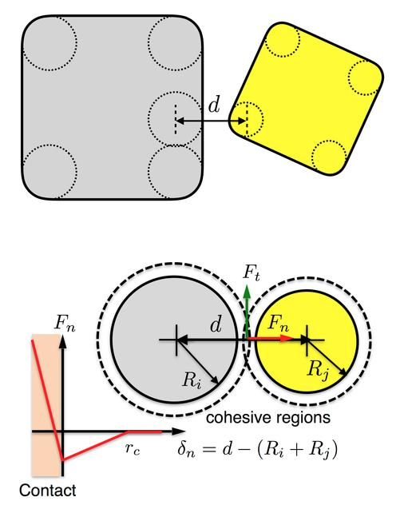

.. index:: pair_style body/rounded/polyhedron
.. index:: pair_style body/rounded/polyhedron/omp

pair_style body/rounded/polyhedron command
==========================================

Accelerator Variants: *body/rounded/polyhedron/omp*

Syntax
""""""

.. code-block:: LAMMPS

   pair_style body/rounded/polyhedron c_n c_t mu delta_ua cutoff keyword

.. parsed-literal::

   c_n = normal damping coefficient
   c_t = tangential damping coefficient
   mu = normal friction coefficient during gross sliding
   delta_ua = multiple contact scaling factor
   cutoff = global separation cutoff for interactions (distance units), see below for definition
   zero or more keywords may be appended
   keyword = *history*
     *history* = keep track of the tangential deformation at the contacts (no value)

Examples
""""""""

.. code-block:: LAMMPS

   pair_style body/rounded/polyhedron 20.0 5.0 0.0 1.0 0.5
   pair_coeff * * 100.0 1.0
   pair_coeff 1 1 100.0 1.0

   pair_style body/rounded/polyhedron 20.0 5.0 0.5 1.0 0.5 history
   pair_coeff * * 100.0 1.0 30.0

Description
"""""""""""

Style *body/rounded/polyhedron* is for use with 3d models of body
particles of style *rounded/polyhedron*\ .  It calculates pairwise
body/body interactions which can include body particles modeled as
1-vertex spheres with a specified diameter.  See the
:doc:`Howto body <Howto_body>` page for more details on using body
rounded/polyhedron particles.

This pairwise interaction between the rounded polyhedra is described
in :ref:`Wang <pair-Wang>`, where a polyhedron does not have sharp corners
and edges, but is rounded at its vertices and edges by spheres
centered on each vertex with a specified diameter.  The edges of the
polyhedron are defined between pairs of adjacent vertices.  Its faces
are defined by a loop of edges.  The sphere diameter for each polyhedron
is specified in the data file read by the :doc:`read data <read_data>`
command.  This is a discrete element model (DEM) which allows for
multiple contact points.

Note that when two particles interact, the effective surface of each
polyhedron particle is displaced outward from each of its vertices,
edges, and faces by half its sphere diameter.  The interaction forces
and energies between two particles are defined with respect to the
separation of their respective rounded surfaces, not by the separation
of the vertices, edges, and faces themselves.

This means that the specified cutoff in the pair_style command is the
cutoff distance, :math:`r_c`, for the surface separation, :math:`\delta_n` (see figure
below).  This is the distance at which two particles no longer
interact.  If :math:`r_c` is specified as 0.0, then it is a contact-only
interaction.  I.e. the two particles must overlap in order to exert a
repulsive force on each other.  If :math:`r_c > 0.0`, then the force between
two particles will be attractive for surface separations from 0 to
:math:`r_c`, and repulsive once the particles overlap.

Note that unlike for other pair styles, the specified cutoff is not
the distance between the centers of two particles at which they stop
interacting.  This center-to-center distance depends on the shape and
size of the two particles and their relative orientation.  LAMMPS
takes that into account when computing the surface separation distance
and applying the :math:`r_c` cutoff.

The forces between vertex-vertex, vertex-edge, vertex-face, edge-edge,
and edge-face overlaps are given by:

.. math::

   F_n &= \begin{cases}
          -k_n \delta_n - j_a k_{na} (r_c - \delta_n) - c_n v_n  &  \delta_n \le 0 \\
          -k_{na} (r_c - \delta_n)                                &  0 < \delta_n \le r_c \\
          0                                                       & \delta_n > r_c \\
          \end{cases} \\
   F_t &= \begin{cases}
          - \min(\mu k_n |\delta_n|, c_t |v_t|) \frac{v_t}{|v_t|} - c_t v_t & \delta_n \le 0 \\
          0                          & \delta_n > 0
          \end{cases}

Here, positive values of :math:`F_n` are repulsive.  The cohesive force
:math:`k_{na} (r_c - \delta_n)` grows with the overlap of the cohesive
regions of the two surfaces, also when the surfaces deform.  When two
particles touch at multiple contact points, the cohesive force at the
contacts is scaled by the factor :math:`j_a \ge 1`, which grows with the
area of the contact region (see *A_ua*), following
:ref:`Wang <pair-Wang>`.  The elastic force :math:`k_n \delta_n` is not
scaled.  The damping forces act at each
contact, while there is a single friction force per pair of particles,
at the contact with the largest overlap times its weight (see below for
the weights and the *history* keyword).  The damping and friction forces
act at the contact point between the rounded surfaces and depend on the
relative velocity of the two particles at that point, including their
rotation, so that they also exert torques, e.g. to make spheres roll.  Following :ref:`Wang
<pair-Wang>`, a vertex of one particle interacts with a face of the other
particle if its projection onto the face lies inside the face, else with
the nearest edge if its projection onto that edge lies inside the edge,
else with the nearest vertex, where each vertex has at most one such
interaction.  In addition, the edges of the two particles interact with
each other, which takes precedence over the interaction of a vertex at
the end of an edge.  A vertex interacts with an edge or a vertex only if
no edge or face next to either of them is closer to the other particle
along the line between the two, else the contact is represented by the
interactions of that edge or face.  Two parallel edges do not interact
as edges, since the ends of their overlap are vertices, which interact
instead.  A sphere touches a polyhedron at a single point, the point of
the polyhedron nearest to the center of the sphere, which can lie on a
face, an edge, or a vertex.  When the overlap exceeds the contact
distance, a vertex, or the center of a sphere, that has penetrated the
other particle is pushed out through the face nearest to it, and two
edges that have crossed each other are pushed apart along their common
normal, so that the repulsion keeps growing with the overlap.

Two nearly parallel faces touch over the region where they overlap,
which the contacts represent by its corners: the vertices of either face
inside the other face, and the crossings of their edges.  The number of
corners changes, e.g. when a vertex crosses an edge of the other face and
two crossings replace it, or when one face is rotated slightly against
the other, which adds four crossings near the middle of the edges.  Each
such contact would add a full contact force, so the forces would jump.
Therefore, the region of overlap of two faces within about 2.5 degrees of
parallel is determined as a polygon in the plane halfway between the
faces.  Each of its corners interacts like the vertex there with the other
face, or like the two edges crossing there, with a weight of its exterior
angle divided by :math:`2 \pi / N`, where :math:`N` is the larger number
of vertices of the two faces.  Since the
exterior angles of a polygon add up to :math:`2 \pi`, the weights always
add up to :math:`N`, a corner where the region hardly turns has a small
weight, and the corners of a face inside a face of the same shape have a
weight of one each, as in :ref:`Wang <pair-Wang>`.  Between 2.5 and 5
degrees, as the region gets narrower than the contact distance, and as
the faces penetrate each other by more than the contact distance, the
region fades out, and the individual contacts of the vertices and edges
take over.  Similarly, the crossing of two edges within 5 degrees of
parallel has a reduced weight, which vanishes for parallel edges, while
the contacts at the ends of their overlap keep the remaining weight.
These weights also apply to the damping, the friction, the energy, and
the contact area of the scaling factor :math:`j_a`.  This deviates from
:ref:`Wang <pair-Wang>`, e.g. two faces of a tetrahedron and a cube in
contact interact at up to four corners with a total weight of four,
instead of at each corner of the region of overlap with a weight of one,
and the weights change as the particles move, so that the forces do not
derive exactly from the energy.

In :ref:`Wang <pair-Wang>`, the tangential friction force between two
particles that are in contact is modeled differently prior to gross
sliding (i.e. static friction) and during gross-sliding (kinetic
friction).  The latter takes place when the tangential deformation
exceeds the Coulomb frictional limit.  Unless the *history* keyword is
used (see below), we do not take into account frictional history, i.e.
we do not keep track of how many time steps the two particles have been
in contact nor calculate the tangential deformation.  Instead, we assume
that gross sliding takes place as soon as two particles are in
contact.

.. versionchanged:: 30Sep2026

The friction term in :math:`F_t` acts in the tangential direction,
opposite to the tangential relative velocity :math:`v_t` at the contact
point, with a magnitude of :math:`\mu` times the elastic normal force
:math:`k_n |\delta_n|`, but at most :math:`c_t |v_t|`.  This limit lets
the friction force vanish smoothly as the sliding stops, instead of
reversing the sliding direction within a time step, and implies that
the friction term requires :math:`c_t > 0`.  Previously, the friction
term was applied along the normal direction at every contact and thus
only increased the normal repulsion.  Also, the scaling factor
:math:`j_a` now applies only to the cohesive force as in the reference
model, instead of to the whole normal force, and the cohesive force keeps
growing when the surfaces deform, instead of staying constant.
The damping and friction forces now act at the contact point between the
rounded surfaces, instead of at the vertices, and the friction force now
also applies to spheres.
Contacts between a vertex and an edge or between two vertices are now
detected, both triangles of a quadrilateral face are tested for edges
crossing the face, and the cohesive force is also scaled for two contact
points.  A vertex no longer interacts with an edge or a vertex when an
edge or face next to them is closer, and two parallel edges no longer
interact with each other at a single point in the middle or at an end
of their overlap.  Previously, edges within about 2.6 degrees of each
other were treated as parallel.  These contacts pushed particles resting
with a face on each other sideways and made them rotate, and made the
forces jump as the particles moved.  A sphere now also interacts with the
vertices of a polyhedron, instead of passing through its corners, and
interacts only once with a polyhedron, instead of with both a face and
the edges of that face near its boundary.  The contacts of nearly parallel
faces and edges are weighted as described above, so that the forces no
longer jump as a particle resting on a face is rotated or moved, and a
vertex interacts only with the face nearest to it.  The energy and the
damping of two contacts at the same point are counted once, as their
force.  A vertex or a sphere that has penetrated the other particle, and
two edges that have crossed each other, are now pushed out instead of
further in, and a rod lying on a face no longer falls through it.

.. versionadded:: 30Sep2026

With the *history* keyword, the friction force is instead that of a
tangential spring, which also acts prior to gross sliding.  The
tangential deformation :math:`\xi` of each pair of particles in contact
is accumulated from their tangential relative velocity,
:math:`\xi \leftarrow \xi + v_t \Delta t`, and the friction force is

.. math::

   F_t = -k_t \xi - c_t v_t

with a magnitude of the spring force :math:`k_t |\xi|` of at most
:math:`\mu \sum k_n |\delta_n|`, the sum of the elastic normal forces
of all contacts of the pair.  Once the spring force exceeds this limit,
the particles slide and :math:`\xi` is reduced accordingly.  There is
still a single friction force per pair of particles, but it acts at the
average of the contact points of the pair, and :math:`v_t` and the
contact normal are averages over the contacts as well, all weighted by
the elastic normal forces of the contacts.  This deviates from
:ref:`Wang <pair-Wang>`, where the friction force acts at the contact
with the largest overlap.  With that choice, the friction force jumps
between contacts whenever the contact with the largest overlap changes,
so that e.g. a particle resting with a face on another particle under
a sideways load keeps rocking instead of coming to rest.  Since the
contact normal changes as the particles move and rotate,
:math:`\xi` is rotated into the current tangent plane at each time
step, keeping its magnitude, following Eq. 17 of
:ref:`Luding <pair-body-polyhedron-Luding>`.  The tangential
deformation is reset to zero when the particles are no longer in
contact.  As in :doc:`pair_style gran/hooke/history
<pair_gran>`, the tangential deformations are stored by an internal
fix NEIGH_HISTORY.  The damping forces are unchanged.  This extends the model of :ref:`Wang <pair-Wang>` and makes
static packings of particles with friction possible.  The input script
*in.heap3d* in the *examples/body* directory demonstrates this: cubes
and tetrahedra poured onto a floor, with the *history* keyword also used
for :doc:`fix wall/body/polyhedron <fix_wall_body_polyhedron>`, settle
into a heap that stays at rest when gravity is tilted by 20 degrees.

The following coefficients must be defined for each pair of atom types
via the :doc:`pair_coeff <pair_coeff>` command as in the examples above,
or in the data file read by the :doc:`read_data <read_data>` command:

* :math:`k_n` (energy/distance\^2 units)
* :math:`k_{na}` (energy/distance\^2 units)
* :math:`k_t` (energy/distance\^2 units) (optional)

Effectively, :math:`k_n - k_{na}` and :math:`k_{na}` are the magnitudes
of the slopes of the lines in the plot above for force versus surface
separation, for :math:`\delta_n < 0` and :math:`0 < \delta_n < r_c`
respectively.  The tangential stiffness :math:`k_t` is used only with
the *history* keyword.  If it is not specified, it is set to
:math:`\frac{2}{7} k_n` as in :doc:`pair_style gran/hooke/history
<pair_gran>`.

----------

.. include:: accel_styles.rst

----------

Mixing, shift, table, tail correction, restart, rRESPA info
"""""""""""""""""""""""""""""""""""""""""""""""""""""""""""

This pair style does not support the :doc:`pair_modify <pair_modify>`
mix, shift, table, and tail options.

.. note::

   The forces of this pair style do not conserve the total energy, even
   without damping and friction (*c_n* = *c_t* = *mu* = 0).  This is a
   property of the model of :ref:`Wang <pair-Wang>` as implemented
   here:

   * The contact forces are scaled up with the estimated area of the
     contact region (controlled by *A_ua*), but no corresponding energy
     is defined.
   * The elastic forces are applied only once for contacts at (nearly)
     the same place, and the set of contacts between two particles
     changes abruptly as they move, which changes the forces
     discontinuously.  With cohesion (:math:`k_{na} > 0`), the energy
     of a contact does not vanish when the surfaces just touch, so that
     these changes also change the energy.
   * Each vertex interacts with at most one face, edge, or vertex of the
     other particle, so that a new interaction can appear abruptly with a
     finite overlap when the vertex moves from the region of one of them
     to another.
   * The reported pair energy includes the interactions at all contacts,
     also those that do not receive an elastic force by the rules above.
     While such contacts exist, the reported energy does not match the
     applied forces.

   The damping and friction forces dissipate energy as intended.  The
   quantities described next can be used to check the energy balance of
   a simulation.

.. versionadded:: 30Sep2026

This pair style computes two extra quantities that can be accessed by
the :doc:`compute pair <compute_pair>` command, as elements 1 and 2 of
its global vector.  They are the accumulated work (energy units) done
since the pair style was defined by two kinds of forces that do not
derive from the reported pair energy:

#. the part of the contact forces added by their scaling with the
   contact size (controlled by *A_ua*),
#. the damping and friction forces (controlled by *c_n*, *c_t*, and *mu*),
   including the tangential spring with the *history* keyword.

The first one exists because the model scales the contact forces but not
the energy.  The kinetic plus potential energy minus these two
quantities stays constant during a time integration with :doc:`fix
nve/body <fix_nve_body>`, up to the time integration error and to the
changes of the set of contacts between two particles, which the model
treats as discontinuous.  The work is not accumulated during an
:doc:`energy minimization <minimize>`.  Note that the
kinetic energy must include the rotational energy of the particles,
e.g. via :doc:`compute temp/body <compute_temp_body>` with 6 degrees
of freedom per particle as in the example below, while the thermo
keyword *ke* includes only the translational part.

.. code-block:: LAMMPS

   compute wp all pair body/rounded/polyhedron
   compute tb all temp/body
   compute_modify tb extra/dof 0
   compute pe all pe
   variable etot equal c_tb*6*count(all)/2+c_pe
   variable ebal equal v_etot-c_wp[1]-c_wp[2]

This pair style does not write its information to :doc:`binary restart files <restart>`.
Thus, you need to re-specify the pair_style and pair_coeff
commands in an input script that reads a restart file.  With the
*history* keyword, the tangential deformations at the contacts are
written to the restart file and are used again when the pair style is
re-specified with the *history* keyword.

This pair style can only be used via the *pair* keyword of the
:doc:`run_style respa <run_style>` command.  It does not support the
*inner*, *middle*, *outer* keywords.

Restrictions
""""""""""""

These pair styles are part of the BODY package.  They are only enabled
if LAMMPS was built with that package.  See the :doc:`Build package <Build_package>` page for more info.

This pair style requires the :doc:`newton <newton>` setting to be "on"
for pair interactions.

Related commands
""""""""""""""""

:doc:`pair_coeff <pair_coeff>`

Default
"""""""

The *history* keyword is not used, and :math:`k_t = \frac{2}{7} k_n`.

.. _pair-Wang:

**(Wang)** J. Wang, H. S. Yu, P. A. Langston, F. Y. Fraige, Granular
Matter, 13, 1 (2011).

.. _pair-body-polyhedron-Luding:

**(Luding)** S. Luding, Cohesive, frictional powders: contact models for
tension, Granular Matter, 10, 235 (2008).
