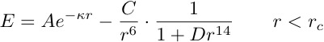
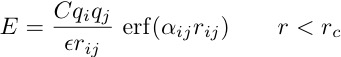

.. index:: pair\_style buck6d/coul/gauss/dsf

pair\_style buck6d/coul/gauss/dsf command
=========================================

pair\_style buck6d/coul/gauss/long command
==========================================

Syntax
""""""

.. parsed-literal::

   pair_style style args

* style = *buck6d/coul/gauss/dsf* or *buck6d/coul/gauss/long*
* args = list of arguments for a particular style

.. parsed-literal::

     *buck6d/coul/gauss/dsf* args = smooth cutoff (cutoff2)
       smooth  = smoothing onset within Buckingham cutoff (ratio)
       cutoff  = global cutoff for Buckingham (and Coulombic if only 1 arg) (distance units)
       cutoff2 = global cutoff for Coulombic (optional) (distance units)
     *buck6d/coul/gauss/long* args = smooth smooth2 cutoff (cutoff2)
       smooth   = smoothing onset within Buckingham cutoff (ratio)
       smooth2  = smoothing onset within Coulombic cutoff (ratio)
       cutoff   = global cutoff for Buckingham (and Coulombic if only 1 arg) (distance units)
       cutoff2  = global cutoff for Coulombic (optional) (distance units)

Examples
""""""""

.. parsed-literal::

   pair_style buck6d/coul/gauss/dsf    0.9000    12.0000
   pair_coeff 1  1  1030.  3.061  457.179  4.521  0.608

   pair_style buck6d/coul/gauss/long   0.9000  1.0000  12.0000
   pair_coeff 1  1  1030.  3.061  457.179  4.521  0.608

Description
"""""""""""

The *buck6d/coul/gauss* styles evaluate vdW and Coulomb
interactions following the MOF-FF force field after
:ref:`(Schmid) <Schmid>`. The vdW term of the *buck6d* styles
computes a dispersion damped Buckingham potential:

where A and C are a force constant, kappa is an ionic-pair dependent
reciprocal length parameter, D is a dispersion correction parameter,
and the cutoff Rc truncates the interaction distance.
The first term in the potential corresponds to the Buckingham
repulsion term and the second term to the dispersion attraction with
a damping correction analog to the Grimme correction used in DFT.
The latter corrects for artifacts occurring at short distances which
become an issue for soft vdW potentials.

The *buck6d* styles include a smoothing function which is invoked
according to the global smoothing parameter within the specified
cutoff.  Hereby a parameter of i.e. 0.9 invokes the smoothing
within 90% of the cutoff.  No smoothing is applied at a value
of 1.0. For the *gauss/dsf* style this smoothing is only applicable
for the dispersion damped Buckingham potential. For the *gauss/long*
styles the smoothing function can also be invoked for the real
space coulomb interactions which enforce continuous energies and
forces at the cutoff.

Both styles *buck6d/coul/gauss/dsf* and *buck6d/coul/gauss/long*
evaluate a Coulomb potential using spherical Gaussian type charge
distributions which effectively dampen electrostatic interactions
for high charges at close distances.  The electrostatic potential
is thus evaluated as:

where C is an energy-conversion constant, Qi and Qj are the
charges on the 2 atoms, epsilon is the dielectric constant which
can be set by the :doc:`dielectric <dielectric>` command, alpha is
ion pair dependent damping parameter and erf() is the error-function.
The cutoff Rc truncates the interaction distance.

The style *buck6d/coul/gauss/dsf* computes the Coulomb interaction
via the damped shifted force model described in :ref:`(Fennell) <Fennell>`
approximating an Ewald sum similar to the :doc:`pair coul/dsf <pair_coul>`
styles. In *buck6d/coul/gauss/long* an additional damping factor is
applied to the Coulombic term so it can be used in conjunction with the
:doc:`kspace_style <kspace_style>` command and its *ewald* or *pppm*
options. The Coulombic cutoff in this case separates the real and
reciprocal space evaluation of the Ewald sum.

If one cutoff is specified it is used for both the vdW and Coulomb
terms.  If two cutoffs are specified, the first is used as the cutoff
for the vdW terms, and the second is the cutoff for the Coulombic term.

The following coefficients must be defined for each pair of atoms
types via the :doc:`pair_coeff <pair_coeff>` command as in the examples
above, or in the data file or restart files read by the
:doc:`read_data <read_data>` or :doc:`read_restart <read_restart>`
commands:

* A (energy units)
* rho (distance\^-1 units)
* C (energy-distance\^6 units)
* D (distance\^14 units)
* alpha (distance\^-1 units)
* cutoff (distance units)

The second coefficient, rho, must be greater than zero. The latter
coefficient is optional.  If not specified, the global vdW cutoff
is used.

----------

**Mixing, shift, table, tail correction, restart, rRESPA info**\ :

These pair styles do not support mixing.  Thus, coefficients for all
I,J pairs must be specified explicitly.

These styles do not support the :doc:`pair_modify <pair_modify>` shift
option for the energy. Instead the smoothing function should be applied
by setting the global smoothing parameter to a value < 1.0.

These styles write their information to :doc:`binary restart files <restart>`, so pair\_style and pair\_coeff commands do not need
to be specified in an input script that reads a restart file.

Restrictions
""""""""""""

These styles are part of the USER-MOFFF package.  They are only
enabled if LAMMPS was built with that package.  See the :doc:`Build package <Build_package>` doc page for more info.

Related commands
""""""""""""""""

:doc:`pair_coeff <pair_coeff>`

**Default:** none

.. _Schmid:

.. _Fennell:

**(Schmid)** S. Bureekaew, S. Amirjalayer, M. Tafipolsky, C. Spickermann, T.K. Roy and R. Schmid, Phys. Status Solidi B, 6, 1128 (2013).

**(Fennell)** C. J. Fennell, J. D. Gezelter, J Chem Phys, 124, 234104 (2006).

