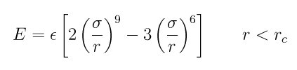

.. index:: pair\_style lj/class2

pair\_style lj/class2 command
=============================

pair\_style lj/class2/gpu command
=================================

pair\_style lj/class2/kk command
================================

pair\_style lj/class2/omp command
=================================

pair\_style lj/class2/coul/cut command
======================================

pair\_style lj/class2/coul/cut/kk command
=========================================

pair\_style lj/class2/coul/cut/omp command
==========================================

pair\_style lj/class2/coul/long command
=======================================

pair\_style lj/class2/coul/long/gpu command
===========================================

pair\_style lj/class2/coul/long/kk command
==========================================

pair\_style lj/class2/coul/long/omp command
===========================================

Syntax
""""""

.. parsed-literal::

   pair_style style args

* style = *lj/class2* or *lj/class2/coul/cut* or *lj/class2/coul/long*
* args = list of arguments for a particular style

.. parsed-literal::

     *lj/class2* args = cutoff
       cutoff = global cutoff for class 2 interactions (distance units)
     *lj/class2/coul/cut* args = cutoff (cutoff2)
       cutoff = global cutoff for class 2 (and Coulombic if only 1 arg) (distance units)
       cutoff2 = global cutoff for Coulombic (optional) (distance units)
     *lj/class2/coul/long* args = cutoff (cutoff2)
       cutoff = global cutoff for class 2 (and Coulombic if only 1 arg) (distance units)
       cutoff2 = global cutoff for Coulombic (optional) (distance units)

Examples
""""""""

.. parsed-literal::

   pair_style lj/class2 10.0
   pair_coeff \* \* 100.0 2.5
   pair_coeff 1 2\* 100.0 2.5 9.0

   pair_style lj/class2/coul/cut 10.0
   pair_style lj/class2/coul/cut 10.0 8.0
   pair_coeff \* \* 100.0 3.0
   pair_coeff 1 1 100.0 3.5 9.0
   pair_coeff 1 1 100.0 3.5 9.0 9.0

   pair_style lj/class2/coul/long 10.0
   pair_style lj/class2/coul/long 10.0 8.0
   pair_coeff \* \* 100.0 3.0
   pair_coeff 1 1 100.0 3.5 9.0

Description
"""""""""""

The *lj/class2* styles compute a 6/9 Lennard-Jones potential given by

Rc is the cutoff.

The *lj/class2/coul/cut* and *lj/class2/coul/long* styles add a
Coulombic term as described for the :doc:`lj/cut <pair_lj>` pair styles.

See :ref:`(Sun) <pair-Sun>` for a description of the COMPASS class2 force field.

The following coefficients must be defined for each pair of atoms
types via the :doc:`pair_coeff <pair_coeff>` command as in the examples
above, or in the data file or restart files read by the
:doc:`read_data <read_data>` or :doc:`read_restart <read_restart>`
commands, or by mixing as described below:

* epsilon (energy units)
* sigma (distance units)
* cutoff1 (distance units)
* cutoff2 (distance units)

The latter 2 coefficients are optional.  If not specified, the global
class 2 and Coulombic cutoffs are used.  If only one cutoff is
specified, it is used as the cutoff for both class 2 and Coulombic
interactions for this type pair.  If both coefficients are specified,
they are used as the class 2 and Coulombic cutoffs for this type pair.
You cannot specify 2 cutoffs for style *lj/class2*\ , since it has no
Coulombic terms.

For *lj/class2/coul/long* only the class 2 cutoff can be specified
since a Coulombic cutoff cannot be specified for an individual I,J
type pair.  All type pairs use the same global Coulombic cutoff
specified in the pair\_style command.

----------

If the pair\_coeff command is not used to define coefficients for a
particular I != J type pair, the mixing rule for epsilon and sigma for
all class2 potentials is to use the *sixthpower* formulas documented
by the :doc:`pair_modify <pair_modify>` command.  The :doc:`pair_modify mix <pair_modify>` setting is thus ignored for class2 potentials
for epsilon and sigma.  However it is still followed for mixing the
cutoff distance.

----------

A version of these styles with a soft core, *lj/cut/soft*\ , suitable for use in
free energy calculations, is part of the USER-FEP package and is documented with
the :doc:`pair_style */soft <pair_fep_soft>` styles. The version with soft core is
only available if LAMMPS was built with that package. See the :doc:`Build package <Build_package>` doc page for more info.

----------

Styles with a *gpu*\ , *intel*\ , *kk*\ , *omp*\ , or *opt* suffix are
functionally the same as the corresponding style without the suffix.
They have been optimized to run faster, depending on your available
hardware, as discussed on the :doc:`Speed packages <Speed_packages>` doc
page.  The accelerated styles take the same arguments and should
produce the same results, except for round-off and precision issues.

These accelerated styles are part of the GPU, USER-INTEL, KOKKOS,
USER-OMP and OPT packages, respectively.  They are only enabled if
LAMMPS was built with those packages.  See the :doc:`Build package <Build_package>` doc page for more info.

You can specify the accelerated styles explicitly in your input script
by including their suffix, or you can use the :doc:`-suffix command-line switch <Run_options>` when you invoke LAMMPS, or you can use the
:doc:`suffix <suffix>` command in your input script.

See the :doc:`Speed packages <Speed_packages>` doc page for more
instructions on how to use the accelerated styles effectively.

----------

**Mixing, shift, table, tail correction, restart, rRESPA info**\ :

For atom type pairs I,J and I != J, the epsilon and sigma coefficients
and cutoff distance for all of the lj/class2 pair styles can be mixed.
Epsilon and sigma are always mixed with the value *sixthpower*\ .  The
cutoff distance is mixed by whatever option is set by the pair\_modify
command (default = geometric).  See the "pair\_modify" command for
details.

All of the lj/class2 pair styles support the
:doc:`pair_modify <pair_modify>` shift option for the energy of the
Lennard-Jones portion of the pair interaction.

The *lj/class2/coul/long* pair style does not support the
:doc:`pair_modify <pair_modify>` table option since a tabulation
capability has not yet been added to this potential.

All of the lj/class2 pair styles support the
:doc:`pair_modify <pair_modify>` tail option for adding a long-range
tail correction to the energy and pressure of the Lennard-Jones
portion of the pair interaction.

All of the lj/class2 pair styles write their information to :doc:`binary restart files <restart>`, so pair\_style and pair\_coeff commands do
not need to be specified in an input script that reads a restart file.

Only the *lj/class2* and *lj/class2/coul/long* pair styles support the use of the
*inner*\ , *middle*\ , and *outer* keywords of the :doc:`run_style respa <run_style>` command, meaning the pairwise forces can be
partitioned by distance at different levels of the rRESPA hierarchy.
The other styles only support the *pair* keyword of run\_style respa.
See the :doc:`run_style <run_style>` command for details.

Restrictions
""""""""""""

These styles are part of the CLASS2 package.  They are only enabled if
LAMMPS was built with that package.  See the :doc:`Build package <Build_package>` doc page for more info.

Related commands
""""""""""""""""

:doc:`pair_coeff <pair_coeff>`, :doc:`pair_style */soft <pair_fep_soft>`

**Default:** none

----------

.. _pair-Sun:

**(Sun)** Sun, J Phys Chem B 102, 7338-7364 (1998).
