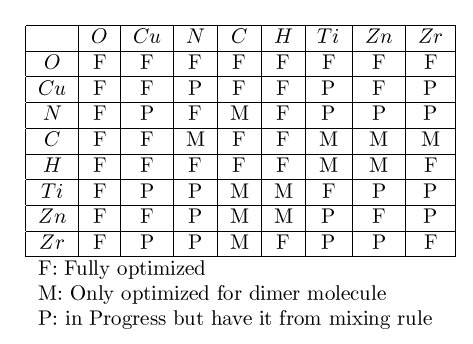

.. index:: pair\_style comb

pair\_style comb command
========================

pair\_style comb/omp command
============================

pair\_style comb3 command
=========================

Syntax
""""""

.. parsed-literal::

   pair_style comb
   pair_style comb3 keyword

   keyword = *polar*
     *polar* value = *polar_on* or *polar_off* = whether or not to include atomic polarization

Examples
""""""""

.. parsed-literal::

   pair_style comb
   pair_coeff \* \* ../potentials/ffield.comb Si
   pair_coeff \* \* ../potentials/ffield.comb Hf Si O

   pair_style comb3 polar_off
   pair_coeff \* \* ../potentials/ffield.comb3 O Cu N C O

Description
"""""""""""

Style *comb* computes the second-generation variable charge COMB
(Charge-Optimized Many-Body) potential.  Style *comb3* computes the
third-generation COMB potential.  These COMB potentials are described
in :ref:`(COMB) <COMB>` and :ref:`(COMB3) <COMB3>`.  Briefly, the total energy
*ET* of a system of atoms is given by

.. image:: Eqs/pair_comb1.jpg
   :align: center

where *Eiself* is the self-energy of atom *i*
(including atomic ionization energies and electron affinities),
*Eijshort* is the bond-order potential between
atoms *i* and *j*\ ,
*EijCoul* is the Coulomb interactions,
*Epolar* is the polarization term for organic systems
(style *comb3* only),
*EvdW* is the van der Waals energy (style *comb3* only),
*Ebarr* is a charge barrier function, and
*Ecorr* are angular correction terms.

The COMB potentials (styles *comb* and *comb3*\ ) are variable charge
potentials.  The equilibrium charge on each atom is calculated by the
electronegativity equalization (QEq) method.  See :ref:`Rick <Rick2>` for
further details.  This is implemented by the :doc:`fix qeq/comb <fix_qeq_comb>` command, which should normally be
specified in the input script when running a model with the COMB
potential.  The :doc:`fix qeq/comb <fix_qeq_comb>` command has options
that determine how often charge equilibration is performed, its
convergence criterion, and which atoms are included in the
calculation.

Only a single pair\_coeff command is used with the *comb* and *comb3*
styles which specifies the COMB potential file with parameters for all
needed elements.  These are mapped to LAMMPS atom types by specifying
N additional arguments after the potential file in the pair\_coeff
command, where N is the number of LAMMPS atom types.

For example, if your LAMMPS simulation of a Si/SiO2/
HfO2 interface has 4 atom types, and you want the 1st and
last to be Si, the 2nd to be Hf, and the 3rd to be O, and you would
use the following pair\_coeff command:

.. parsed-literal::

   pair_coeff \* \* ../potentials/ffield.comb Si Hf O Si

The first two arguments must be \* \* so as to span all LAMMPS atom
types.  The first and last Si arguments map LAMMPS atom types 1 and 4
to the Si element in the *ffield.comb* file.  The second Hf argument
maps LAMMPS atom type 2 to the Hf element, and the third O argument
maps LAMMPS atom type 3 to the O element in the potential file.  If a
mapping value is specified as NULL, the mapping is not performed.
This can be used when a *comb* potential is used as part of the
*hybrid* pair style.  The NULL values are placeholders for atom types
that will be used with other potentials.

For style *comb*\ , the provided potential file *ffield.comb* contains
all currently-available 2nd generation COMB parameterizations: for Si,
Cu, Hf, Ti, O, their oxides and Zr, Zn and U metals.  For style
*comb3*\ , the potential file *ffield.comb3* contains all
currently-available 3rd generation COMB parameterizations: O, Cu, N, C,
H, Ti, Zn and Zr.  The status of the optimization of the compounds, for
example Cu2O, TiN and hydrocarbons, are given in the
following table:

For style *comb3*\ , in addition to ffield.comb3, a special parameter
file, *lib.comb3*\ , that is exclusively used for C/O/H systems, will be
automatically loaded if carbon atom is detected in LAMMPS input
structure.  This file must be in your working directory or in the
directory pointed to by the environment variable LAMMPS\_POTENTIALS, as
described on the :doc:`pair_coeff <pair_coeff>` command doc page.

Keyword *polar* indicates whether the force field includes
the atomic polarization.  Since the equilibration of the polarization
has not yet been implemented, it can only set polar\_off at present.

.. note::

   You can not use potential file *ffield.comb* with style *comb3*\ ,
   nor file *ffield.comb3* with style *comb*\ .

----------

Styles with a *gpu*\ , *intel*\ , *kk*\ , *omp*\ , or *opt* suffix are
functionally the same as the corresponding style without the suffix.
They have been optimized to run faster, depending on your available
hardware, as discussed on the :doc:`Speed packages <Speed_packages>` doc
page.  The accelerated styles take the same arguments and should
produce the same results, except for round-off and precision issues.

These accelerated styles are part of the GPU, USER-INTEL, KOKKOS,
USER-OMP and OPT packages, respectively.  They are only enabled if
LAMMPS was built with those packages.  See the :doc:`Build package <Build_package>` doc page for more info.

You can specify the accelerated styles explicitly in your input script
by including their suffix, or you can use the :doc:`-suffix command-line switch <Run_options>` when you invoke LAMMPS, or you can use the
:doc:`suffix <suffix>` command in your input script.

See the :doc:`Speed packages <Speed_packages>` doc page for more
instructions on how to use the accelerated styles effectively.

----------

**Mixing, shift, table, tail correction, restart, rRESPA info**\ :

For atom type pairs I,J and I != J, where types I and J correspond to
two different element types, mixing is performed by LAMMPS as
described above from values in the potential file.

These pair styles does not support the :doc:`pair_modify <pair_modify>`
shift, table, and tail options.

These pair styles do not write its information to :doc:`binary restart files <restart>`, since it is stored in potential files.  Thus, you
need to re-specify the pair\_style, pair\_coeff, and :doc:`fix qeq/comb <fix_qeq_comb>` commands in an input script that reads a
restart file.

These pair styles can only be used via the *pair* keyword of the
:doc:`run_style respa <run_style>` command.  It does not support the
*inner*\ , *middle*\ , *outer* keywords.

----------

Restrictions
""""""""""""

These pair styles are part of the MANYBODY package.  It is only
enabled if LAMMPS was built with that package.  See the :doc:`Build package <Build_package>` doc page for more info.

These pair styles requires the :doc:`newton <newton>` setting to be "on"
for pair interactions.

The COMB potentials in the *ffield.comb* and *ffield.comb3* files provided
with LAMMPS (see the potentials directory) are parameterized for metal
:doc:`units <units>`.  You can use the COMB potential with any LAMMPS
units, but you would need to create your own COMB potential file with
coefficients listed in the appropriate units if your simulation
doesn't use "metal" units.

Related commands
""""""""""""""""

:doc:`pair_style <pair_style>`, :doc:`pair_coeff <pair_coeff>`,
:doc:`fix qeq/comb <fix_qeq_comb>`

**Default:** none

----------

.. _COMB:

**(COMB)**  T.-R. Shan, B. D. Devine, T. W. Kemper, S. B. Sinnott, and
S. R. Phillpot, Phys. Rev. B 81, 125328 (2010)

.. _COMB3:

**(COMB3)** T. Liang, T.-R. Shan, Y.-T. Cheng, B. D. Devine, M. Noordhoek,
Y. Li, Z. Lu, S. R. Phillpot, and S. B. Sinnott, Mat. Sci. & Eng: R 74,
255-279 (2013).

.. _Rick2:

**(Rick)** S. W. Rick, S. J. Stuart, B. J. Berne, J Chem Phys 101, 6141
(1994).
