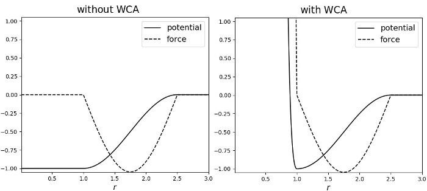

.. index:: pair_style cosine/squared

pair_style cosine/squared command
=================================

Syntax
""""""

.. code-block:: LAMMPS

   pair_style cosine/squared cutoff

* cutoff = global cutoff for cosine-squared interactions (distance units)

.. code-block:: LAMMPS

   pair_coeff i j eps sigma
   pair_coeff i j eps sigma cutoff
   pair_coeff i j eps sigma wca
   pair_coeff i j eps sigma cutoff wca

* i,j = a particle type
* eps = interaction strength, i.e. the depth of the potential minimum (energy units)
* sigma = distance of the potential minimum from 0
* cutoff = the cutoff distance for this pair type, if different from global (distance units)
* wca = if specified a Weeks-Chandler-Andersen potential (with eps strength and minimum at sigma) is added, otherwise not

Examples
""""""""

.. code-block:: LAMMPS

   pair_style cosine/squared 3.0
   pair_coeff * * 1.0 1.3
   pair_coeff 1 3 1.0 1.3 2.0
   pair_coeff 1 3 1.0 1.3 wca
   pair_coeff 1 3 1.0 1.3 2.0 wca

Description
"""""""""""

Style *cosine/squared* computes a potential of the form

.. math::

   E =
   \begin{cases}
   -\epsilon& \quad r < \sigma \\
   -\epsilon\cos\left(\frac{\pi\left(r - \sigma\right)}{2\left(r_c - \sigma\right)}\right)^2&\quad \sigma \leq r < r_c \\
   0& \quad r \geq r_c
   \end{cases}

between two point particles, where (:math:`\sigma, -\epsilon`) is the
location of the (rightmost) minimum of the potential, as explained in
the syntax section above.

This potential was first used in :ref:`(Cooke) <CKD>` for a coarse-grained lipid
membrane model.  It is generally very useful as a non-specific
interaction potential because it is fully adjustable in depth and width
while joining the minimum at (sigma, -epsilon) and zero at (cutoff, 0)
smoothly, requiring no shifting and causing no related artifacts, tail
energy calculations etc. This evidently requires *cutoff* to be larger
than *sigma*\ .

If the *wca* option is used then a Weeks-Chandler-Andersen potential
:ref:`(Weeks) <WCA>` is added to the above specified cosine-squared potential,
specifically the following:

.. math::

 E = \epsilon \left[ \left(\frac{\sigma}{r}\right)^{12} -
                       2\left(\frac{\sigma}{r}\right)^6 + 1\right]
                       , \quad r < \sigma

In this case, and this case only, the :math:`\sigma` parameter can be equal to
*cutoff* (:math:`\sigma =` cutoff) which will result in ONLY the WCA potential
being used (and print a warning), so the minimum will be attained at
(sigma, 0). This is a convenience feature that enables a purely
repulsive potential to be used without a need to define an additional
pair style and use the hybrid styles.

The energy and force of this pair style for parameters epsilon = 1.0,
sigma = 1.0, cutoff = 2.5, with and without the WCA potential, are shown
in the graphs below:

----------

Mixing, shift, table, tail correction, restart, rRESPA info
"""""""""""""""""""""""""""""""""""""""""""""""""""""""""""

Mixing is not supported for this style.

The *shift*, *table* and *tail* options are not relevant for this style.

This pair style writes its information to :doc:`binary restart files <restart>`, so pair_style and pair_coeff commands do not need
to be specified in an input script that reads a restart file.

These pair styles can only be used via the *pair* keyword of the
:doc:`run_style respa <run_style>` command.  They do not support the
*inner*, *middle*, *outer* keywords.

----------

Restrictions
""""""""""""

The *cosine/squared* style is part of the EXTRA-PAIR package. It is only
enabled if LAMMPS is build with that package.  See the :doc:`Build package <Build_package>` page for more info.

Related commands
""""""""""""""""

:doc:`pair_coeff <pair_coeff>`,
:doc:`pair_style lj/cut <pair_lj>`

Default
"""""""

none

.. _CKD:

**(Cooke)** "Cooke, Kremer and Deserno, Phys. Rev. E, 72, 011506 (2005)"

.. _WCA:

**(Weeks)** "Weeks, Chandler and Andersen, J. Chem. Phys., 54, 5237 (1971)"
