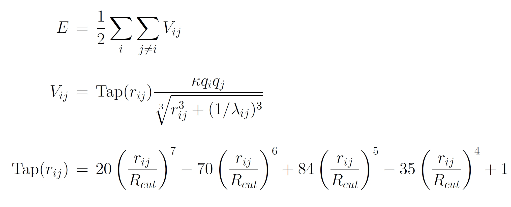

.. index:: pair\_style coul/shield

pair\_style coul/shield command
===============================

Syntax
""""""

.. parsed-literal::

   pair_style coul/shield cutoff tap_flag

* cutoff = global cutoff (distance units)
* tap\_flag = 0/1 to turn off/on the taper function

Examples
""""""""

.. parsed-literal::

   pair_style coul/shield 16.0 1
   pair_coeff 1 2 0.70

Description
"""""""""""

Style *coul/shield* computes a Coulomb interaction for boron and
nitrogen atoms located in different layers of hexagonal boron
nitride. This potential is designed be used in combination with
the pair style :doc:`ilp/graphene/hbn <pair_ilp_graphene_hbn>`

.. note::

   This potential is intended for electrostatic interactions between
   two different layers of hexagonal boron nitride. Therefore, to avoid
   interaction within the same layers, each layer should have a separate
   molecule id and is recommended to use the "full" atom style, so that
   charge and molecule ID information is included.

Where Tap(r\_ij) is the taper function which provides a continuous cutoff
(up to third derivative) for inter-atomic separations larger than r\_c
:ref:`(Leven1) <Leven3>`, :ref:`(Leven2) <Leven4>` and :ref:`(Maaravi) <Maaravi1>`.
Here *lambda* is the shielding parameter that
eliminates the short-range singularity of the classical mono-polar
electrostatic interaction expression :ref:`(Maaravi) <Maaravi1>`.

The shielding parameter *lambda* (1/distance units) must be defined for
each pair of atom types via the :doc:`pair_coeff <pair_coeff>` command as
in the example above, or in the data file or restart files read by the
:doc:`read_data <read_data>` or :doc:`read_restart <read_restart>` commands:

The global cutoff (r\_c) specified in the pair\_style command is used.

----------

**Mixing, shift, table, tail correction, restart, rRESPA info**\ :

This pair style does not support parameter mixing. Coefficients must
be given explicitly for each type of particle pairs.

The :doc:`pair_modify <pair_modify>` *table* option is not relevant
for this pair style.

This pair style does not support the :doc:`pair_modify <pair_modify>`
*tail* option for adding long-range tail corrections to energy and
pressure.

This pair style can only be used via the *pair* keyword of the
:doc:`run_style respa <run_style>` command.  It does not support the
*inner*\ , *middle*\ , *outer* keywords.

Restrictions
""""""""""""

This style is part of the USER-MISC package.  It is only enabled if
LAMMPS was built with that package.  See the :doc:`Build package <Build_package>` doc page for more info.

Related commands
""""""""""""""""

:doc:`pair_coeff <pair_coeff>`
:doc:`pair_style ilp/graphene/hbn <pair_ilp_graphene_hbn>`

**Default:** tap\_flag = 1

----------

.. _Leven3:

**(Leven1)** I. Leven, I. Azuri, L. Kronik and O. Hod, J. Chem. Phys. 140, 104106 (2014).

.. _Leven4:

**(Leven2)** I. Leven et al, J. Chem.Theory Comput. 12, 2896-905 (2016).

.. _Maaravi1:

**(Maaravi)** T. Maaravi et al, J. Phys. Chem. C 121, 22826-22835 (2017).

