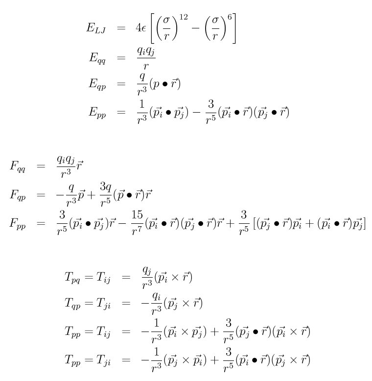
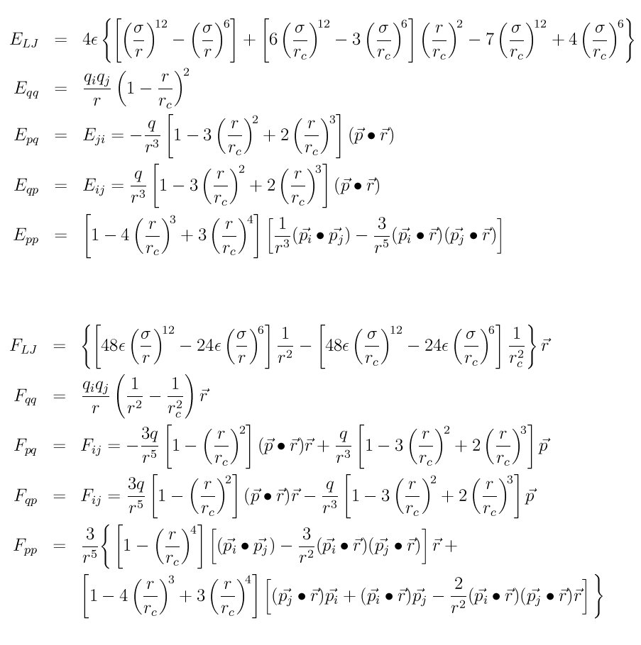
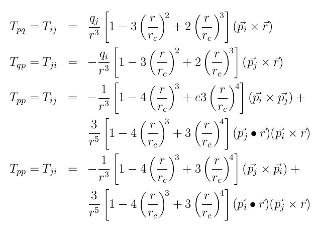

.. index:: pair\_style lj/cut/dipole/cut

pair\_style lj/cut/dipole/cut command
=====================================

pair\_style lj/cut/dipole/cut/gpu command
=========================================

pair\_style lj/cut/dipole/cut/omp command
=========================================

pair\_style lj/sf/dipole/sf command
===================================

pair\_style lj/sf/dipole/sf/gpu command
=======================================

pair\_style lj/sf/dipole/sf/omp command
=======================================

pair\_style lj/cut/dipole/long command
======================================

pair\_style lj/cut/dipole/long/gpu command
==========================================

pair\_style lj/long/dipole/long command
=======================================

Syntax
""""""

.. parsed-literal::

   pair_style lj/cut/dipole/cut cutoff (cutoff2)
   pair_style lj/sf/dipole/sf cutoff (cutoff2)
   pair_style lj/cut/dipole/long cutoff (cutoff2)
   pair_style lj/long/dipole/long flag_lj flag_coul cutoff (cutoff2)

* cutoff = global cutoff LJ (and Coulombic if only 1 arg) (distance units)
* cutoff2 = global cutoff for Coulombic and dipole (optional) (distance units)
* flag\_lj = *long* or *cut* or *off*
  
  .. parsed-literal::
  
       *long* = use long-range damping on dispersion 1/r\^6 term
       *cut* = use a cutoff on dispersion 1/r\^6 term
       *off* = omit disperion 1/r\^6 term entirely

* flag\_coul = *long* or *off*
  
  .. parsed-literal::
  
       *long* = use long-range damping on Coulombic 1/r and point-dipole terms
       *off* = omit Coulombic and point-dipole terms entirely

Examples
""""""""

.. parsed-literal::

   pair_style lj/cut/dipole/cut 10.0
   pair_coeff \* \* 1.0 1.0
   pair_coeff 2 3 1.0 1.0 2.5 4.0

   pair_style lj/sf/dipole/sf 9.0
   pair_coeff \* \* 1.0 1.0
   pair_coeff 2 3 1.0 1.0 2.5 4.0 scale 0.5
   pair_coeff 2 3 1.0 1.0 2.5 4.0

   pair_style lj/cut/dipole/long 10.0
   pair_coeff \* \* 1.0 1.0
   pair_coeff 2 3 1.0 1.0 2.5 4.0

   pair_style lj/long/dipole/long long long 3.5 10.0
   pair_coeff \* \* 1.0 1.0
   pair_coeff 2 3 1.0 1.0 2.5 4.0

Description
"""""""""""

Style *lj/cut/dipole/cut* computes interactions between pairs of particles
that each have a charge and/or a point dipole moment.  In addition to
the usual Lennard-Jones interaction between the particles (Elj) the
charge-charge (Eqq), charge-dipole (Eqp), and dipole-dipole (Epp)
interactions are computed by these formulas for the energy (E), force
(F), and torque (T) between particles I and J.

where qi and qj are the charges on the two particles, pi and pj are
the dipole moment vectors of the two particles, r is their separation
distance, and the vector r = Ri - Rj is the separation vector between
the two particles.  Note that Eqq and Fqq are simply Coulombic energy
and force, Fij = -Fji as symmetric forces, and Tij != -Tji since the
torques do not act symmetrically.  These formulas are discussed in
:ref:`(Allen) <Allen2>` and in :ref:`(Toukmaji) <Toukmaji2>`.

Also note, that in the code, all of these terms (except Elj) have a
C/epsilon prefactor, the same as the Coulombic term in the LJ +
Coulombic pair styles discussed :doc:`here <pair_lj>`.  C is an
energy-conversion constant and epsilon is the dielectric constant
which can be set by the :doc:`dielectric <dielectric>` command.  The
same is true of the equations that follow for other dipole pair
styles.

Style *lj/sf/dipole/sf* computes "shifted-force" interactions between
pairs of particles that each have a charge and/or a point dipole
moment. In general, a shifted-force potential is a (slightly) modified
potential containing extra terms that make both the energy and its
derivative go to zero at the cutoff distance; this removes
(cutoff-related) problems in energy conservation and any numerical
instability in the equations of motion :ref:`(Allen) <Allen2>`. Shifted-force
interactions for the Lennard-Jones (E\_LJ), charge-charge (Eqq),
charge-dipole (Eqp), dipole-charge (Epq) and dipole-dipole (Epp)
potentials are computed by these formulas for the energy (E), force
(F), and torque (T) between particles I and J:

where epsilon and sigma are the standard LJ parameters, r\_c is the
cutoff, qi and qj are the charges on the two particles, pi and pj are
the dipole moment vectors of the two particles, r is their separation
distance, and the vector r = Ri - Rj is the separation vector between
the two particles.  Note that Eqq and Fqq are simply Coulombic energy
and force, Fij = -Fji as symmetric forces, and Tij != -Tji since the
torques do not act symmetrically.  The shifted-force formula for the
Lennard-Jones potential is reported in :ref:`(Stoddard) <Stoddard>`.  The
original (non-shifted) formulas for the electrostatic potentials,
forces and torques can be found in :ref:`(Price) <Price2>`. The shifted-force
electrostatic potentials have been obtained by applying equation 5.13
of :ref:`(Allen) <Allen2>`. The formulas for the corresponding forces and
torques have been obtained by applying the 'chain rule' as in appendix
C.3 of :ref:`(Allen) <Allen2>`.

If one cutoff is specified in the pair\_style command, it is used for
both the LJ and Coulombic (q,p) terms.  If two cutoffs are specified,
they are used as cutoffs for the LJ and Coulombic (q,p) terms
respectively. This pair style also supports an optional *scale* keyword
as part of a pair\_coeff statement, where the interactions can be
scaled according to this factor. This scale factor is also made available
for use with fix adapt.

Style *lj/cut/dipole/long* computes long-range point-dipole
interactions as discussed in :ref:`(Toukmaji) <Toukmaji2>`. Dipole-dipole,
dipole-charge, and charge-charge interactions are all supported, along
with the standard 12/6 Lennard-Jones interactions, which are computed
with a cutoff.  A :doc:`kspace\_style <kspace_style>` must be defined to
use this pair style.  Currently, only :doc:`kspace\_style ewald/disp <kspace_style>` support long-range point-dipole
interactions.

Style *lj/long/dipole/long* also computes point-dipole interactions as
discussed in :ref:`(Toukmaji) <Toukmaji2>`. Long-range dipole-dipole,
dipole-charge, and charge-charge interactions are all supported, along
with the standard 12/6 Lennard-Jones interactions.  LJ interactions
can be cutoff or long-ranged.

For style *lj/long/dipole/long*\ , if *flag\_lj* is set to *long*\ , no
cutoff is used on the LJ 1/r\^6 dispersion term.  The long-range
portion is calculated by using the :doc:`kspace\_style ewald\_disp <kspace_style>` command.  The specified LJ cutoff then
determines which portion of the LJ interactions are computed directly
by the pair potential versus which part is computed in reciprocal
space via the Kspace style.  If *flag\_lj* is set to *cut*\ , the LJ
interactions are simply cutoff, as with :doc:`pair\_style lj/cut <pair_lj>`.  If *flag\_lj* is set to *off*\ , LJ interactions
are not computed at all.

If *flag\_coul* is set to *long*\ , no cutoff is used on the Coulombic or
dipole interactions.  The long-range portion is calculated by using
*ewald\_disp* of the :doc:`kspace\_style <kspace_style>` command. If
*flag\_coul* is set to *off*\ , Coulombic and dipole interactions are not
computed at all.

Atoms with dipole moments should be integrated using the :doc:`fix nve/sphere update dipole <fix_nve_sphere>` or the :doc:`fix nvt/sphere update dipole <fix_nvt_sphere>` command to rotate the
dipole moments.  The *omega* option on the :doc:`fix langevin <fix_langevin>` command can be used to thermostat the
rotational motion.  The :doc:`compute temp/sphere <compute_temp_sphere>`
command can be used to monitor the temperature, since it includes
rotational degrees of freedom.  The :doc:`atom\_style hybrid dipole sphere <atom_style>` command should be used since
it defines the point dipoles and their rotational state.
The magnitude and orientation of the dipole moment for each particle
can be defined by the :doc:`set <set>` command or in the "Atoms" section
of the data file read in by the :doc:`read\_data <read_data>` command.

The following coefficients must be defined for each pair of atoms
types via the :doc:`pair\_coeff <pair_coeff>` command as in the examples
above, or in the data file or restart files read by the
:doc:`read\_data <read_data>` or :doc:`read\_restart <read_restart>`
commands, or by mixing as described below:

* epsilon (energy units)
* sigma (distance units)
* cutoff1 (distance units)
* cutoff2 (distance units)

The latter 2 coefficients are optional.  If not specified, the global
LJ and Coulombic cutoffs specified in the pair\_style command are used.
If only one cutoff is specified, it is used as the cutoff for both LJ
and Coulombic interactions for this type pair.  If both coefficients
are specified, they are used as the LJ and Coulombic cutoffs for this
type pair.

----------

Styles with a *gpu*\ , *intel*\ , *kk*\ , *omp*\ , or *opt* suffix are
functionally the same as the corresponding style without the suffix.
They have been optimized to run faster, depending on your available
hardware, as discussed on the :doc:`Speed packages <Speed_packages>` doc
page.  The accelerated styles take the same arguments and should
produce the same results, except for round-off and precision issues.

These accelerated styles are part of the GPU, USER-INTEL, KOKKOS,
USER-OMP and OPT packages, respectively.  They are only enabled if
LAMMPS was built with those packages.  See the :doc:`Build package <Build_package>` doc page for more info.

You can specify the accelerated styles explicitly in your input script
by including their suffix, or you can use the :doc:`-suffix command-line switch <Run_options>` when you invoke LAMMPS, or you can use the
:doc:`suffix <suffix>` command in your input script.

See the :doc:`Speed packages <Speed_packages>` doc page for more
instructions on how to use the accelerated styles effectively.

----------

**Mixing, shift, table, tail correction, restart, rRESPA info**\ :

For atom type pairs I,J and I != J, the epsilon and sigma coefficients
and cutoff distances for this pair style can be mixed.  The default
mix value is *geometric*\ .  See the "pair\_modify" command for details.

For atom type pairs I,J and I != J, the A, sigma, d1, and d2
coefficients and cutoff distance for this pair style can be mixed.  A
is an energy value mixed like a LJ epsilon.  D1 and d2 are distance
values and are mixed like sigma.  The default mix value is
*geometric*\ .  See the "pair\_modify" command for details.

This pair style does not support the :doc:`pair\_modify <pair_modify>`
shift option for the energy of the Lennard-Jones portion of the pair
interaction; such energy goes to zero at the cutoff by construction.

The :doc:`pair\_modify <pair_modify>` table option is not relevant
for this pair style.

This pair style does not support the :doc:`pair\_modify <pair_modify>`
tail option for adding long-range tail corrections to energy and
pressure.

This pair style writes its information to :doc:`binary restart files <restart>`, so pair\_style and pair\_coeff commands do not need
to be specified in an input script that reads a restart file.

This pair style can only be used via the *pair* keyword of the
:doc:`run\_style respa <run_style>` command.  It does not support the
*inner*\ , *middle*\ , *outer* keywords.

Restrictions
""""""""""""

The *lj/cut/dipole/cut*\ , *lj/cut/dipole/long*\ , and
*lj/long/dipole/long* styles are part of the DIPOLE package.  They are
only enabled if LAMMPS was built with that package.  See the :doc:`Build package <Build_package>` doc page for more info.

The *lj/sf/dipole/sf* style is part of the USER-MISC package.  It is
only enabled if LAMMPS was built with that package.  See the :doc:`Build package <Build_package>` doc page for more info.

Using dipole pair styles with *electron* :doc:`units <units>` is not
currently supported.

Related commands
""""""""""""""""

:doc:`pair\_coeff <pair_coeff>`, :doc:`set <set>`, :doc:`read\_data <read_data>`,
:doc:`fix nve/sphere <fix_nve_sphere>`, :doc:`fix nvt/sphere <fix_nvt_sphere>`

**Default:** none

----------

.. _Allen2:

**(Allen)** Allen and Tildesley, Computer Simulation of Liquids,
Clarendon Press, Oxford, 1987.

.. _Toukmaji2:

**(Toukmaji)** Toukmaji, Sagui, Board, and Darden, J Chem Phys, 113,
10913 (2000).

.. _Stoddard:

**(Stoddard)** Stoddard and Ford, Phys Rev A, 8, 1504 (1973).

.. _Price2:

**(Price)** Price, Stone and Alderton, Mol Phys, 52, 987 (1984).

.. _lws: http://lammps.sandia.gov
.. _ld: Manual.html
.. _lc: Commands_all.html
