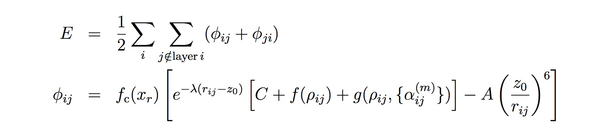

.. index:: pair\_style drip

pair\_style drip command
========================

Syntax
""""""

.. parsed-literal::

   pair_style hybrid/overlay drip [styles ...]

* styles = other styles to be overlayed with drip (optional)

Examples
""""""""

.. parsed-literal::

   pair_style hybrid/overlay drip
   pair_coeff \* \* none
   pair_coeff \* \* drip  C.drip  C

   pair_style hybrid/overlay drip rebo
   pair_coeff \* \* drip  C.drip     C
   pair_coeff \* \* rebo  CH.airebo  C

   pair_style hybrid/overlay drip rebo
   pair_coeff \* \* drip  C.drip     C NULL
   pair_coeff \* \* rebo  CH.airebo  C H

Description
"""""""""""

Style *drip* computes the interlayer interactions of layered materials using
the dihedral-angle-corrected registry-dependent (DRIP) potential as described
in :ref:`(Wen) <Wen2018>`, which is based on the :ref:`(Kolmogorov) <Kolmogorov2005>`
potential and provides an improved prediction for forces.
The total potential energy of a system is

where the *r\^-6* term models the attractive London dispersion,
the exponential term is designed to capture the registry effect due to
overlapping *pi* bonds, and *fc* is a cutoff function.

This potential (DRIP) only provides the interlayer interactions between
graphene layers. So, to perform a realistic simulation, it should be used in
combination with an intralayer potential such as :doc:`REBO <pair_airebo>` and
:doc:`Tersoff <pair_tersoff>`.
To keep the intralayer interactions unaffected, we should avoid applying DRIP
to contribute energy to intralayer interactions. This can be achieved by
assigning different molecular IDs to atoms in different layers, and DRIP is
implemented such that only atoms with different molecular ID can interact with
each other. For this purpose, :doc:`atom style <atom_style>` "molecular" or
"full" has to be used.

On the other way around, :doc:`REBO <pair_airebo>` (:doc:`Tersoff <pair_tersoff>`
or any other potential used to provide the intralayer interactions) should not
interfere with the interlayer interactions described by DRIP. This is typically
automatically achieved using the commands provided in the *Examples* section
above, since the cutoff distance for carbon-carbon interaction in the intralayer
potentials (e.g. 2 Angstrom for :doc:`REBO <pair_airebo>`) is much smaller than
the equilibrium layer distance of graphene layers (about 3.4 Angstrom).
If you want, you can enforce this by assigning different atom types to atoms in
different layers, and apply an intralayer potential to one atom type.
See :doc:`pair_hybrid <pair_hybrid>` for details.

----------

The :doc:`pair_coeff <pair_coeff>` command for DRIP takes *4+N* arguments, where
*N* is the number of LAMMPS atom types. The fist three arguments must be fixed
to be *\* \* drip*, the fourth argument is the path to the DRIP parameter file,
and the remaining N arguments specifying the mapping between element in the
parameter file and atom types. For example, if your LAMMPS simulation has 3 atom
types and you want all of them to be C, you would use the following pair\_coeff
command:

.. parsed-literal::

   pair_coeff \* \* drip  C.drip  C C C

If a mapping value is specified as NULL, the mapping is not performed. This
could be useful when DRIP is used to model part of the system where other
element exists. Suppose you have a hydrocarbon system, with C of atom type 1
and H of atom type 2, you can use the following command to inform DRIP not to
model H atoms:

.. parsed-literal::

   pair_style hybrid/overlay drip rebo
   pair_coeff \* \* drip  C.drip     C NULL
   pair_coeff \* \* rebo  CH.airebo  C H

.. note::

   The potential parameters developed in :ref:`(Wen) <Wen2018>` are provided with
   LAMMPS (see the "potentials" directory). Besides those in :ref:`Wen <Wen2018>`, an
   additional parameter "normal\_cutoff", specific to the LAMMPS implementation, is
   used to find the three nearest neighbors of an atom to construct the normal.

----------

**Mixing, shift, table, tail correction, and restart info**\ :

This pair style does not support the pair\_modify mix, shift, table,
and tail options.

This pair style does not write their information to binary restart files, since
it is stored in potential files. Thus, you need to re-specify the pair\_style and
pair\_coeff commands in an input script that reads a restart file.

Restrictions
""""""""""""

This pair style is part of the USER-MISC package. It is only enabled if LAMMPS
was built with that package.  See the :doc:`Build package <Build_package>` doc
page for more info.

This pair potential requires the :doc:`newton <newton>` setting to be "on" for
pair interactions.

The *C.drip* parameter file provided with LAMMPS (see the "potentials"
directory) is parameterized for metal :doc:`units <units>`. You can use the DRIP
potential with any LAMMPS units, but you would need to create your own custom
parameter file with coefficients listed in the appropriate units, if your
simulation doesn't use "metal" units.

Related commands
""""""""""""""""

:doc:`pair_style lebedeva\_z <pair_lebedeva_z>`,
:doc:`pair_style kolmogorov/crespi/z <pair_kolmogorov_crespi_z>`,
:doc:`pair_style kolmogorov/crespi/full <pair_kolmogorov_crespi_full>`,
:doc:`pair_style ilp/graphene/hbn <pair_ilp_graphene_hbn>`.

----------

.. _Wen2018:

**(Wen)** M. Wen, S. Carr, S. Fang, E. Kaxiras, and E. B. Tadmor, Phys. Rev. B,
98, 235404 (2018)

.. _Kolmogorov2005:

**(Kolmogorov)** A. N. Kolmogorov, V. H. Crespi, Phys. Rev. B 71, 235415 (2005)
