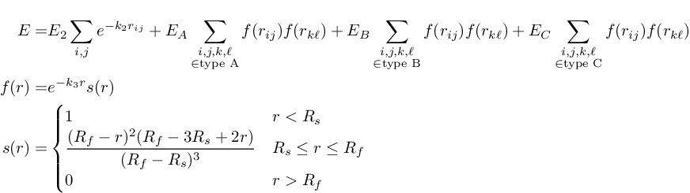

.. index:: pair\_style e3b

pair\_style e3b command
=======================

Syntax
""""""

.. parsed-literal::

   pair_style e3b Otype

* Otype = atom type for oxygen

.. parsed-literal::

   pair_coeff \* \* keyword

* one or more keyword/value pairs must be appended.
* keyword = *preset* or *Ea* or *Eb* or *Ec* or *E2* or *K3* or *K2* or *Rs* or *Rc3* or *Rc2* or *bondL* or *neigh*
* If the *preset* keyword is given, no others are needed.
  Otherwise, all are mandatory except for *neigh*\ .
  The *neigh* keyword is always optional.

.. parsed-literal::

     *preset* arg = *2011* or *2015* = which set of predefined parameters to use
              2011 = use the potential parameters from :ref:`(Tainter 2011) <Tainter2011>`
              2015 = use the potential parameters from :ref:`(Tainter 2015) <Tainter2015>`
     *Ea* arg = three-body energy for type A hydrogen bonding interactions (energy units)
     *Eb* arg = three-body energy for type B hydrogen bonding interactions (energy units)
     *Ec* arg = three-body energy for type C hydrogen bonding interactions (energy units)
     *E2* arg = two-body energy correction (energy units)
     *K3* arg = three-body exponential constant (inverse distance units)
     *K2* arg = two-body exponential constant (inverse distance units)
     *Rc3* arg = three-body cutoff (distance units)
     *Rc2* arg = two-body cutoff (distance units)
     *Rs* arg = three-body switching function cutoff (distance units)
     *bondL* arg = intramolecular OH bond length (distance units)
     *neigh* arg = approximate integer number of molecules within Rc3 of an oxygen atom

Examples
""""""""

.. parsed-literal::

   pair_style e3b 1
   pair_coeff \* \* Ea 35.85 Eb -240.2 Ec 449.3 E2 108269.9 K3 1.907 K2 4.872 Rc3 5.2 Rc2 5.2 Rs 5.0 bondL 0.9572

   pair_style hybrid/overlay e3b 1 lj/cut/tip4p/long 1 2 1 1 0.15 8.5
   pair_coeff \* \* e3b preset 2011

Description
"""""""""""

The *e3b* style computes an \"explicit three-body\" (E3B) potential for water :ref:`(Kumar 2008) <Kumar>`.

This potential was developed as a water model that includes the three-body cooperativity of hydrogen bonding explicitly.
To use it in this way, it must be applied in conjunction with a conventional two-body water model, through *pair\_style hybrid/overlay*.
The three body interactions are split into three types: A, B, and C.
Type A corresponds to anti-cooperative double hydrogen bond donor interactions.
Type B corresponds to the cooperative interaction of molecules that both donate and accept a hydrogen bond.
Type C corresponds to anti-cooperative double hydrogen bond acceptor interactions.
The three-body interactions are smoothly cutoff by the switching function s(r) between Rs and Rc3.
The two-body interactions are designed to correct for the effective many-body interactions implicitly included in the conventional two-body potential.
The two-body interactions are cut off sharply at Rc2, because K3 is typically significantly smaller than K2.
See :ref:`(Kumar 2008) <Kumar>` for more details.

Only a single *pair\_coeff* command is used with the *e3b* style.
The 1st two arguments must be \* \*.
The oxygen atom type for the pair style is passed as the only argument to the *pair\_style* command, not in the *pair\_coeff* command.
The hydrogen atom type is inferred by the ordering of the atoms.

.. note::

   Every atom of type Otype must be part of a water molecule.
   Each water molecule must have consecutive IDs with the oxygen first.
   This pair style does not test that this criteria is met.

The *pair\_coeff* command must have at least one keyword/value pair, as described above.
The *preset* keyword sets the potential parameters to the values used in :ref:`(Tainter 2011) <Tainter2011>` or :ref:`(Tainter 2015) <Tainter2015>`.
To use the water models defined in those references, the *e3b* style should always be used in conjunction with an *lj/cut/tip4p/long* style through *pair\_style hybrid/overlay*, as demonstrated in the second example above.
The *preset 2011* option should be used with the :doc:`TIP4P water model <Howto_tip4p>`.
The *preset 2015* option should be used with the :doc:`TIP4P/2005 water model <Howto_tip4p>`.
If the *preset* keyword is used, no other keyword is needed.
Changes to the preset parameters can be made by specifying the *preset* keyword followed by the specific parameter to change, like *Ea*\ .
Note that the other keywords must come after *preset* in the pair\_style command.
The *e3b* style can also be used to implement any three-body potential of the same form by specifying all the keywords except *neigh*\ : *Ea*\ , *Eb*\ , *Ec*\ , *E2*\ , *K3*\ , *K2*\ , *Rc3*\ , *Rc2*\ , *Rs*\ , and *bondL*\ .
The keyword *bondL* specifies the intramolecular OH bond length of the water model being used.
This is needed to include H atoms that are within the cutoff even when the attached oxygen atom is not.

This pair style allocates arrays sized according to the number of pairwise interactions within Rc3.
To do this it needs an estimate for the number of water molecules within Rc3 of an oxygen atom.
This estimate defaults to 10 and can be changed using the *neigh* keyword, which takes an integer as an argument.
If the neigh setting is too small, the simulation will fail with the error "neigh is too small".
If the neigh setting is too large, the pair style will use more memory than necessary.

This pair style tallies a breakdown of the total E3B potential energy into sub-categories, which can be accessed via the :doc:`compute pair <compute_pair>` command as a vector of values of length 4.
The 4 values correspond to the terms in the first equation above: the E2 term, the Ea term, the Eb term, and the Ec term.

See the examples/USER/e3b directory for a complete example script.

----------

**Mixing, shift, table, tail correction, restart, rRESPA info**\ :

This pair style does not support the :doc:`pair_modify <pair_modify>`
shift, table, and tail options.

This pair style does not write its information to :doc:`binary restart files <restart>`.  Thus, you
need to re-specify the pair\_style and pair\_coeff commands in an input
script that reads a restart file.

This pair style is incompatible with :doc:`respa <run_style>`.

----------

Restrictions
""""""""""""

This pair style is part of the USER-MISC package.  It is only enabled
if LAMMPS was built with that package.  See the :doc:`Build package <Build_package>` doc page for more info.

This pair style requires the :doc:`newton <newton>` setting to be "on"
for pair interactions.

This pair style requires a fixed number of atoms in the simulation, so it is incompatible with fixes like :doc:`fix deposit <fix_deposit>`.
If the number of atoms changes between runs, this pair style must be re-initialized by calling the *pair\_style* and *pair\_coeffs* commands.
This is not a fundamental limitation of the pair style, but the code currently does not support a variable number of atoms.

The *preset* keyword currently only works with real, metal, si, and cgs :doc:`units <units>`.

Related commands
""""""""""""""""

:doc:`pair_coeff <pair_coeff>`, :doc:`compute pair <compute_pair>`

Default
"""""""

The option default for the *neigh* keyword is 10.

----------

.. _Kumar:

.. _Tainter2011:

**(Kumar)** Kumar and Skinner, J. Phys. Chem. B, 112, 8311 (2008)

.. _Tainter2015:

**(Tainter 2011)** Tainter, Pieniazek, Lin, and Skinner, J. Chem. Phys., 134, 184501 (2011)

**(Tainter 2015)** Tainter, Shi, and Skinner, 11, 2268 (2015)
