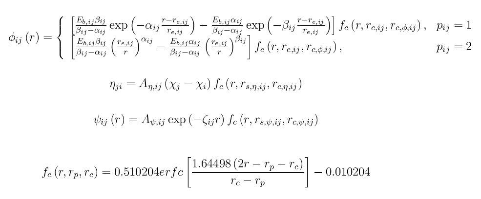

.. index:: pair\_style eim

pair\_style eim command
=======================

pair\_style eim/omp command
===========================

Syntax
""""""

.. parsed-literal::

   pair_style style

* style = *eim*

Examples
""""""""

.. parsed-literal::

   pair_style eim
   pair_coeff \* \* Na Cl ../potentials/ffield.eim Na Cl
   pair_coeff \* \* Na Cl ffield.eim  Na Na Na Cl
   pair_coeff \* \* Na Cl ../potentials/ffield.eim Cl NULL Na

Description
"""""""""""

Style *eim* computes pairwise interactions for ionic compounds
using embedded-ion method (EIM) potentials :ref:`(Zhou) <Zhou2>`.  The
energy of the system E is given by

.. image:: Eqs/pair_eim1.jpg
   :align: center

The first term is a double pairwise sum over the J neighbors of all I
atoms, where phi\_ij is a pair potential.  The second term sums over
the embedding energy E\_i of atom I, which is a function of its charge
q\_i and the electrical potential sigma\_i at its location.  E\_i, q\_i,
and sigma\_i are calculated as

.. image:: Eqs/pair_eim2.jpg
   :align: center

where eta\_ji is a pairwise function describing electron flow from atom
I to atom J, and psi\_ij is another pairwise function.  The multi-body
nature of the EIM potential is a result of the embedding energy term.
A complete list of all the pair functions used in EIM is summarized
below

Here E\_b, r\_e, r\_(c,phi), alpha, beta, A\_(psi), zeta, r\_(s,psi),
r\_(c,psi), A\_(eta), r\_(s,eta), r\_(c,eta), chi, and pair function type
p are parameters, with subscripts ij indicating the two species of
atoms in the atomic pair.

.. note::

   Even though the EIM potential is treating atoms as charged ions,
   you should not use a LAMMPS :doc:`atom_style <atom_style>` that stores a
   charge on each atom and thus requires you to assign a charge to each
   atom, e.g. the *charge* or *full* atom styles.  This is because the
   EIM potential infers the charge on an atom from the equation above for
   q\_i; you do not assign charges explicitly.

----------

All the EIM parameters are listed in a potential file which is
specified by the :doc:`pair_coeff <pair_coeff>` command.  This is an
ASCII text file in a format described below.  The "ffield.eim" file
included in the "potentials" directory of the LAMMPS distribution
currently includes nine elements Li, Na, K, Rb, Cs, F, Cl, Br, and I.
A system with any combination of these elements can be modeled.  This
file is parameterized in terms of LAMMPS :doc:`metal units <units>`.

Note that unlike other potentials, cutoffs for EIM potentials are not
set in the pair\_style or pair\_coeff command; they are specified in the
EIM potential file itself.  Likewise, the EIM potential file lists
atomic masses; thus you do not need to use the :doc:`mass <mass>`
command to specify them.

Only a single pair\_coeff command is used with the *eim* style which
specifies an EIM potential file and the element(s) to extract
information for.  The EIM elements are mapped to LAMMPS atom types by
specifying N additional arguments after the filename in the pair\_coeff
command, where N is the number of LAMMPS atom types:

* Elem1, Elem2, ...
* EIM potential file
* N element names = mapping of EIM elements to atom types

See the :doc:`pair_coeff <pair_coeff>` doc page for alternate ways
to specify the path for the potential file.

As an example like one of those above, suppose you want to model a
system with Na and Cl atoms.  If your LAMMPS simulation has 4 atoms
types and you want the 1st 3 to be Na, and the 4th to be Cl, you would
use the following pair\_coeff command:

.. parsed-literal::

   pair_coeff \* \* Na Cl ffield.eim Na Na Na Cl

The 1st 2 arguments must be \* \* so as to span all LAMMPS atom types.
The filename is the EIM potential file.  The Na and Cl arguments
(before the file name) are the two elements for which info will be
extracted from the potential file.  The first three trailing Na
arguments map LAMMPS atom types 1,2,3 to the EIM Na element.  The
final Cl argument maps LAMMPS atom type 4 to the EIM Cl element.

If a mapping value is specified as NULL, the mapping is not performed.
This can be used when an *eim* potential is used as part of the
*hybrid* pair style.  The NULL values are placeholders for atom types
that will be used with other potentials.

The ffield.eim file in the *potentials* directory of the LAMMPS
distribution is formatted as follows:

Lines starting with # are comments and are ignored by LAMMPS.  Lines
starting with "global:" include three global values. The first value
divides the cations from anions, i.e., any elements with
electronegativity above this value are viewed as anions, and any
elements with electronegativity below this value are viewed as
cations. The second and third values are related to the cutoff
function - i.e. the 0.510204, 1.64498, and 0.010204 shown in the above
equation can be derived from these values.

Lines starting with "element:" are formatted as follows: name of
element, atomic number, atomic mass, electronic negativity, atomic
radius (LAMMPS ignores it), ionic radius (LAMMPS ignores it), cohesive
energy (LAMMPS ignores it), and q0 (must be 0).

Lines starting with "pair:" are entered as: element 1, element 2,
r\_(c,phi), r\_(c,phi) (redundant for historical reasons), E\_b, r\_e,
alpha, beta, r\_(c,eta), A\_(eta), r\_(s,eta), r\_(c,psi), A\_(psi), zeta,
r\_(s,psi), and p.

The lines in the file can be in any order; LAMMPS extracts the info it
needs.

----------

Styles with a *gpu*\ , *intel*\ , *kk*\ , *omp*\ , or *opt* suffix are
functionally the same as the corresponding style without the suffix.
They have been optimized to run faster, depending on your available
hardware, as discussed on the :doc:`Speed packages <Speed_packages>` doc
page.  The accelerated styles take the same arguments and should
produce the same results, except for round-off and precision issues.

These accelerated styles are part of the GPU, USER-INTEL, KOKKOS,
USER-OMP and OPT packages, respectively.  They are only enabled if
LAMMPS was built with those packages.  See the :doc:`Build package <Build_package>` doc page for more info.

You can specify the accelerated styles explicitly in your input script
by including their suffix, or you can use the :doc:`-suffix command-line switch <Run_options>` when you invoke LAMMPS, or you can use the
:doc:`suffix <suffix>` command in your input script.

See the :doc:`Speed packages <Speed_packages>` doc page for more
instructions on how to use the accelerated styles effectively.

----------

Restrictions
""""""""""""

This style is part of the MANYBODY package.  It is only enabled if
LAMMPS was built with that package.

Related commands
""""""""""""""""

:doc:`pair_coeff <pair_coeff>`

**Default:** none

----------

.. _Zhou2:

**(Zhou)** Zhou, submitted for publication (2010).  Please contact
Xiaowang Zhou (Sandia) for details via email at xzhou at sandia.gov.
