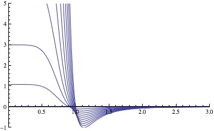
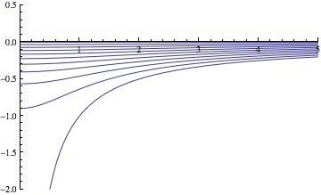

.. index:: pair_style lj/cut/soft
.. index:: pair_style lj/cut/soft/omp
.. index:: pair_style lj/cut/coul/cut/soft
.. index:: pair_style lj/cut/coul/cut/soft/omp
.. index:: pair_style lj/cut/coul/long/soft
.. index:: pair_style lj/cut/coul/long/soft/omp
.. index:: pair_style lj/cut/tip4p/long/soft
.. index:: pair_style lj/cut/tip4p/long/soft/omp
.. index:: pair_style lj/charmm/coul/long/soft
.. index:: pair_style lj/charmm/coul/long/soft/omp
.. index:: pair_style lj/class2/soft
.. index:: pair_style lj/class2/coul/cut/soft
.. index:: pair_style lj/class2/coul/long/soft
.. index:: pair_style coul/cut/soft
.. index:: pair_style coul/cut/soft/omp
.. index:: pair_style coul/long/soft
.. index:: pair_style coul/long/soft/omp
.. index:: pair_style tip4p/long/soft
.. index:: pair_style tip4p/long/soft/omp
.. index:: pair_style morse/soft

pair_style lj/cut/soft command
==============================

Accelerator Variants: *lj/cut/soft/omp*

pair_style lj/cut/coul/cut/soft command
=======================================

Accelerator Variants: *lj/cut/coul/cut/soft/omp*

pair_style lj/cut/coul/long/soft command
========================================

Accelerator Variants: *lj/cut/coul/long/soft/omp*

pair_style lj/cut/tip4p/long/soft command
=========================================

Accelerator Variants: *lj/cut/tip4p/long/soft/omp*

pair_style lj/charmm/coul/long/soft command
===========================================

Accelerator Variants: *lj/charmm/coul/long/soft/omp*

pair_style lj/class2/soft command
=================================

pair_style lj/class2/coul/cut/soft command
==========================================

pair_style lj/class2/coul/long/soft command
===========================================

pair_style coul/cut/soft command
================================

Accelerator Variants: *coul/cut/soft/omp*

pair_style coul/long/soft command
=================================

Accelerator Variants: *coul/long/soft/omp*

pair_style tip4p/long/soft command
==================================

Accelerator Variants: *tip4p/long/soft/omp*

pair_style morse/soft command
=============================

Syntax
""""""

.. code-block:: LAMMPS

   pair_style style args

* style = *lj/cut/soft* or *lj/cut/coul/cut/soft* or *lj/cut/coul/long/soft* or *lj/cut/tip4p/long/soft* or *lj/charmm/coul/long/soft* or *lj/class2/soft* or *lj/class2/coul/cut/soft* or *lj/class2/coul/long/soft* or *coul/cut/soft* or *coul/long/soft* or *tip4p/long/soft* or *morse/soft*
* args = list of arguments for a particular style

.. parsed-literal::

     *lj/cut/soft* args = n alpha_lj cutoff
       n, alpha_LJ = parameters of soft-core potential
       cutoff = global cutoff for Lennard-Jones interactions (distance units)
     *lj/cut/coul/cut/soft* args = n alpha_LJ alpha_C cutoff (cutoff2)
       n, alpha_LJ, alpha_C = parameters of soft-core potential
       cutoff = global cutoff for LJ (and Coulombic if only 1 arg) (distance units)
       cutoff2 = global cutoff for Coulombic (optional) (distance units)
     *lj/cut/coul/long/soft* args = n alpha_LJ alpha_C cutoff
       n, alpha_LJ, alpha_C = parameters of the soft-core potential
       cutoff = global cutoff for LJ (and Coulombic if only 1 arg) (distance units)
       cutoff2 = global cutoff for Coulombic (optional) (distance units)
     *lj/cut/tip4p/long/soft* args = otype htype btype atype qdist n alpha_LJ alpha_C cutoff (cutoff2)
       otype,htype = atom types for TIP4P O and H
       btype,atype = bond and angle types for TIP4P waters
       qdist = distance from O atom to massless charge (distance units)
       n, alpha_LJ, alpha_C = parameters of the soft-core potential
       cutoff = global cutoff for LJ (and Coulombic if only 1 arg) (distance units)
       cutoff2 = global cutoff for Coulombic (optional) (distance units)
     *lj/charmm/coul/long/soft* args = n alpha_LJ alpha_C inner outer (cutoff)
       n, alpha_LJ, alpha_C = parameters of the soft-core potential
       inner, outer = global switching cutoffs for LJ (and Coulombic if only 5 args)
       cutoff = global cutoff for Coulombic (optional, outer is Coulombic cutoff if only 5 args)
     *lj/class2/soft* args = n alpha_lj cutoff
       n, alpha_LJ = parameters of soft-core potential
       cutoff = global cutoff for Lennard-Jones interactions (distance units)
     *lj/class2/coul/cut/soft* args = n alpha_LJ alpha_C cutoff (cutoff2)
       n, alpha_LJ, alpha_C = parameters of soft-core potential
       cutoff = global cutoff for LJ (and Coulombic if only 1 arg) (distance units)
       cutoff2 = global cutoff for Coulombic (optional) (distance units)
     *lj/class2/coul/long/soft* args = n alpha_LJ alpha_C cutoff (cutoff2)
       n, alpha_LJ, alpha_C = parameters of soft-core potential
       cutoff = global cutoff for LJ (and Coulombic if only 1 arg) (distance units)
       cutoff2 = global cutoff for Coulombic (optional) (distance units)
     *coul/cut/soft* args = n alpha_C cutoff
       n, alpha_C = parameters of the soft-core potential
       cutoff = global cutoff for Coulomb interactions (distance units)
     *coul/long/soft* args = n alpha_C cutoff
       n, alpha_C = parameters of the soft-core potential
       cutoff = global cutoff for Coulomb interactions (distance units)
     *tip4p/long/soft* args = otype htype btype atype qdist n alpha_C cutoff
       otype,htype = atom types for TIP4P O and H
       btype,atype = bond and angle types for TIP4P waters
       qdist = distance from O atom to massless charge (distance units)
       n, alpha_C = parameters of the soft-core potential
       cutoff = global cutoff for Coulomb interactions (distance units)
     *morse/soft* args = n lf cutoff
       n = soft-core parameter
       lf = transformation range is lf < lambda < 1
       cutoff = global cutoff for Morse interactions (distance units)

Examples
""""""""

.. code-block:: LAMMPS

   pair_style lj/cut/soft 2.0 0.5 9.5
   pair_coeff * * 0.28 3.1 1.0
   pair_coeff 1 1 0.28 3.1 1.0 9.5

   pair_style lj/cut/coul/cut/soft 2.0 0.5 10.0 9.5
   pair_style lj/cut/coul/cut/soft 2.0 0.5 10.0 9.5 9.5
   pair_coeff * * 0.28 3.1 1.0
   pair_coeff 1 1 0.28 3.1 0.5 10.0
   pair_coeff 1 1 0.28 3.1 0.5 10.0 9.5

   pair_style lj/cut/coul/long/soft 2.0 0.5 10.0 9.5
   pair_style lj/cut/coul/long/soft 2.0 0.5 10.0 9.5 9.5
   pair_coeff * * 0.28 3.1 1.0
   pair_coeff 1 1 0.28 3.1 0.0 10.0
   pair_coeff 1 1 0.28 3.1 0.0 10.0 9.5

   pair_style lj/cut/tip4p/long/soft 1 2 7 8 0.15 2.0 0.5 10.0 9.8
   pair_style lj/cut/tip4p/long/soft 1 2 7 8 0.15 2.0 0.5 10.0 9.8 9.5
   pair_coeff * * 0.155 3.1536 1.0
   pair_coeff 1 1 0.155 3.1536 1.0 9.5

   pair_style lj/charmm/coul/long 2.0 0.5 10.0 8.0 10.0
   pair_style lj/charmm/coul/long 2.0 0.5 10.0 8.0 10.0 9.0
   pair_coeff * * 0.28 3.1 1.0
   pair_coeff 1 1 0.28 3.1 1.0 0.14 3.1

   pair_style lj/class2/coul/long/soft 2.0 0.5 10.0 9.5
   pair_style lj/class2/coul/long/soft 2.0 0.5 10.0 9.5 9.5
   pair_coeff * * 0.28 3.1 1.0
   pair_coeff 1 1 0.28 3.1 0.0 10.0
   pair_coeff 1 1 0.28 3.1 0.0 10.0 9.5

   pair_style coul/long/soft 1.0 10.0 9.5
   pair_coeff * * 1.0
   pair_coeff 1 1 1.0

   pair_style tip4p/long/soft 1 2 7 8 0.15 2.0 0.5 10.0 9.8
   pair_coeff * * 1.0
   pair_coeff 1 1 1.0

   pair_style morse/soft 4 0.9 10.0
   pair_coeff * * 100.0 2.0 1.5 1.0
   pair_coeff 1 1 100.0 2.0 1.5 1.0 3.0

Example input scripts available: examples/PACKAGES/fep

Description
"""""""""""

These pair styles have a soft repulsive core, tunable by a parameter lambda,
in order to avoid singularities during free energy calculations when sites are
created or annihilated :ref:`(Beutler) <Beutler>`.  When lambda tends to 0 the pair
interaction vanishes with a soft repulsive core.  When lambda tends to 1, the pair
interaction approaches the normal, non-soft potential. These pair styles
are suited for "alchemical" free energy calculations using the :doc:`fix adapt/fep <fix_adapt_fep>` and :doc:`compute fep <compute_fep>` commands.

The *lj/cut/soft* style and related sub-styles compute the 12-6 Lennard-Jones
and Coulomb potentials modified by a soft core, with the functional form

.. math::

   E = \lambda^n 4 \epsilon \left\{
   \frac{1}{ \left[ \alpha_{\mathrm{LJ}} (1-\lambda)^2 +
   \left( \displaystyle\frac{r}{\sigma} \right)^6 \right]^2 } -
   \frac{1}{ \alpha_{\mathrm{LJ}} (1-\lambda)^2 +
   \left( \displaystyle\frac{r}{\sigma} \right)^6 }
   \right\} \qquad r < r_c

The *lj/class2/soft* style is a 9-6 potential with the exponent of the
denominator of the first term in brackets taking the value 1.5 instead of 2
(other details differ, see the form of the potential in
:doc:`pair_style lj/class2 <pair_class2>`).

Coulomb interactions can also be damped with a soft core at short distance,

.. math::

   E = \lambda^n \frac{ C q_i q_j}{\epsilon \left[ \alpha_{\mathrm{C}}
   (1-\lambda)^2 + r^2 \right]^{1/2}} \qquad r < r_c

In the Coulomb part :math:`C` is an energy-conversion constant, :math:`q_i` and
:math:`q_j` are the charges on the 2 atoms, and epsilon is the dielectric
constant which can be set by the :doc:`dielectric <dielectric>` command.

The coefficient lambda is an activation parameter. When :math:`\lambda = 1` the
pair potential is identical to a Lennard-Jones term or a Coulomb term or a
combination of both. When :math:`\lambda = 0` the interactions are
deactivated. The transition between these two extrema is smoothed by a soft
repulsive core in order to avoid singularities in potential energy and forces
when sites are created or annihilated and can overlap :ref:`(Beutler)
<Beutler>`.

The parameters :math:`n`, :math:`\alpha_\mathrm{LJ}` and
:math:`\alpha_\mathrm{C}` are set in the :doc:`pair_style <pair_style>` command,
before the cutoffs.  Usual choices for the exponent are :math:`n = 2` or
:math:`n = 1`. For the remaining coefficients :math:`\alpha_\mathrm{LJ} = 0.5`
and :math:`\alpha_\mathrm{C} = 10~\text{A}^2` are appropriate choices. Plots of
the 12-6 LJ and Coulomb terms are shown below, for lambda ranging from 1 to 0
every 0.1.

For the *lj/cut/coul/cut/soft* or *lj/cut/coul/long/soft* pair styles, as well
as for the equivalent *class2* versions, the following coefficients must be
defined for each pair of atoms types via the :doc:`pair_coeff <pair_coeff>`
command as in the examples above, or in the data file or restart files read by
the :doc:`read_data <read_data>` or :doc:`read_restart <read_restart>` commands,
or by mixing as described below:

* :math:`\epsilon` (energy units)
* :math:`\sigma` (distance units)
* :math:`\lambda` (activation parameter, between 0 and 1)
* cutoff1 (distance units)
* cutoff2 (distance units)

The latter two coefficients are optional.  If not specified, the global
LJ and Coulombic cutoffs specified in the pair_style command are used.
If only one cutoff is specified, it is used as the cutoff for both LJ
and Coulombic interactions for this type pair.  If both coefficients
are specified, they are used as the LJ and Coulombic cutoffs for this
type pair.  You cannot specify 2 cutoffs for style *lj/cut/soft*,
since it has no Coulombic terms. For the *coul/cut/soft* and
*coul/long/soft* only lambda and the optional cutoff2 are to be
specified.

Style *lj/cut/tip4p/long/soft* implements a soft-core version of the TIP4P water
model. The usage of the TIP4P pair style is documented in the :doc:`pair_lj
<pair_lj>` styles. In the soft version the parameters :math:`n`,
:math:`\alpha_\mathrm{LJ}` and :math:`\alpha_\mathrm {C}` are set in the
:doc:`pair_style <pair_style>` command, after the specific parameters of the
TIP4P water model and before the cutoffs. The activation parameter lambda is
supplied as an argument of the :doc:`pair_coeff <pair_coeff>` command, after
epsilon and sigma and before the optional cutoffs.

Style *lj/charmm/coul/long/soft* implements a soft-core version of the modified
12-6 LJ potential used in CHARMM and documented in the :doc:`pair_style
lj/charmm/coul/long <pair_charmm>` style. In the soft version the parameters
:math:`n`, :math:`\alpha_\mathrm{LJ}` and :math:`\alpha_\mathrm{C}` are set in
the :doc:`pair_style <pair_style>` command, before the global cutoffs. The
activation parameter lambda is introduced as an argument of the :doc:`pair_coeff
<pair_coeff>` command, after :math:`\epsilon` and :math:`\sigma` and before the
optional eps14 and sigma14.

Style *lj/class2/soft* implements a soft-core version of the 9-6 potential in
:doc:`pair_style lj/class2 <pair_class2>`. In the soft version the parameters
:math:`n`, :math:`\alpha_\mathrm{LJ}` and :math:`\alpha_\mathrm{C}` are set in the
:doc:`pair_style <pair_style>` command, before the global cutoffs. The
activation parameter lambda is introduced as an argument of the the
:doc:`pair_coeff <pair_coeff>` command, after :math:`\epsilon` and
:math:`\sigma` and before the optional cutoffs.

The *coul/cut/soft*, *coul/long/soft* and *tip4p/long/soft* sub-styles are
designed to be combined with other pair potentials via the :doc:`pair_style
hybrid/overlay <pair_hybrid>` command.  This is because they have no repulsive
core.  Hence, if used by themselves, there will be no repulsion to keep two
oppositely charged particles from overlapping each other. In this case, if
:math:`\lambda = 1`, a singularity may occur.  These sub-styles are suitable to
represent charges embedded in the Lennard-Jones radius of another site (for
example hydrogen atoms in several water models). The :math:`\lambda` must
be defined for each pair, and *coul/cut/soft* can accept an optional cutoff as
the second coefficient.

.. note::

   When using the soft-core Coulomb potentials with long-range solvers (\
   *coul/long/soft*, *lj/cut/coul/long/soft*, etc.)  in a free energy
   calculation in which sites holding electrostatic charges are being created or
   annihilated (using :doc:`fix adapt/fep <fix_adapt_fep>` and :doc:`compute fep
   <compute_fep>`) it is important to adapt both the :math:`\lambda` activation
   parameter (from 0 to 1, or the reverse) and the value of the charge (from 0
   to its final value, or the reverse). This ensures that long-range
   electrostatic terms (kspace) are correct. It is not necessary to use
   soft-core Coulomb potentials if the van der Waals site is present during the
   free-energy route, thus avoiding overlap of the charges. Examples are
   provided in the LAMMPS source directory tree, under examples/PACKAGES/fep.

.. note::

   To avoid division by zero do not set :math:`\sigma = 0` in the *lj/cut/soft*
   and related styles; use the lambda parameter instead to activate/deactivate
   interactions, or use :math:`\epsilon = 0` and :math:`\sigma = 1`.
   Alternatively, when sites do not interact though the Lennard-Jones term
   the *coul/long/soft* or similar sub-style can be used via the
   :doc:`pair_style hybrid/overlay <pair_hybrid>` command.

----------

The *morse/soft* variant modifies the :doc:`pair_morse <pair_morse>` style at
short range to have a soft core. The functional form differs from that of the
*lj/soft* styles, and is instead given by:

.. math::

   \begin{split}
   s(\lambda) =& (1 - \lambda) / (1 - \lambda_f), \qquad B = -2D e^{-2 \alpha
   r_0} (e^{\alpha r_0} - 1) / 3 \\
   E =& D_0 \left[ e^{- 2 \alpha (r - r_0)} - 2 e^{- \alpha (r - r_0)} \right] +
   s(\lambda) B e^{-3\alpha(r-r_0)}, \qquad \hspace{2.85em}\lambda \geq
   \lambda_f,\quad r < r_c \\
   E =& \left( D_0 \left[ e^{- 2 \alpha (r - r_0)} - 2 e^{- \alpha (r - r_0)}
   \right] + B e^{-3\alpha(r-r_0)} \right)(\lambda/\lambda_f)^n, \qquad \lambda
   < \lambda_f,\quad r < r_c
   \end{split}

The *morse/soft* style requires the following pair coefficients:

* :math:`D_0` (energy units)
* :math:`\alpha` (1/distance units)
* :math:`r_0` (distance units)
* :math:`\lambda` (unitless, between 0.0 and 1.0)
* cutoff (distance units)

The last coefficient is optional. If not specified, the global morse cutoff is
used.

----------

.. include:: accel_styles.rst

----------

Mixing, shift, table, tail correction, restart, rRESPA info
"""""""""""""""""""""""""""""""""""""""""""""""""""""""""""

The different versions of the *lj/cut/soft* pair styles support mixing.  For
atom type pairs I,J and I != J, the :math:`\epsilon` and :math:`\sigma`
coefficients and cutoff distance for these pair styles can be mixed.  The default
mix value is *geometric* for 12-6 styles.

The mixing rule for epsilon and sigma for *lj/class2/soft* 9-6 potentials is to
use the *sixthpower* formulas. The :doc:`pair_modify mix <pair_modify>` setting
is thus ignored for class2 potentials for :math:`\epsilon` and
:math:`\sigma`. However it is still followed for mixing the cutoff distance. See
the :doc:`pair_modify <pair_modify>` command for details.

The *morse/soft* pair style does not support mixing. Thus, coefficients for all
LJ pairs must be specified explicitly.

All of the pair styles with soft core support the :doc:`pair_modify <pair_modify>`
shift option for the energy of the Lennard-Jones portion of the pair
interaction.

The different versions of the *lj/cut/soft* pair styles support the
:doc:`pair_modify <pair_modify>` tail option for adding a long-range tail
correction to the energy and pressure for the Lennard-Jones portion of the pair
interaction.

.. note::

   The analytical form of the tail corrections for energy and pressure used in
   the *lj/cut/soft* potentials are approximate, being identical to that of the
   corresponding non-soft potentials scaled by a factor :math:`\lambda^n`. The
   errors due to this approximation should be negligible. For example, for a
   cutoff of :math:`2.5\sigma` this approximation leads to maximum relative
   errors in tail corrections of the order of 1e-4 for energy and virial
   (:math:`\alpha_\mathrm{LJ} = 0.5, n = 2`). The error vanishes when lambda
   approaches 0 or 1. Note that these are the errors affecting the long-range
   tail (itself a correction to the interaction energy) which includes other
   approximations, namely that the system is homogeneous (local density equal
   the average density) beyond the cutoff.

The *morse/soft* pair style does not support the :doc:`pair_modify
<pair_modify>` tail option for adding long-range tail corrections to energy and
pressure.

All of these pair styles write information to :doc:`binary restart files
<restart>`, so pair_style and pair_coeff commands do not need to be specified
in an input script that reads a restart file.

----------

Restrictions
""""""""""""

The pair styles with soft core are only enabled if LAMMPS was built with the
FEP package. The *long* versions also require the KSPACE package to be
installed. The soft *tip4p* versions also require the MOLECULE package to be
installed. These styles are only enabled if LAMMPS was built with those
packages.  See the :doc:`Build package <Build_package>` page for more
info.

Related commands
""""""""""""""""

:doc:`pair_coeff <pair_coeff>`, :doc:`fix adapt <fix_adapt>`,
:doc:`fix adapt/fep <fix_adapt_fep>`, :doc:`compute fep <compute_fep>`

Default
"""""""

none

----------

.. _Beutler:

**(Beutler)** Beutler, Mark, van Schaik, Gerber, van Gunsteren, Chem
Phys Lett, 222, 529 (1994).
