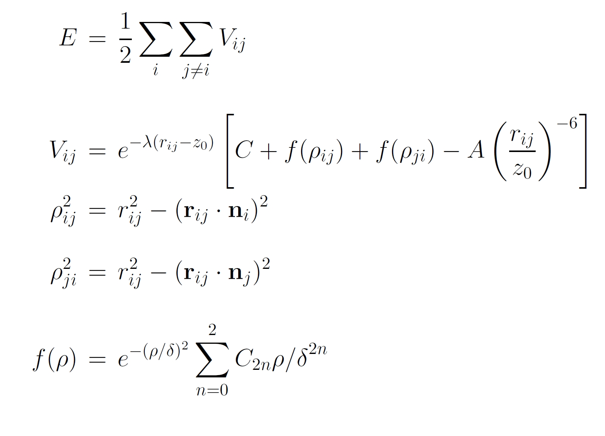

.. index:: pair\_style kolmogorov/crespi/full

pair\_style kolmogorov/crespi/full command
==========================================

Syntax
""""""

.. parsed-literal::

   pair_style hybrid/overlay kolmogorov/crespi/full cutoff tap_flag

* cutoff = global cutoff (distance units)
* tap\_flag = 0/1 to turn off/on the taper function

Examples
""""""""

.. parsed-literal::

   pair_style hybrid/overlay kolmogorov/crespi/full 20.0 0
   pair_coeff \* \* none
   pair_coeff \* \* kolmogorov/crespi/full  CH.KC   C C

   pair_style hybrid/overlay rebo kolmogorov/crespi/full 16.0 1
   pair_coeff \* \* rebo                    CH.rebo      C H
   pair_coeff \* \* kolmogorov/crespi/full  CH_taper.KC  C H

Description
"""""""""""

The *kolmogorov/crespi/full* style computes the Kolmogorov-Crespi (KC)
interaction potential as described in :ref:`(Kolmogorov) <Kolmogorov1>`.
No simplification is made,

It is important to have a sufficiently large cutoff to ensure smooth
forces and to include all the pairs to build the neighbor list for
calculating the normals.  Energies are shifted so that they go
continuously to zero at the cutoff assuming that the exponential part of
*Vij* (first term) decays sufficiently fast.  This shift is achieved by
the last term in the equation for *Vij* above. This is essential only
when the tapper function is turned off. The formula of taper function
can be found in pair style :doc:`ilp/graphene/hbn <pair_ilp_graphene_hbn>`.

.. note::

   This potential (ILP) is intended for interlayer interactions between two
   different layers of graphene. To perform a realistic simulation, this potential
   must be used in combination with intralayer potential, such as
   :doc:`AIREBO <pair_airebo>` or :doc:`Tersoff <pair_tersoff>` potential.
   To keep the intralayer properties unaffected, the interlayer interaction
   within the same layers should be avoided. Hence, each atom has to have a layer
   identifier such that atoms residing on the same layer interact via the
   appropriate intralayer potential and atoms residing on different layers
   interact via the ILP. Here, the molecule id is chosen as the layer identifier,
   thus a data file with the "full" atom style is required to use this potential.

The parameter file (e.g. CH.KC), is intended for use with *metal*
:doc:`units <units>`, with energies in meV. Two additional parameters, *S*\ ,
and *rcut* are included in the parameter file. *S* is designed to
facilitate scaling of energies. *rcut* is designed to build the neighbor
list for calculating the normals for each atom pair.

.. note::

   Two new sets of parameters of KC potential for hydrocarbons, CH.KC
   (without the taper function) and CH\_taper.KC (with the taper function)
   are presented in :ref:`(Ouyang1) <Ouyang3>`.  The energy for the KC potential
   with the taper function goes continuously to zero at the cutoff.  The
   parameters in both CH.KC and CH\_taper.KC provide a good description in
   both short- and long-range interaction regimes. While the original
   parameters (CC.KC) published in :ref:`(Kolmogorov) <Kolmogorov1>` are only
   suitable for long-range interaction regime.  This feature is essential
   for simulations in high pressure regime (i.e., the interlayer distance
   is smaller than the equilibrium distance).  The benchmark tests and
   comparison of these parameters can be found in :ref:`(Ouyang1) <Ouyang3>` and :ref:`(Ouyang2) <Ouyang4>`.

This potential must be used in combination with hybrid/overlay.
Other interactions can be set to zero using pair\_style *none*\ .

This pair style tallies a breakdown of the total interlayer potential
energy into sub-categories, which can be accessed via the :doc:`compute pair <compute_pair>` command as a vector of values of length 2.
The 2 values correspond to the following sub-categories:

1. *E\_vdW* = vdW (attractive) energy
2. *E\_Rep* = Repulsive energy

To print these quantities to the log file (with descriptive column
headings) the following commands could be included in an input script:

.. parsed-literal::

   compute 0 all pair kolmogorov/crespi/full
   variable Evdw  equal c_0[1]
   variable Erep  equal c_0[2]
   thermo_style custom step temp epair v_Erep v_Evdw

----------

**Mixing, shift, table, tail correction, restart, rRESPA info**\ :

This pair style does not support the pair\_modify mix, shift, table,
and tail options.

This pair style does not write their information to binary restart
files, since it is stored in potential files. Thus, you need to
re-specify the pair\_style and pair\_coeff commands in an input script
that reads a restart file.

Restrictions
""""""""""""

This fix is part of the USER-MISC package.  It is only enabled if
LAMMPS was built with that package.  See the :doc:`Build package <Build_package>` doc page for more info.

This pair potential requires the newton setting to be *on* for pair
interactions.

The CH.KC potential file provided with LAMMPS (see the potentials
folder) are parameterized for metal units.  You can use this potential
with any LAMMPS units, but you would need to create your own custom
CC.KC potential file with all coefficients converted to the appropriate
units.

Related commands
""""""""""""""""

:doc:`pair_coeff <pair_coeff>`,
:doc:`pair_none <pair_none>`,
:doc:`pair_style hybrid/overlay <pair_hybrid>`,
:doc:`pair_style drip <pair_drip>`,
:doc:`pair_style pair\_lebedeva\_z <pair_lebedeva_z>`,
:doc:`pair_style kolmogorov/crespi/z <pair_kolmogorov_crespi_z>`,
:doc:`pair_style ilp/graphene/hbn <pair_ilp_graphene_hbn>`.

**Default:** tap\_flag = 0

----------

.. _Kolmogorov1:

**(Kolmogorov)** A. N. Kolmogorov, V. H. Crespi, Phys. Rev. B 71, 235415 (2005)

.. _Ouyang3:

**(Ouyang1)** W. Ouyang, D. Mandelli, M. Urbakh and O. Hod, Nano Lett. 18, 6009-6016 (2018).

.. _Ouyang4:

**(Ouyang2)** W. Ouyang et al., J. Chem. Theory Comput. 16(1), 666-676 (2020).

