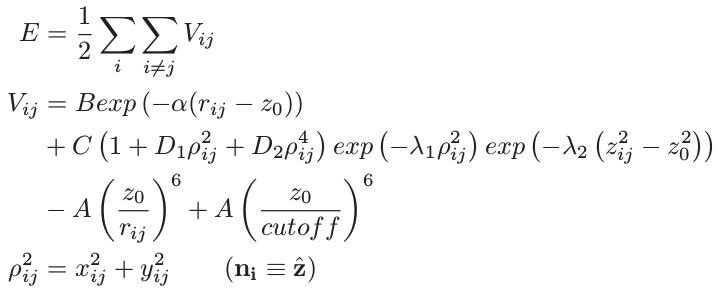

.. index:: pair\_style lebedeva/z

pair\_style lebedeva/z command
==============================

Syntax
""""""

.. parsed-literal::

   pair_style [hybrid/overlay ...] lebedeva/z cutoff

Examples
""""""""

.. parsed-literal::

   pair_style hybrid/overlay lebedeva/z 20.0
   pair_coeff \* \* none
   pair_coeff 1 2 lebedeva/z  CC.Lebedeva   C C

   pair_style hybrid/overlay rebo lebedeva/z 14.0
   pair_coeff \* \* rebo        CH.rebo       C C
   pair_coeff 1 2 lebedeva/z  CC.Lebedeva   C C

Description
"""""""""""

The *lebedeva/z* style computes the Lebedeva interaction
potential as described in :ref:`(Lebedeva et al.) <Leb01>`. An important simplification is made,
which is to take all normals along the z-axis.

It is important to have a sufficiently large cutoff to ensure smooth forces.
Energies are shifted so that they go continuously to zero at the cutoff assuming
that the exponential part of *Vij* (first term) decays sufficiently fast.
This shift is achieved by the last term in the equation for *Vij* above.

The parameter file (e.g. CC.Lebedeva), is intended for use with metal
:doc:`units <units>`, with energies in meV. An additional parameter, *S*\ ,
is available to facilitate scaling of energies.

This potential must be used in combination with hybrid/overlay.
Other interactions can be set to zero using pair\_style *none*\ .

Restrictions
""""""""""""

This fix is part of the USER-MISC package.  It is only enabled if
LAMMPS was built with that package.  See the :doc:`Build package <Build_package>` doc page for more info.

Related commands
""""""""""""""""

:doc:`pair_coeff <pair_coeff>`,
:doc:`pair_style none <pair_none>`,
:doc:`pair_style hybrid/overlay <pair_hybrid>`,
:doc:`pair_style drip <pair_drip>`,
:doc:`pair_style ilp/graphene/hbd <pair_ilp_graphene_hbn>`,
:doc:`pair_style kolmogorov/crespi/z <pair_kolmogorov_crespi_z>`,
:doc:`pair_style kolmogorov/crespi/full <pair_kolmogorov_crespi_full>`.

**Default:** none

----------

.. _Leb01:

**(Lebedeva et al.)** I. V. Lebedeva, A. A. Knizhnik, A. M. Popov, Y. E. Lozovik, B. V. Potapkin, Phys. Rev. B, 84, 245437 (2011)

.. _lws: http://lammps.sandia.gov
.. _ld: Manual.html
.. _lc: Commands_all.html
