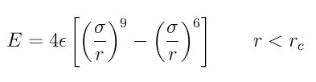

.. index:: pair\_style lj96/cut

pair\_style lj96/cut command
============================

pair\_style lj96/cut/gpu command
================================

pair\_style lj96/cut/omp command
================================

Syntax
""""""

.. parsed-literal::

   pair_style lj96/cut cutoff

* cutoff = global cutoff for lj96/cut interactions (distance units)

Examples
""""""""

.. parsed-literal::

   pair_style lj96/cut 2.5
   pair_coeff \* \* 1.0 1.0 4.0
   pair_coeff 1 1 1.0 1.0

Description
"""""""""""

The *lj96/cut* style compute a 9/6 Lennard-Jones potential, instead
of the standard 12/6 potential, given by

Rc is the cutoff.

The following coefficients must be defined for each pair of atoms
types via the :doc:`pair_coeff <pair_coeff>` command as in the examples
above, or in the data file or restart files read by the
:doc:`read_data <read_data>` or :doc:`read_restart <read_restart>`
commands, or by mixing as described below:

* epsilon (energy units)
* sigma (distance units)
* cutoff (distance units)

The last coefficient is optional.  If not specified, the global LJ
cutoff specified in the pair\_style command is used.

----------

Styles with a *gpu*\ , *intel*\ , *kk*\ , *omp*\ , or *opt* suffix are
functionally the same as the corresponding style without the suffix.
They have been optimized to run faster, depending on your available
hardware, as discussed on the :doc:`Speed packages <Speed_packages>` doc
page.  The accelerated styles take the same arguments and should
produce the same results, except for round-off and precision issues.

These accelerated styles are part of the GPU, USER-INTEL, KOKKOS,
USER-OMP and OPT packages, respectively.  They are only enabled if
LAMMPS was built with those packages.  See the :doc:`Build package <Build_package>` doc page for more info.

You can specify the accelerated styles explicitly in your input script
by including their suffix, or you can use the :doc:`-suffix command-line switch <Run_options>` when you invoke LAMMPS, or you can use the
:doc:`suffix <suffix>` command in your input script.

See the :doc:`Speed packages <Speed_packages>` doc page for more
instructions on how to use the accelerated styles effectively.

----------

**Mixing, shift, table, tail correction, restart, rRESPA info**\ :

For atom type pairs I,J and I != J, the epsilon and sigma coefficients
and cutoff distance for all of the lj/cut pair styles can be mixed.
The default mix value is *geometric*\ .  See the "pair\_modify" command
for details.

This pair style supports the :doc:`pair_modify <pair_modify>` shift
option for the energy of the pair interaction.

The :doc:`pair_modify <pair_modify>` table option is not relevant
for this pair style.

This pair style supports the :doc:`pair_modify <pair_modify>` tail
option for adding a long-range tail correction to the energy and
pressure of the pair interaction.

This pair style writes its information to :doc:`binary restart files <restart>`, so pair\_style and pair\_coeff commands do not need
to be specified in an input script that reads a restart file.

This pair style supports the use of the *inner*\ , *middle*\ , and *outer*
keywords of the :doc:`run_style respa <run_style>` command, meaning the
pairwise forces can be partitioned by distance at different levels of
the rRESPA hierarchy.  See the :doc:`run_style <run_style>` command for
details.

----------

Restrictions
""""""""""""
 none

Related commands
""""""""""""""""

:doc:`pair_coeff <pair_coeff>`

**Default:** none

