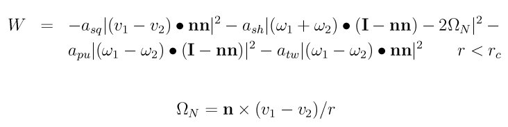
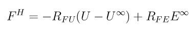

.. index:: pair\_style lubricate

pair\_style lubricate command
=============================

pair\_style lubricate/omp command
=================================

pair\_style lubricate/poly command
==================================

pair\_style lubricate/poly/omp command
======================================

Syntax
""""""

.. parsed-literal::

   pair_style style mu flaglog flagfld cutinner cutoff flagHI flagVF

* style = *lubricate* or *lubricate/poly*
* mu = dynamic viscosity (dynamic viscosity units)
* flaglog = 0/1 to exclude/include log terms in the lubrication approximation
* flagfld = 0/1 to exclude/include Fast Lubrication Dynamics (FLD) effects
* cutinner = inner cutoff distance (distance units)
* cutoff = outer cutoff for interactions (distance units)
* flagHI (optional) = 0/1 to exclude/include 1/r hydrodynamic interactions
* flagVF (optional) = 0/1 to exclude/include volume fraction corrections in the long-range isotropic terms

**Examples:** (all assume radius = 1)

.. parsed-literal::

   pair_style lubricate 1.5 1 1 2.01 2.5
   pair_coeff 1 1 2.05 2.8
   pair_coeff \* \*

   pair_style lubricate 1.5 1 1 2.01 2.5
   pair_coeff \* \*
   variable mu equal ramp(1,2)
   fix 1 all adapt 1 pair lubricate mu \* \* v_mu

Description
"""""""""""

Styles *lubricate* and *lubricate/poly* compute hydrodynamic
interactions between mono-disperse finite-size spherical particles in
a pairwise fashion.  The interactions have 2 components.  The first is
Ball-Melrose lubrication terms via the formulas in :ref:`(Ball and Melrose) <Ball1>`

which represents the dissipation W between two nearby particles due to
their relative velocities in the presence of a background solvent with
viscosity *mu*\ .  Note that this is dynamic viscosity which has units of
mass/distance/time, not kinematic viscosity.

The Asq (squeeze) term is the strongest and is included if *flagHI* is
set to 1 (default). It scales as 1/gap where gap is the separation
between the surfaces of the 2 particles. The Ash (shear) and Apu
(pump) terms are only included if *flaglog* is set to 1. They are the
next strongest interactions, and the only other singular interaction,
and scale as log(gap). Note that *flaglog* = 1 and *flagHI* = 0 is
invalid, and will result in a warning message, after which *flagHI* will
be set to 1. The Atw (twist) term is currently not included. It is
typically a very small contribution to the lubrication forces.

The *flagHI* and *flagVF* settings are optional.  Neither should be
used, or both must be defined.

*Cutinner* sets the minimum center-to-center separation that will be
used in calculations irrespective of the actual separation.  *Cutoff*
is the maximum center-to-center separation at which an interaction is
computed.  Using a *cutoff* less than 3 radii is recommended if
*flaglog* is set to 1.

The other component is due to the Fast Lubrication Dynamics (FLD)
approximation, described in :ref:`(Kumar) <Kumar1>`, which can be
represented by the following equation

where U represents the velocities and angular velocities of the
particles, U\^\ *infty* represents the velocity and the angular velocity
of the undisturbed fluid, and E\^\ *infty* represents the rate of strain
tensor of the undisturbed fluid with viscosity *mu*\ . Again, note that
this is dynamic viscosity which has units of mass/distance/time, not
kinematic viscosity. Volume fraction corrections to R\_FU are included
as long as *flagVF* is set to 1 (default).

.. note::

   When using the FLD terms, these pair styles are designed to be
   used with explicit time integration and a correspondingly small
   timestep.  Thus either :doc:`fix nve/sphere <fix_nve_sphere>` or :doc:`fix nve/asphere <fix_nve_asphere>` should be used for time integration.
   To perform implicit FLD, see the :doc:`pair\_style lubricateU <pair_lubricateU>` command.

Style *lubricate* requires monodisperse spherical particles; style
*lubricate/poly* allows for polydisperse spherical particles.

The viscosity *mu* can be varied in a time-dependent manner over the
course of a simulation, in which case in which case the pair\_style
setting for *mu* will be overridden.  See the :doc:`fix adapt <fix_adapt>`
command for details.

If the suspension is sheared via the :doc:`fix deform <fix_deform>`
command then the pair style uses the shear rate to adjust the
hydrodynamic interactions accordingly. Volume changes due to fix
deform are accounted for when computing the volume fraction
corrections to R\_FU.

When computing the volume fraction corrections to R\_FU, the presence
of walls (whether moving or stationary) will affect the volume
fraction available to colloidal particles. This is currently accounted
for with the following types of walls: :doc:`wall/lj93 <fix_wall>`,
:doc:`wall/lj126 <fix_wall>`, :doc:`wall/colloid <fix_wall>`, and
:doc:`wall/harmonic <fix_wall>`.  For these wall styles, the correct
volume fraction will be used when walls do not coincide with the box
boundary, as well as when walls move and thereby cause a change in the
volume fraction. Other wall styles will still work, but they will
result in the volume fraction being computed based on the box
boundaries.

Since lubrication forces are dissipative, it is usually desirable to
thermostat the system at a constant temperature. If Brownian motion
(at a constant temperature) is desired, it can be set using the
:doc:`pair\_style brownian <pair_brownian>` command. These pair styles
and the brownian style should use consistent parameters for *mu*\ ,
*flaglog*\ , *flagfld*\ , *cutinner*\ , *cutoff*\ , *flagHI* and *flagVF*\ .

----------

The following coefficients must be defined for each pair of atoms
types via the :doc:`pair\_coeff <pair_coeff>` command as in the examples
above, or in the data file or restart files read by the
:doc:`read\_data <read_data>` or :doc:`read\_restart <read_restart>`
commands, or by mixing as described below:

* cutinner (distance units)
* cutoff (distance units)

The two coefficients are optional.  If neither is specified, the two
cutoffs specified in the pair\_style command are used.  Otherwise both
must be specified.

----------

Styles with a *gpu*\ , *intel*\ , *kk*\ , *omp*\ , or *opt* suffix are
functionally the same as the corresponding style without the suffix.
They have been optimized to run faster, depending on your available
hardware, as discussed in :doc:`this section <Speed>` of
the manual.  The accelerated styles take the same arguments and should
produce the same results, except for round-off and precision issues.

These accelerated styles are part of the GPU, USER-INTEL, KOKKOS,
USER-OMP and OPT packages, respectively.  They are only enabled if
LAMMPS was built with those packages.  See the :doc:`Build package <Build_package>` doc page for more info.

You can specify the accelerated styles explicitly in your input script
by including their suffix, or you can use the :doc:`-suffix command-line switch <Run_options>` when you invoke LAMMPS, or you can use the
:doc:`suffix <suffix>` command in your input script.

See :doc:`this section <Speed>` of the manual for more
instructions on how to use the accelerated styles effectively.

----------

**Mixing, shift, table, tail correction, restart, rRESPA info**\ :

For atom type pairs I,J and I != J, the two cutoff distances for this
pair style can be mixed.  The default mix value is *geometric*\ .  See
the "pair\_modify" command for details.

This pair style does not support the :doc:`pair\_modify <pair_modify>`
shift option for the energy of the pair interaction.

The :doc:`pair\_modify <pair_modify>` table option is not relevant
for this pair style.

This pair style does not support the :doc:`pair\_modify <pair_modify>`
tail option for adding long-range tail corrections to energy and
pressure.

This pair style writes its information to :doc:`binary restart files <restart>`, so pair\_style and pair\_coeff commands do not need
to be specified in an input script that reads a restart file.

This pair style can only be used via the *pair* keyword of the
:doc:`run\_style respa <run_style>` command.  It does not support the
*inner*\ , *middle*\ , *outer* keywords.

----------

Restrictions
""""""""""""

These styles are part of the COLLOID package.  They are only enabled
if LAMMPS was built with that package.  See the :doc:`Build package <Build_package>` doc page for more info.

Only spherical monodisperse particles are allowed for pair\_style
lubricate.

Only spherical particles are allowed for pair\_style lubricate/poly.

These pair styles will not restart exactly when using the
:doc:`read\_restart <read_restart>` command, though they should provide
statistically similar results.  This is because the forces they
compute depend on atom velocities.  See the
:doc:`read\_restart <read_restart>` command for more details.

Related commands
""""""""""""""""

:doc:`pair\_coeff <pair_coeff>`, :doc:`pair\_style lubricateU <pair_lubricateU>`

Default
"""""""

The default settings for the optional args are flagHI = 1 and flagVF =
1.

----------

.. _Ball1:

**(Ball)** Ball and Melrose, Physica A, 247, 444-472 (1997).

.. _Kumar1:

**(Kumar)** Kumar and Higdon, Phys Rev E, 82, 051401 (2010).  See also
his thesis for more details: A. Kumar, "Microscale Dynamics in
Suspensions of Non-spherical Particles", Thesis, University of
Illinois Urbana-Champaign,
(2010). (`https://www.ideals.illinois.edu/handle/2142/16032 <https://www.ideals.illinois.edu/handle/2142/16032>`_)

.. _lws: http://lammps.sandia.gov
.. _ld: Manual.html
.. _lc: Commands_all.html
