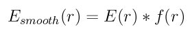
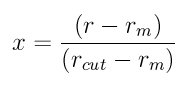
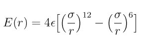
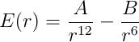

.. index:: pair\_style lj/mdf

pair\_style lj/mdf command
==========================

pair\_style buck/mdf command
============================

pair\_style lennard/mdf command
===============================

Syntax
""""""

.. parsed-literal::

   pair_style style args

* style = *lj/mdf* or *buck/mdf* or *lennard/mdf*
* args = list of arguments for a particular style
  
  .. parsed-literal::
  
       *lj/mdf* args = cutoff1 cutoff2
         cutoff1 = inner cutoff for the start of the tapering function
         cutoff1 = out cutoff for the end of the tapering function
       *buck/mdf* args = cutoff1 cutoff2
         cutoff1 = inner cutoff for the start of the tapering function
         cutoff1 = out cutoff for the end of the tapering function
       *lennard/mdf* args = cutoff1 cutoff2
         cutoff1 = inner cutoff for the start of the tapering function
         cutoff1 = out cutoff for the end of the tapering function

Examples
""""""""

.. parsed-literal::

   pair_style lj/mdf 2.5 3.0
   pair_coeff \* \* 1.0 1.0
   pair_coeff 1 1 1.1 2.8 3.0 3.2

   pair_style buck 2.5 3.0
   pair_coeff \* \* 100.0 1.5 200.0
   pair_coeff \* \* 100.0 1.5 200.0 3.0 3.5

   pair_style lennard/mdf 2.5 3.0
   pair_coeff \* \* 1.0 1.0
   pair_coeff 1 1 1021760.3664 2120.317338 3.0 3.2

Description
"""""""""""

The *lj/mdf*\ , *buck/mdf* and *lennard/mdf* compute the standard 12-6
Lennard-Jones and Buckingham potential with the addition of a taper
function that ramps the energy and force smoothly to zero between an
inner and outer cutoff.

The tapering, *f(r)*\ , is done by using the Mei, Davenport, Fernando
function :ref:`(Mei) <Mei>`.

.. image:: Eqs/pair_mdf-2.jpg
   :align: center

where

Here *r\_m* is the inner cutoff radius and *r\_cut* is the outer cutoff
radius.

----------

For the *lj/mdf* pair\_style, the potential energy, *E(r)*\ , is the
standard 12-6 Lennard-Jones written in the epsilon/sigma form:

Either the first two or all of the following coefficients must be
defined for each pair of atoms types via the pair\_coeff command as
in the examples above, or in the data file read by the
:doc:`read\_data <read_data>`. The two cutoffs default to the global
values and epsilon and sigma can also be determined by mixing as
described below:

* epsilon (energy units)
* sigma (distance units)
* r\_m (distance units)
* r\_\ *cut* (distance units)

----------

For the *buck/mdf* pair\_style, the potential energy, *E(r)*\ , is the
standard Buckingham potential with three required coefficients.
The two cutoffs can be omitted and default to the corresponding
global values:

.. image:: Eqs/pair_mdf-5.jpg
   :align: center

* A (energy units)
* \rho (distance units)
* C (energy-distance\^6 units)
* r\_m (distance units)
* r\_\ *cut* (distance units)

----------

For the *lennard/mdf* pair\_style, the potential energy, *E(r)*\ , is the
standard 12-6 Lennard-Jones written in the A/B form:

The following coefficients must be defined for each pair of atoms
types via the pair\_coeff command as in the examples above, or in the
data file read by the read\_data commands, or by mixing as described below.
The two cutoffs default to their global values and must be either both
given or both left out:

* A (energy-distance\^12 units)
* B (energy-distance\^6 units)
* r\_m (distance units)
* r\_\ *cut* (distance units)

----------

**Mixing, shift, table, tail correction, restart, rRESPA info**\ :

For atom type pairs I,J and I != J, the epsilon and sigma coefficients
and cutoff distances for the lj/mdf pair style can be mixed.
The default mix value is *geometric*\ .  See the "pair\_modify" command
for details. The other two pair styles buck/mdf and lennard/mdf do not
support mixing, so all I,J pairs of coefficients must be specified
explicitly.

None of the lj/mdf, buck/mdf, or lennard/mdf pair styles supports
the :doc:`pair\_modify <pair_modify>` shift option or long-range
tail corrections to pressure and energy.

These styles write their information to :doc:`binary restart files <restart>`, so pair\_style and pair\_coeff commands do not need
to be specified in an input script that reads a restart file.

These styles can only be used via the *pair* keyword of the :doc:`run\_style respa <run_style>` command.  They do not support the *inner*\ ,
*middle*\ , *outer* keywords.

----------

Restrictions
""""""""""""

These pair styles can only be used if LAMMPS was built with the
USER-MISC package.  See the :doc:`Build package <Build_package>` doc
page for more info.

Related commands
""""""""""""""""

:doc:`pair\_coeff <pair_coeff>`

**Default:** none

----------

.. _Mei:

**(Mei)** Mei, Davenport, Fernando, Phys Rev B, 43 4653 (1991)

.. _lws: http://lammps.sandia.gov
.. _ld: Manual.html
.. _lc: Commands_all.html
