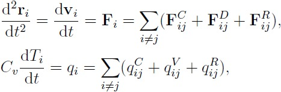
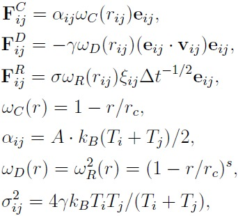
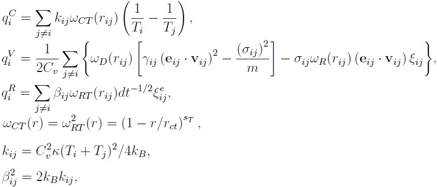
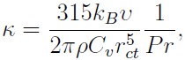
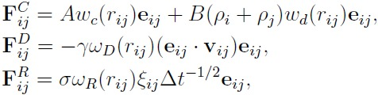
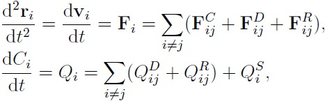
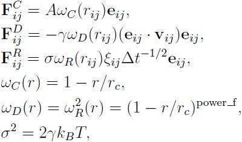
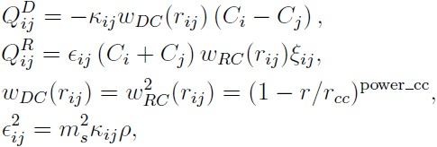

.. index:: pair\_style edpd

pair\_style edpd command
========================

pair\_style mdpd command
========================

pair\_style mdpd/rhosum command
===============================

pair\_style tdpd command
========================

Syntax
""""""

.. parsed-literal::

   pair_style style args

* style = *edpd* or *mdpd* or *mdpd/rhosum* or *tdpd*
* args = list of arguments for a particular style
  
  .. parsed-literal::
  
       *edpd* args = cutoff seed
         cutoff = global cutoff for eDPD interactions (distance units)
         seed = random # seed (integer) (if <= 0, eDPD will use current time as the seed)
       *mdpd* args = T cutoff seed
         T = temperature (temperature units)
         cutoff = global cutoff for mDPD interactions (distance units)
         seed = random # seed (integer) (if <= 0, mDPD will use current time as the seed)
       *mdpd/rhosum* args =
       *tdpd* args = T cutoff seed
         T = temperature (temperature units)
         cutoff = global cutoff for tDPD interactions (distance units)
         seed = random # seed (integer) (if <= 0, tDPD will use current time as the seed)

Examples
""""""""

.. parsed-literal::

   pair_style edpd 1.58 9872598
   pair_coeff \* \* 18.75 4.5 0.41 1.58 1.42E-5 2.0 1.58
   pair_coeff 1 1 18.75 4.5 0.41 1.58 1.42E-5 2.0 1.58 power 10.54 -3.66 3.44 -4.10
   pair_coeff 1 1 18.75 4.5 0.41 1.58 1.42E-5 2.0 1.58 power 10.54 -3.66 3.44 -4.10 kappa -0.44 -3.21 5.04 0.00

   pair_style hybrid/overlay mdpd/rhosum mdpd 1.0 1.0 65689
   pair_coeff 1 1 mdpd/rhosum  0.75
   pair_coeff 1 1 mdpd -40.0 25.0 18.0 1.0 0.75

   pair_style tdpd 1.0 1.58 935662
   pair_coeff \* \* 18.75 4.5 0.41 1.58 1.58 1.0 1.0E-5 2.0
   pair_coeff 1 1 18.75 4.5 0.41 1.58 1.58 1.0 1.0E-5 2.0 3.0 1.0E-5 2.0

Description
"""""""""""

The *edpd* style computes the pairwise interactions and heat fluxes
for eDPD particles following the formulations in
:ref:`(Li2014\_JCP) <Li2014_JCP>` and :ref:`Li2015\_CC <Li2015_CC>`. The time
evolution of an eDPD particle is governed by the conservation of
momentum and energy given by

where the three components of Fi
including the conservative force FijC, dissipative force FijD and random force FijR are expressed as

in which the exponent of the weighting function <i>s</i> can be defined as a temperature-dependent
variable. The heat flux between particles accounting for the
collisional heat flux qC, viscous
heat flux qV, and random heat flux
qR are given by

where the mesoscopic heat friction &kappa; is given by

with &upsilon; being the kinematic
viscosity. For more details, see Eq.(15) in :ref:`(Li2014\_JCP) <Li2014_JCP>`.

The following coefficients must be defined in eDPD system for each
pair of atom types via the :doc:`pair\_coeff <pair_coeff>` command as in
the examples above.

* A (force units)
* gamma (force/velocity units)
* power\_f (positive real)
* cutoff (distance units)
* kappa (thermal conductivity units)
* power\_T (positive real)
* cutoff\_T (distance units)
* optional keyword = power or kappa

The keyword *power* or *kappa* is optional. Both "power" and "kappa"
require 4 parameters c1, c2,
c4, c4 showing the temperature dependence
of the exponent 
 <i>s</i>(<i>T</i>) =
power\_f\*(1+c1\*(T-1)+c2\*(T-1)2
+c3\*(T-1)3+c4\*(T-1)4)

and of the mesoscopic heat friction 

<i>sT(T)</i> =
kappa\*(1+c1\*(T-1)+c2\*(T-1)2
+c3\*(T-1)3+c4\*(T-1)4)

If the keyword *power* or *kappa* is not specified, the eDPD system
will use constant power\_f and kappa, which is independent to
temperature changes.

----------

The *mdpd/rhosum* style computes the local particle mass density rho
for mDPD particles by kernel function interpolation.

The following coefficients must be defined for each pair of atom types
via the :doc:`pair\_coeff <pair_coeff>` command as in the examples above.

* cutoff (distance units)

----------

The *mdpd* style computes the many-body interactions between mDPD
particles following the formulations in
:ref:`(Li2013\_POF) <Li2013_POF>`. The dissipative and random forces are in
the form same as the classical DPD, but the conservative force is
local density dependent, which are given by

where the first term in FC with a
negative coefficient A < 0 stands for an attractive force within an
interaction range rc, and the second
term with B > 0 is the density-dependent repulsive force within an
interaction range rd.

The following coefficients must be defined for each pair of atom types via the
:doc:`pair\_coeff <pair_coeff>` command as in the examples above.

* A (force units)
* B (force units)
* gamma (force/velocity units)
* cutoff\_c (distance units)
* cutoff\_d (distance units)

----------

The *tdpd* style computes the pairwise interactions and chemical
concentration fluxes for tDPD particles following the formulations in
:ref:`(Li2015\_JCP) <Li2015_JCP>`.  The time evolution of a tDPD particle is
governed by the conservation of momentum and concentration given by

where the three components of Fi
including the conservative force FijC, dissipative force FijD and random force FijR are expressed as

The concentration flux between two tDPD particles includes the Fickian
flux QijD and random flux
QijR, which are given by

where the parameters kappa and epsilon determine the strength of the
Fickian and random fluxes. <i>m</i>s
is the mass of a single solute molecule.  In general, <i>m</i>s is much smaller than the mass of
a tDPD particle <i>m</i>. For more details, see
:ref:`(Li2015\_JCP) <Li2015_JCP>`.

The following coefficients must be defined for each pair of atom types via the
:doc:`pair\_coeff <pair_coeff>` command as in the examples above.

* A (force units)
* gamma (force/velocity units)
* power\_f (positive real)
* cutoff (distance units)
* cutoff\_CC (distance units)
* kappa\_i (diffusivity units)
* epsilon\_i (diffusivity units)
* power\_cc\_i (positive real)

The last 3 values must be repeated Nspecies times, so that values for
each of the Nspecies chemical species are specified, as indicated by
the "I" suffix.  In the first pair\_coeff example above for pair\_style
tdpd, Nspecies = 1.  In the second example, Nspecies = 2, so 3
additional coeffs are specified (for species 2).

----------

**Example scripts**

There are example scripts for using all these pair styles in
examples/USER/meso.  The example for an eDPD simulation models heat
conduction with source terms analog of periodic Poiseuille flow
problem. The setup follows Fig.12 in :ref:`(Li2014\_JCP) <Li2014_JCP>`. The
output of the short eDPD simulation (about 2 minutes on a single core)
gives a temperature and density profiles as

.. image:: JPG/examples_edpd.jpg
   :align: center

The example for a mDPD simulation models the oscillations of a liquid
droplet started from a liquid film. The mDPD parameters are adopted
from :ref:`(Li2013\_POF) <Li2013_POF>`.  The short mDPD run (about 2 minutes
on a single core) generates a particle trajectory which can
be visualized as follows.

.. image:: JPG/examples_mdpd_first.jpg
   :target: JPG/examples_mdpd.gif
   :align: center

.. image:: JPG/examples_mdpd_last.jpg
   :align: center

The first image is the initial state of the simulation.  If you
click it a GIF movie should play in your browser.  The second image
is the final state of the simulation.

The example for a tDPD simulation computes the effective diffusion
coefficient of a tDPD system using a method analogous to the periodic
Poiseuille flow.  The tDPD system is specified with two chemical
species, and the setup follows Fig.1 in
:ref:`(Li2015\_JCP) <Li2015_JCP>`. The output of the short tDPD simulation
(about one and a half minutes on a single core) gives the
concentration profiles of the two chemical species as

.. image:: JPG/examples_tdpd.jpg
   :align: center

----------

**Mixing, shift, table, tail correction, restart, rRESPA info**\ :

The styles *edpd*\ , *mdpd*\ , *mdpd/rhosum* and *tdpd* do not support
mixing. Thus, coefficients for all I,J pairs must be specified explicitly.

The styles *edpd*\ , *mdpd*\ , *mdpd/rhosum* and *tdpd* do not support
the :doc:`pair\_modify <pair_modify>` shift, table, and tail options.

The styles *edpd*\ , *mdpd*\ , *mdpd/rhosum* and *tdpd* do not write
information to :doc:`binary restart files <restart>`. Thus, you need
to re-specify the pair\_style and pair\_coeff commands in an input script
that reads a restart file.

Restrictions
""""""""""""

The pair styles *edpd*\ , *mdpd*\ , *mdpd/rhosum* and *tdpd* are part of
the USER-MESO package. It is only enabled if LAMMPS was built with
that package.  See the :doc:`Build package <Build_package>` doc page for
more info.

Related commands
""""""""""""""""

:doc:`pair\_coeff <pair_coeff>`, :doc:`fix mvv/dpd <fix_mvv_dpd>`,
:doc:`fix mvv/edpd <fix_mvv_dpd>`, :doc:`fix mvv/tdpd <fix_mvv_dpd>`,
:doc:`fix edpd/source <fix_dpd_source>`, :doc:`fix tdpd/source <fix_dpd_source>`,
:doc:`compute edpd/temp/atom <compute_edpd_temp_atom>`,
:doc:`compute tdpd/cc/atom <compute_tdpd_cc_atom>`

**Default:** none

----------

.. _Li2014\_JCP:

**(Li2014\_JCP)** Li, Tang, Lei, Caswell, Karniadakis, J Comput Phys,
265: 113-127 (2014).  DOI: 10.1016/j.jcp.2014.02.003.

.. _Li2015\_CC:

**(Li2015\_CC)** Li, Tang, Li, Karniadakis, Chem Commun, 51: 11038-11040
(2015).  DOI: 10.1039/C5CC01684C.

.. _Li2013\_POF:

**(Li2013\_POF)** Li, Hu, Wang, Ma, Zhou, Phys Fluids, 25: 072103 (2013).
DOI: 10.1063/1.4812366.

.. _Li2015\_JCP:

**(Li2015\_JCP)** Li, Yazdani, Tartakovsky, Karniadakis, J Chem Phys,
143: 014101 (2015).  DOI: 10.1063/1.4923254.

.. _lws: http://lammps.sandia.gov
.. _ld: Manual.html
.. _lc: Commands_all.html
