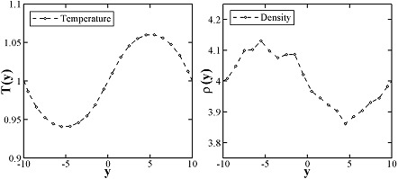

.. index:: pair_style edpd

pair_style edpd command
=======================

pair_style mdpd command
=======================

pair_style mdpd/rhosum command
==============================

pair_style tdpd command
=======================

Syntax
""""""

.. code-block:: LAMMPS

   pair_style style args

* style = *edpd* or *mdpd* or *mdpd/rhosum* or *tdpd*
* args = list of arguments for a particular style

  .. parsed-literal::

       *edpd* args = cutoff seed
         cutoff = global cutoff for eDPD interactions (distance units)
         seed = random # seed (integer) (if <= 0, eDPD will use current time as the seed)
       *mdpd* args = T cutoff seed
         T = temperature (temperature units)
         cutoff = global cutoff for mDPD interactions (distance units)
         seed = random # seed (integer) (if <= 0, mDPD will use current time as the seed)
       *mdpd/rhosum* args =
       *tdpd* args = T cutoff seed
         T = temperature (temperature units)
         cutoff = global cutoff for tDPD interactions (distance units)
         seed = random # seed (integer) (if <= 0, tDPD will use current time as the seed)

Examples
""""""""

.. code-block:: LAMMPS

   pair_style edpd 1.58 9872598
   pair_coeff * * 18.75 4.5 0.41 1.58 1.42E-5 2.0 1.58
   pair_coeff 1 1 18.75 4.5 0.41 1.58 1.42E-5 2.0 1.58 power 10.54 -3.66 3.44 -4.10
   pair_coeff 1 1 18.75 4.5 0.41 1.58 1.42E-5 2.0 1.58 power 10.54 -3.66 3.44 -4.10 kappa -0.44 -3.21 5.04 0.00

   pair_style hybrid/overlay mdpd/rhosum mdpd 1.0 1.0 65689
   pair_coeff 1 1 mdpd/rhosum  0.75
   pair_coeff 1 1 mdpd -40.0 25.0 18.0 1.0 0.75

   pair_style tdpd 1.0 1.58 935662
   pair_coeff * * 18.75 4.5 0.41 1.58 1.58 1.0 1.0E-5 2.0
   pair_coeff 1 1 18.75 4.5 0.41 1.58 1.58 1.0 1.0E-5 2.0 3.0 1.0E-5 2.0

Description
"""""""""""

The *edpd* style computes the pairwise interactions and heat fluxes
for eDPD particles following the formulations in
:ref:`(Li2014_JCP) <Li2014_JCP>` and :ref:`Li2015_CC <Li2015_CC>`. The time
evolution of an eDPD particle is governed by the conservation of
momentum and energy given by

.. math::

   \frac{\mathrm{d}^2 \mathbf{r}_i}{\mathrm{d} t^2}=
   \frac{\mathrm{d} \mathbf{v}_i}{\mathrm{d} t}
   =\mathbf{F}_{i}=\sum_{i\neq j}(\mathbf{F}_{ij}^{C}+\mathbf{F}_{ij}^{D}+\mathbf{F}_{ij}^{R}) \\
   C_v\frac{\mathrm{d} T_i}{\mathrm{d} t}= q_{i} = \sum_{i\neq j}(q_{ij}^{C}+q_{ij}^{V}+q_{ij}^{R}),

where the three components of :math:`F_{i}` including the conservative
force :math:`F_{ij}^C`, dissipative force :math:`F_{ij}^D` and random
force :math:`F_{ij}^R` are expressed as

.. math::

  \mathbf{F}_{ij}^{C} & = \alpha_{ij}{\omega_{C}}(r_{ij})\mathbf{e}_{ij} \\
  \mathbf{F}_{ij}^{D} & = -\gamma {\omega_{D}}(r_{ij})(\mathbf{e}_{ij} \cdot \mathbf{v}_{ij})\mathbf{e}_{ij} \\
  \mathbf{F}_{ij}^{R} & = \sigma {\omega_{R}}(r_{ij}){\xi_{ij}}\Delta t^{-1/2} \mathbf{e}_{ij} \\
  \omega_{C}(r) & = 1 - r/r_c \\
  \alpha_{ij} & = A\cdot k_B(T_i + T_j)/2 \\
  \omega_{D}(r) & = \omega^2_{R}(r) = (1-r/r_c)^s \\
  \sigma_{ij}^2 & = 4\gamma k_B T_i T_j/(T_i + T_j)

in which the exponent of the weighting function *s* can be defined as a
temperature-dependent variable. The heat flux between particles
accounting for the collisional heat flux :math:`q^C`, viscous heat flux
:math:`q^V`, and random heat flux :math:`q^R` are given by

.. math::

   q_i^C & = \sum_{j \ne i} k_{ij} \omega_{CT}(r_{ij}) \left( \frac{1}{T_i} - \frac{1}{T_j} \right) \\
   q_i^V & = \frac{1}{2 C_v}\sum_{j \ne i}{ \left\{ \omega_D(r_{ij})\left[\gamma_{ij} \left( \mathbf{e}_{ij} \cdot \mathbf{v}_{ij} \right)^2 - \frac{\left( \sigma _{ij} \right)^2}{m}\right] - \sigma _{ij} \omega_R(r_{ij})\left( \mathbf{e}_{ij} \cdot \mathbf{v}_{ij} \right){\xi_{ij}} \right\} } \\
   q_i^R & = \sum_{j \ne i} \beta _{ij} \omega_{RT}(r_{ij}) d {t^{ - 1/2}} \xi_{ij}^e \\
   \omega_{CT}(r) & =\omega_{RT}^2(r)=\left(1-r/r_{ct}\right)^{s_T} \\
   k_{ij} & =C_v^2\kappa(T_i + T_j)^2/4k_B \\
   \beta_{ij}^2 & = 2k_Bk_{ij}

where the mesoscopic heat friction :math:`\kappa` is given by

.. math::

  \kappa  = \frac{315k_B\upsilon }{2\pi \rho C_v r_{ct}^5}\frac{1}{Pr},

with :math:`\upsilon` being the kinematic viscosity. For more details,
see Eq.(15) in :ref:`(Li2014_JCP) <Li2014_JCP>`.

The following coefficients must be defined in eDPD system for each
pair of atom types via the :doc:`pair_coeff <pair_coeff>` command as in
the examples above.

* A (force units)
* :math:`\gamma` (force/velocity units)
* power_f (positive real)
* cutoff (distance units)
* kappa (thermal conductivity units)
* power_T (positive real)
* cutoff_T (distance units)
* optional keyword = power or kappa

The keyword *power* or *kappa* is optional. Both "power" and "kappa"
require 4 parameters :math:`c_1, c_2, c_3, c_4` showing the temperature
dependence of the exponent :math:`s(T) = \mathrm{power}_f ( 1+c_1
(T-1) + c_2 (T-1)^2 + c_3 (T-1)^3 + c_4 (T-1)^4 )` and of the mesoscopic
heat friction :math:`s_T(T) = \kappa (1 + c_1 (T-1) + c_2 (T-1)^2 + c_3
(T-1)^3 + c_4 (T-1)^4)`.  If the keyword *power* or *kappa* is not
specified, the eDPD system will use constant power_f and
:math:`\kappa`, which is independent to temperature changes.

----------

The *mdpd/rhosum* style computes the local particle mass density
:math:`\rho` for mDPD particles by kernel function interpolation.

The following coefficients must be defined for each pair of atom types
via the :doc:`pair_coeff <pair_coeff>` command as in the examples above.

* cutoff (distance units)

----------

The *mdpd* style computes the many-body interactions between mDPD
particles following the formulations in
:ref:`(Li2013_POF) <Li2013_POF>`. The dissipative and random forces are in
the form same as the classical DPD, but the conservative force is
local density dependent, which are given by

.. math::

   \mathbf{F}_{ij}^C & = Aw_c(r_{ij})\mathbf{e}_{ij} + B(\rho_i+\rho_j)w_d(r_{ij})\mathbf{e}_{ij} \\
   \mathbf{F}_{ij}^{D} & = -\gamma {\omega_{D}}(r_{ij})(\mathbf{e}_{ij} \cdot \mathbf{v}_{ij})\mathbf{e}_{ij} \\
   \mathbf{F}_{ij}^{R} & = \sigma {\omega_{R}}(r_{ij}){\xi_{ij}}\Delta t^{-1/2} \mathbf{e}_{ij}

where the first term in :math:`F_C` with a negative coefficient :math:`A
< 0` stands for an attractive force within an interaction range
:math:`r_c`, and the second term with :math:`B > 0` is the
density-dependent repulsive force within an interaction range
:math:`r_d`.

The following coefficients must be defined for each pair of atom types via the
:doc:`pair_coeff <pair_coeff>` command as in the examples above.

* A (force units)
* B (force units)
* :math:`\gamma` (force/velocity units)
* cutoff_c (distance units)
* cutoff_d (distance units)

----------

The *tdpd* style computes the pairwise interactions and chemical
concentration fluxes for tDPD particles following the formulations in
:ref:`(Li2015_JCP) <Li2015_JCP>`.  The time evolution of a tDPD particle is
governed by the conservation of momentum and concentration given by

.. math::

   \frac{\mathrm{d}^2 \mathbf{r}_i}{\mathrm{d} t^2} & = \frac{\mathrm{d} \mathbf{v}_i}{\mathrm{d} t}=\mathbf{F}_{i}=\sum_{i\neq j}(\mathbf{F}_{ij}^{C}+\mathbf{F}_{ij}^{D}+\mathbf{F}_{ij}^{R}) \\
   \frac{\mathrm{d} C_{i}}{\mathrm{d} t} & = Q_{i} = \sum_{i\neq j}(Q_{ij}^{D}+Q_{ij}^{R}) + Q_{i}^{S}

where the three components of :math:`F_{i}` including the conservative
force :math:`F_{ij}^C`, dissipative force :math:`F_{ij}^C` and random
force :math:`F_{ij}^C` are expressed as

.. math::

  \mathbf{F}_{ij}^{C} & = A{\omega_{C}}(r_{ij})\mathbf{e}_{ij} \\
  \mathbf{F}_{ij}^{D} & = -\gamma {\omega_{D}}(r_{ij})(\mathbf{e}_{ij} \cdot \mathbf{v}_{ij})\mathbf{e}_{ij}  \\
  \mathbf{F}_{ij}^{R} & = \sigma {\omega_{R}}(r_{ij}){\xi_{ij}}\Delta t^{-1/2} \mathbf{e}_{ij} \\
  \omega_{C}(r) & = 1 - r/r_c \\
  \omega_{D}(r) & = \omega^2_{R}(r) = (1-r/r_c)^{\rm power_f} \\
  \sigma^2 = 2\gamma k_B T

The concentration flux between two tDPD particles includes the Fickian
flux :math:`Q_{ij}^D` and random flux :math:`Q_{ij}^R`, which are given
by

.. math::

   Q_{ij}^D & = -\kappa_{ij} w_{DC}(r_{ij}) \left( C_i - C_j \right) \\
   Q_{ij}^R & = \epsilon_{ij}\left( C_i + C_j \right) w_{RC}(r_{ij}) \xi_{ij} \\
   w_{DC}(r_{ij}) & =w^2_{RC}(r_{ij}) = (1 - r/r_{cc})^{\rm power_{cc}} \\
   \epsilon_{ij}^2 & = m_s^2\kappa_{ij}\rho

where the parameters kappa and epsilon determine the strength of the
Fickian and random fluxes. :math:`m_s` is the mass of a single solute
molecule.  In general, :math:`m_s` is much smaller than the mass of a
tDPD particle *m*\ . For more details, see :ref:`(Li2015_JCP)
<Li2015_JCP>`.

The following coefficients must be defined for each pair of atom types via the
:doc:`pair_coeff <pair_coeff>` command as in the examples above.

* A (force units)
* :math:`\gamma` (force/velocity units)
* power_f (positive real)
* cutoff (distance units)
* cutoff_CC (distance units)
* :math:`\kappa_i` (diffusivity units)
* :math:`\epsilon_i` (diffusivity units)
* power_cc_i (positive real)

The last 3 values must be repeated Nspecies times, so that values for
each of the Nspecies chemical species are specified, as indicated by
the "I" suffix.  In the first pair_coeff example above for pair_style
tdpd, Nspecies = 1.  In the second example, Nspecies = 2, so 3
additional coeffs are specified (for species 2).

----------

**Example scripts**

There are example scripts for using all these pair styles in
examples/USER/meso.  The example for an eDPD simulation models heat
conduction with source terms analog of periodic Poiseuille flow
problem. The setup follows Fig.12 in :ref:`(Li2014_JCP) <Li2014_JCP>`. The
output of the short eDPD simulation (about 2 minutes on a single core)
gives a temperature and density profiles as

The example for a mDPD simulation models the oscillations of a liquid
droplet started from a liquid film. The mDPD parameters are adopted
from :ref:`(Li2013_POF) <Li2013_POF>`.  The short mDPD run (about 2 minutes
on a single core) generates a particle trajectory which can
be visualized as follows.

.. image:: JPG/examples_mdpd_first.jpg
   :target: JPG/examples_mdpd.gif
   :align: center

.. image:: JPG/examples_mdpd_last.jpg
   :align: center

The first image is the initial state of the simulation.  If you
click it a GIF movie should play in your browser.  The second image
is the final state of the simulation.

The example for a tDPD simulation computes the effective diffusion
coefficient of a tDPD system using a method analogous to the periodic
Poiseuille flow.  The tDPD system is specified with two chemical
species, and the setup follows Fig.1 in
:ref:`(Li2015_JCP) <Li2015_JCP>`. The output of the short tDPD simulation
(about one and a half minutes on a single core) gives the
concentration profiles of the two chemical species as

.. image:: JPG/examples_tdpd.jpg
   :align: center

----------

**Mixing, shift, table, tail correction, restart, rRESPA info**\ :

The styles *edpd*\ , *mdpd*\ , *mdpd/rhosum* and *tdpd* do not support
mixing. Thus, coefficients for all I,J pairs must be specified explicitly.

The styles *edpd*\ , *mdpd*\ , *mdpd/rhosum* and *tdpd* do not support
the :doc:`pair_modify <pair_modify>` shift, table, and tail options.

The styles *edpd*\ , *mdpd*\ , *mdpd/rhosum* and *tdpd* do not write
information to :doc:`binary restart files <restart>`. Thus, you need
to re-specify the pair_style and pair_coeff commands in an input script
that reads a restart file.

Restrictions
""""""""""""

The pair styles *edpd*\ , *mdpd*\ , *mdpd/rhosum* and *tdpd* are part of
the USER-MESODPD package. It is only enabled if LAMMPS was built with
that package.  See the :doc:`Build package <Build_package>` doc page for
more info.

Related commands
""""""""""""""""

:doc:`pair_coeff <pair_coeff>`, :doc:`fix mvv/dpd <fix_mvv_dpd>`,
:doc:`fix mvv/edpd <fix_mvv_dpd>`, :doc:`fix mvv/tdpd <fix_mvv_dpd>`,
:doc:`fix edpd/source <fix_dpd_source>`, :doc:`fix tdpd/source <fix_dpd_source>`,
:doc:`compute edpd/temp/atom <compute_edpd_temp_atom>`,
:doc:`compute tdpd/cc/atom <compute_tdpd_cc_atom>`

**Default:** none

----------

.. _Li2014_JCP:

**(Li2014_JCP)** Li, Tang, Lei, Caswell, Karniadakis, J Comput Phys,
265: 113-127 (2014).  DOI: 10.1016/j.jcp.2014.02.003.

.. _Li2015_CC:

**(Li2015_CC)** Li, Tang, Li, Karniadakis, Chem Commun, 51: 11038-11040
(2015).  DOI: 10.1039/C5CC01684C.

.. _Li2013_POF:

**(Li2013_POF)** Li, Hu, Wang, Ma, Zhou, Phys Fluids, 25: 072103 (2013).
DOI: 10.1063/1.4812366.

.. _Li2015_JCP:

**(Li2015_JCP)** Li, Yazdani, Tartakovsky, Karniadakis, J Chem Phys,
143: 014101 (2015).  DOI: 10.1063/1.4923254.
