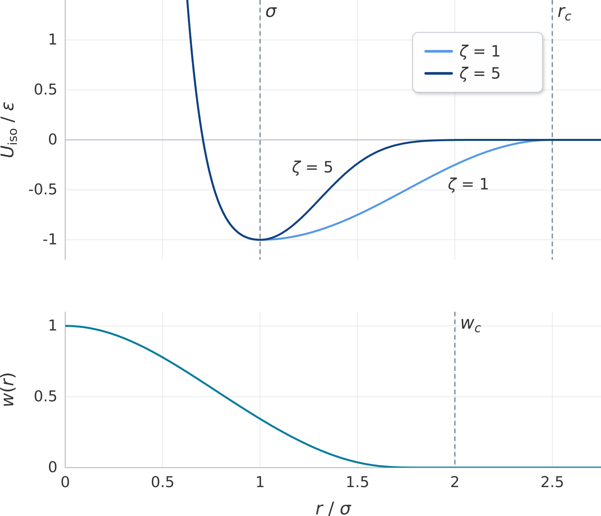
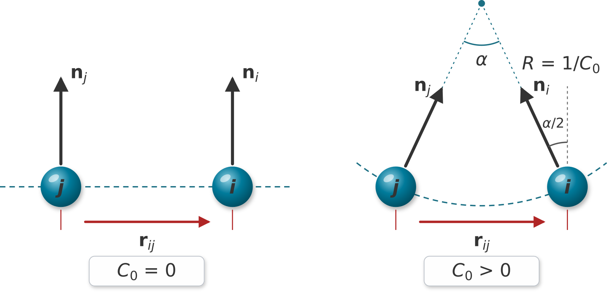

.. index:: pair_style mesomem/dipole
.. index:: pair_style mesomem/dipole/omp

pair_style mesomem/dipole command
=================================

Accelerator Variants: *mesomem/dipole/omp*

Syntax
""""""

.. code-block:: LAMMPS

   pair_style mesomem/dipole

This pair style has no arguments.  The cutoffs are set for each pair of
atom types with the :doc:`pair_coeff <pair_coeff>` command.

Examples
""""""""

.. code-block:: LAMMPS

   pair_style mesomem/dipole
   pair_coeff * * 1.0 1.0 15.0 1.0 2.5 2.0 5.0 0.0
   pair_coeff 1 2 1.0 1.0 15.0 1.0 2.5 2.0 5.0 0.05

Example input scripts available: examples/PACKAGES/mesomem, https://gitlab.tudelft.nl/idema-group/mesomem

Description
"""""""""""

.. versionadded:: TBD

The *mesomem/dipole* style computes the MesoMem interaction
:ref:`(Sillano) <Sillano>` for a solvent-free, one-particle-thick,
coarse-grained model of fluid membranes.  Each particle represents a
patch of a lipid bilayer, and the *direction* of its dipole vector
represents the local membrane normal.  Unlike for :doc:`pair_style ylz
<pair_ylz>`, where the orientation dependence multiplies the isotropic
potential, this pair style adds tilt and splay energies, weighted by a
smooth, short-ranged function of the distance, to a purely radial
isotropic potential:

.. math::

   U(\mathbf{r}_{ij}, \mathbf{n}_i, \mathbf{n}_j) = U_{iso}(r)
      + w(r) \left[ U_{tilt}(\mathbf{r}_{ij}, \mathbf{n}_i, \mathbf{n}_j)
      + U_{splay}(r, \mathbf{n}_i, \mathbf{n}_j) \right]

Here :math:`\mathbf{r}_{ij} = \mathbf{r}_i - \mathbf{r}_j` is the
distance vector between particles *i* and *j*,
:math:`r = |\mathbf{r}_{ij}|`, :math:`\hat{\mathbf{r}}_{ij} =
\mathbf{r}_{ij}/r`, and the unit vectors :math:`\mathbf{n}_i` and
:math:`\mathbf{n}_j` point along the dipoles of particles *i* and *j*.

The isotropic part :math:`U_{iso}` is

.. math::

   U_{iso}(r) = \left\{\begin{matrix}
      \epsilon \left[ \left( \dfrac{\sigma}{r} \right)^{4}
         - 2 \left( \dfrac{\sigma}{r} \right)^{2} \right], & r < \sigma \\[1.2ex]
      -\epsilon \, \cos^{2\zeta} \left[ \dfrac{\pi}{2}
         \dfrac{r - \sigma}{r_{c} - \sigma} \right], & \sigma \le r < r_{c} \\[1.2ex]
      0, & r \ge r_{c}
   \end{matrix}\right.

where :math:`\epsilon` is the depth of the minimum at :math:`r = \sigma`,
and :math:`r_c` is the cutoff for this pair of atom types.  The exponent
:math:`\zeta` controls the width of the attractive branch (larger values
make it narrower) and thus the in-plane diffusivity of the particles
within the membrane.  For :math:`\zeta > 0.5` the force goes smoothly to
zero at :math:`r_c`.

The tilt and splay energies act only over a shorter distance and are
switched off smoothly at the cutoff :math:`w_c` by the weight function

.. math::

   w(r) = \left\{\begin{matrix}
      \exp \left[ - \dfrac{r^{2}}{ \left( w_{c}/2 \right)^{2}
         \left( 1 - \left( r / w_{c} \right)^{4} \right) } \right], & r < w_{c} \\[1.2ex]
      0, & r \ge w_{c}
   \end{matrix}\right.

   Isotropic potential :math:`U_{iso}(r)` for two values of
   :math:`\zeta` (top) and weight function :math:`w(r)` for the tilt and
   splay energies (bottom), both for :math:`r_c = 2.5\,\sigma` and
   :math:`w_c = 2\,\sigma`.

With the spontaneous curvature shift :math:`s = \tfrac{1}{2} r C_0` and
the tilt deviations :math:`d_i = \mathbf{n}_i \cdot \hat{\mathbf{r}}_{ij}
+ s` and :math:`d_j = \mathbf{n}_j \cdot \hat{\mathbf{r}}_{ij} - s`, the
tilt and splay energies are

.. math::

   U_{tilt} & = \frac{1}{2} k_{tilt} \left( d_i^{2} + d_j^{2} \right) \\
   U_{splay} & = \frac{1}{2} k_{splay} \left( \mathbf{n}_i \cdot \mathbf{n}_j
      - 1 + 2 s^{2} \right)^{2}

where :math:`k_{tilt}` and :math:`k_{splay}` are the tilt and splay
stiffness constants and :math:`C_0` is the spontaneous curvature.  Both
energies are zero for the pair geometries shown in the figure below.  For
:math:`C_0 = 0` this is a flat membrane, where both normals are parallel
to each other and perpendicular to :math:`\mathbf{r}_{ij}`.  For
:math:`C_0 \ne 0` both particles are located on a sphere of radius
:math:`R = 1/|C_0|` and their normals are tilted by the angle
:math:`\alpha/2` against the perpendicular to :math:`\mathbf{r}_{ij}`,
with :math:`\sin(\alpha/2) = r |C_0|/2`.  For :math:`C_0 > 0` the normals
point *toward* the center of curvature, i.e. the membrane prefers to bend
toward the side the dipoles point to; for :math:`C_0 < 0` they point away
from it.

   Pair geometries with zero tilt and splay energy for :math:`C_0 = 0`
   (left) and :math:`C_0 > 0` (right).  The angle :math:`\alpha` is
   exaggerated for clarity.

Particles with a zero length dipole moment vector interact with all
other particles only through :math:`U_{iso}`.

.. note::

   This pair style does *not* compute any electrostatic interactions;
   there are no charge-dipole or dipole-dipole terms.  The dipole vector
   of :doc:`atom_style dipole <atom_style>` only serves to store the
   orientation of each particle, and its magnitude has no effect on this
   pair style.

   Other commands treat the dipole vector as an electric dipole moment,
   for example :doc:`fix efield <fix_efield>` or :doc:`compute dipole
   <compute_dipole>`.  Their results are therefore only meaningful if
   the dipole vector is also meant to represent one.  Electrostatic
   interactions between the dipoles can be added to the MesoMem
   interaction with :doc:`pair_style hybrid/overlay <pair_hybrid>` and a
   point dipole pair style, for example :doc:`pair_style
   lj/cut/dipole/cut <pair_dipole>` with :math:`\epsilon = 0`.  Then the
   magnitude of the dipole moments matters for the electrostatic part,
   but still not for the MesoMem part:

   .. code-block:: LAMMPS

      pair_style hybrid/overlay mesomem/dipole lj/cut/dipole/cut 2.5 5.0
      pair_coeff * * mesomem/dipole 1.0 1.0 15.0 1.0 2.5 2.0 5.0 0.0
      pair_coeff * * lj/cut/dipole/cut 0.0 1.0

The following coefficients must be defined for each pair of atom types
via the :doc:`pair_coeff <pair_coeff>` command as in the examples above,
or in the data file or restart files read by the
:doc:`read_data <read_data>` or :doc:`read_restart <read_restart>`
commands:

* :math:`\sigma` (distance units), :math:`\sigma > 0`
* :math:`\epsilon` (energy units)
* :math:`k_{tilt}` (energy units)
* :math:`k_{splay}` (energy units)
* :math:`r_c` (distance units), :math:`r_c > \sigma`
* :math:`w_c` (distance units), :math:`0 < w_c \le r_c`
* :math:`\zeta` (unitless), :math:`\zeta \ge 0.5`
* :math:`C_0` (inverse distance units)

All eight coefficients must always be specified.

To integrate the rotational motion of the particles, use a time
integration fix that updates the dipole orientation, for example
:doc:`fix nve/sphere <fix_nve_sphere>` or
:doc:`fix nvt/sphere <fix_nvt_sphere>` with the *update dipole* keyword,
or :doc:`fix brownian/sphere <fix_brownian>`.  When adding a
:doc:`fix langevin <fix_langevin>` thermostat, use the *omega yes*
keyword to also thermalize the rotational degrees of freedom.  The
rotational dynamics depends on the moment of inertia of the particles,
which is determined by their mass and diameter; the diameter does not
enter the pair interaction.  An example input is in the
``examples/PACKAGES/mesomem`` directory.

----------

.. include:: accel_styles.rst

----------

Mixing, shift, table, tail correction, restart, rRESPA info
"""""""""""""""""""""""""""""""""""""""""""""""""""""""""""

This pair style does not support mixing.  Coefficients for all pairs of
atom types, both I = J and I != J, must be set explicitly.  Data files
that can be read back must therefore be written with the *pair ij*
option of the :doc:`write_data <write_data>` command.

The :doc:`pair_modify <pair_modify>` shift option is not needed, since
the energy of this pair style goes to zero at the cutoff.  The
pair_modify table and tail options are not relevant for this pair style.

This pair style writes its information to :doc:`binary restart files
<restart>`, so pair_style and pair_coeff commands do not need to be
specified in an input script that reads a restart file.

This pair style can only be used via the *pair* keyword of the
:doc:`run_style respa <run_style>` command.  It does not support the
*inner*, *middle*, *outer* keywords.

----------

Restrictions
""""""""""""

This pair style is part of the DIPOLE package.  It is only enabled if
LAMMPS was built with that package.  See the :doc:`Build package
<Build_package>` page for more info.

This pair style requires the per-atom attributes *mu* and *torque*, as
provided for example by :doc:`atom_style hybrid sphere dipole
<atom_style>`.  With that atom style, a per-type mass must also be set
with the :doc:`mass <mass>` command (or in the data file), even though
only the per-atom masses are used.

Related commands
""""""""""""""""

:doc:`pair_coeff <pair_coeff>`, :doc:`pair_style ylz <pair_ylz>`,
:doc:`pair_style lj/cut/dipole/cut <pair_dipole>`,
:doc:`fix nve/sphere <fix_nve_sphere>`

Default
"""""""

none

----------

.. _Sillano:

**(Sillano)** Sillano, Marrink, Idema, Phys. Rev. E, 114, 034412 (2026).
