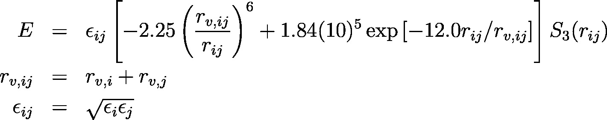
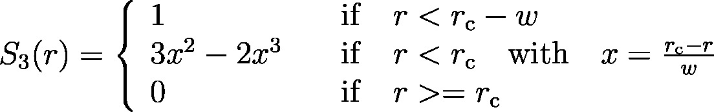
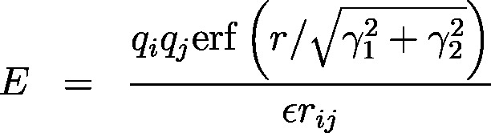

.. index:: pair\_style mm3/switch3/coulgauss/long

pair\_style mm3/switch3/coulgauss/long command
==============================================

Syntax
""""""

.. parsed-literal::

   pair_style style args

* style = *mm3/switch3/coulgauss/long*
* args = list of arguments for a particular style

.. parsed-literal::

     *mm3/switch3/coulgauss/long* args = cutoff (cutoff2) width
       cutoff  = global cutoff for MM3 (and Coulombic if only 1 arg) (distance units)
       cutoff2 = global cutoff for Coulombic (optional) (distance units)
       width  = width parameter of the smoothing function (distance units)

Examples
""""""""

.. parsed-literal::

   pair_style mm3/switch3/coulgauss/long    12.0 3.0
   pair_coeff 1  0.2 2.5 1.2

   pair_style mm3/switch3/coulgauss/long   12.0 10.0 3.0
   pair_coeff 1  0.2 2.5 1.2

Description
"""""""""""

The *mm3/switch3/coulgauss/long* style evaluates the MM3
vdW potential :ref:`(Allinger) <mm3-allinger1989>`

, which goes smoothly to zero at the cutoff r\_c as defined
by the switching function

where w is the width defined in the arguments. This potential
is combined with Coulomb interaction between Gaussian charge densities:

where qi and qj are the
charges on the 2 atoms, epsilon is the dielectric constant which
can be set by the :doc:`dielectric <dielectric>` command, gamma\_i and gamma\_j
are the widths of the Gaussian charge distribution and erf() is the error-function.
This style has to be used in conjunction with the :doc:`kspace_style <kspace_style>` command

If one cutoff is specified it is used for both the vdW and Coulomb
terms.  If two cutoffs are specified, the first is used as the cutoff
for the vdW terms, and the second is the cutoff for the Coulombic term.

The following coefficients must be defined for each pair of atoms
types via the :doc:`pair_coeff <pair_coeff>` command as in the examples
above, or in the data file or restart files read by the
:doc:`read_data <read_data>` or :doc:`read_restart <read_restart>`
commands:

* epsilon (energy)
* r\_v (distance)
* gamma (distance)

----------

**Mixing, shift, table, tail correction, restart, rRESPA info**\ :

Mixing rules are fixed for this style as defined above.

Shifting the potential energy is not necessary because the switching
function ensures that the potential is zero at the cut-off.

Restrictions
""""""""""""

These styles are part of the USER-YAFF package.  They are only
enabled if LAMMPS was built with that package.  See the :doc:`Build package <Build_package>` doc page for more info.

Related commands
""""""""""""""""

:doc:`pair_coeff <pair_coeff>`

**Default:** none

