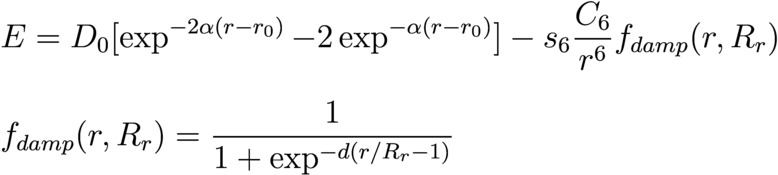

.. index:: pair\_style momb

pair\_style momb command
========================

Syntax
""""""

.. parsed-literal::

   pair_style momb cutoff s6 d

* cutoff = global cutoff (distance units)
* s6 = global scaling factor of the exchange-correlation functional used (unitless)
* d = damping scaling factor of Grimme's method (unitless)

Examples
""""""""

.. parsed-literal::

   pair_style momb 12.0 0.75 20.0
   pair_style hybrid/overlay eam/fs lj/charmm/coul/long 10.0 12.0 momb 12.0 0.75 20.0 morse 5.5

   pair_coeff 1 2 momb 0.0 1.0 1.0 10.2847 2.361

Description
"""""""""""

Style *momb* computes pairwise van der Waals (vdW) and short-range
interactions using the Morse potential and :ref:`(Grimme) <Grimme>` method
implemented in the Many-Body Metal-Organic (MOMB) force field
described comprehensively in :ref:`(Fichthorn) <Fichthorn>` and
:ref:`(Zhou) <Zhou4>`. Grimme's method is widely used to correct for
dispersion in density functional theory calculations.

For the *momb* pair style, the following coefficients must be defined
for each pair of atoms types via the :doc:`pair_coeff <pair_coeff>`
command as in the examples above, or in the data file or restart files
read by the :doc:`read_data <read_data>` as described below:

* D0 (energy units)
* alpha (1/distance units)
* r0 (distance units)
* C6 (energy\*distance\^6 units)
* Rr (distance units, typically sum of atomic vdW radii)

----------

Restrictions
""""""""""""

This style is part of the USER-MISC package. It is only enabled if
LAMMPS is built with that package. See the :doc:`Build package <Build_package>` doc page on for more info.

Related commands
""""""""""""""""

:doc:`pair_coeff <pair_coeff>`, :doc:`pair_style morse <pair_morse>`

**Default:** none

----------

.. _Grimme:

**(Grimme)** Grimme, J Comput Chem, 27(15), 1787-1799 (2006).

.. _Fichthorn:

**(Fichthorn)** Fichthorn, Balankura, Qi, CrystEngComm, 18(29), 5410-5417 (2016).

.. _Zhou4:

**(Zhou)** Zhou, Saidi, Fichthorn, J Phys Chem C, 118(6), 3366-3374 (2014).
