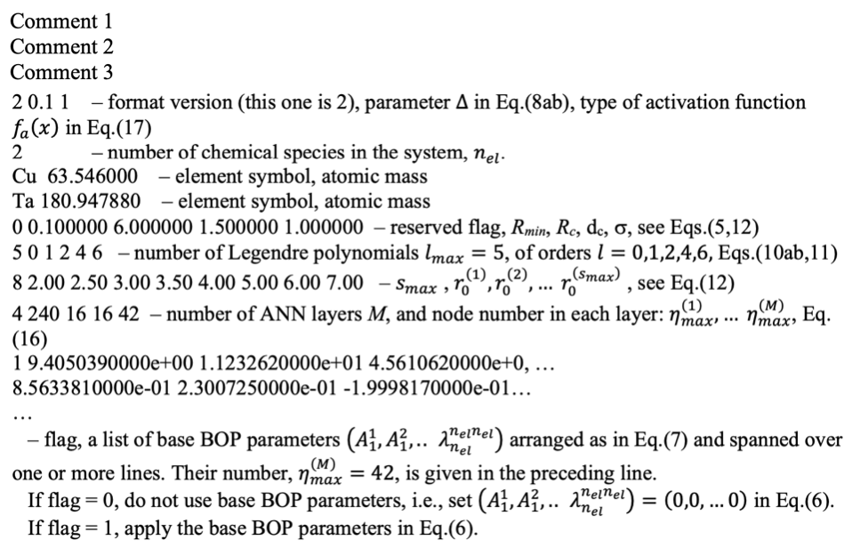
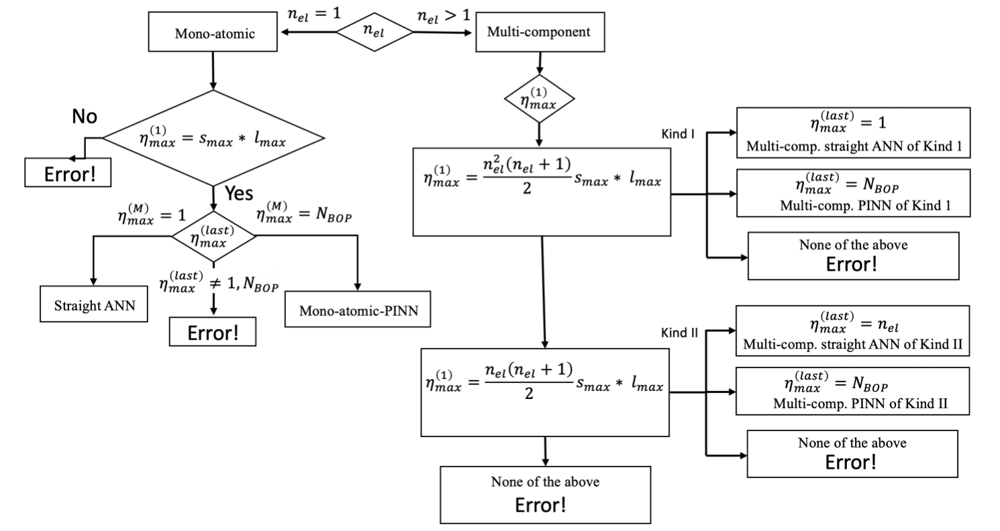

.. index:: pair_style pinn

pair_style pinn command
==============================

Accelerator Variants: none

Syntax

.. code-block:: LAMMPS

   pair_style pinn

Examples
""""""""

.. code-block:: LAMMPS

   pair_style pinn
   pair_coeff  *  *  ../potentials/Al_2020.pinn Al Al 

The following commands can be used to build LAMMPS with the user-pinn package:

.. code-block:: LAMMPS

   make clean-all 
   make yes-USER-PINN
   make mpi

Description
"""""""""""

Style pinn computes interatomic interactions for various materials using physically informed neural network (PINN) potentials :ref:`(1) <1>`, :ref:`(2) <2>`.  Computationally, PINN uses an artificial neural network (ANN) to predict parameters for a physics-based potential to calculate the energy :math:`E_{i_{\alpha}}` of an atom :math:`i_{\alpha}` of chemical element :math:`\alpha` as a function of its position with respect to other atoms inside a spherical neighborhood of radius :math:`R_c`. In the current formulation, :math:`E_{i_{\alpha}}` is calculated through a modified version of a bond-order potential (BOP) as follows:

.. math::

   E_{i_{ \alpha }}=\frac{1}{2} \sum _{j_{ \beta } \neq i_{ \alpha }}^{} \left[ e^{ \left( A_{i_{ \alpha }}^{ \beta }-a_{i_{ \alpha }}^{ \beta }r_{i_{ \alpha }}^{j_{ \beta }} \right) }-S_{i_{ \alpha }}^{j_{ \beta }} \Phi _{i_{ \alpha }}^{j_{ \beta }}e^{ \left( B_{i_{ \alpha }}^{ \beta }-b_{i_{ \alpha }}^{ \beta }r_{i_{ \alpha }}^{j_{ \beta }} \right) } \right] f_{c} \left( r_{i_{ \alpha }}^{j_{ \beta }} \right) +W_{i_{ \alpha }}~,~~~~~~~~~~~   \left( 1 \right)  

where

.. math::

   S_{i_{ \alpha }}^{j_{ \beta }}= \prod_{k_{ \gamma } \neq i_{ \alpha },j_{ \beta }}^{} s_{i_{ \alpha }}^{j_{ \beta }k_{ \gamma }};~~~~~s_{i_{ \alpha }}^{j_{ \beta }k_{ \gamma }}=1-f_{c} \left( r_{i_{ \alpha }}^{k_{ \gamma }}+r_{j_{ \beta }}^{k_{ \gamma }}-r_{i_{ \alpha }}^{j_{ \beta }} \right) e^{- \lambda _{i_{ \alpha }}^{ \beta  \gamma } \left( r_{i_{ \alpha }}^{k_{ \gamma }}+r_{j_{ \beta }}^{k_{ \gamma }}-r_{i_{ \alpha }}^{j_{ \beta }} \right) },~~~~  \left( 2 \right)

.. math::

   \Phi _{i_{ \alpha }}^{j_{ \beta }}= \left( 1+Z_{i_{ \alpha }}^{j_{ \beta }} \right) ^{-\frac{1}{2}};~~~~~Z_{i_{ \alpha }}^{j_{ \beta }}= \sum _{k_{ \gamma } \neq i_{ \alpha },j_{ \beta }}^{} \zeta _{i_{ \alpha }}^{ \beta  \gamma }S_{i_{ \alpha }}^{k_{ \gamma }} \left( \cos  \theta _{i_{ \alpha }}^{j_{ \beta }k_{ \gamma }}-h_{i_{ \alpha }}^{ \beta  \gamma } \right) ^{2}f_{c} \left( r_{i_{ \alpha }}^{k_{ \gamma }} \right) ,~~~  \left( 3 \right)

.. math::

   W_{i_{ \alpha }}=- \sigma _{i_{ \alpha }} \psi _{i_{ \alpha }}^{\frac{1}{2}};~~~~ \psi _{i_{ \alpha }}= \sum _{j_{ \beta } \neq i_{ \alpha }}^{}S_{i_{ \alpha }}^{j_{ \beta }} \Phi _{i_{ \alpha }}^{j_{ \beta }}f_{c} \left( r_{i_{ \alpha }}^{j_{ \beta }} \right) ,~~~~  \left( 4 \right) 

.. math::

   f_{c}\left( r \right) = f_{c}\left( r,R_{c} \right) = \left\{ \begin{matrix}
   \frac{\left( R_{c} - r \right)^{4}}{{d_{c}}^{4} + \left( R_{c} - r \right)^{4}}\ :\ R_{\min} < r \leq R_{c} \\
   0\ \ \ \ \ \ \ \ \ \ \ \ :\ \ r > R_{c} \\
   \end{matrix} \right.\ .\ \ \ \ (5)

The following nomenclature is used in the above equations: (i) Greek
symbols, :math:`\alpha,\beta,\gamma = 1,2,..\ n_{\text{el}}`, indicate
the chemical elements, :math:`n_{\text{el}}` of them in total; (ii) the
subscript :math:`i_{\alpha}` indicates the atom :math:`i_{\alpha}` of
element :math:`\alpha` , whose energy is calculated. This atom is referred to as the
*host* atom. The superscripts :math:`j_{\beta}k_{\gamma}` indicate the
*neighbor*\ s of the host atom with their chemical types. The distance
between the atoms :math:`\left( i_{\alpha} \right)` and
:math:`\left( j_{\beta} \right)` is denoted as
:math:`r_{i_{\alpha}}^{j_{\beta}}`.
:math:`\theta_{i_{\alpha}}^{j_{\beta}k_{\gamma}}` is the bond angle
between the :math:`\left( i - j \right)` and
:math:`\left( i - k \right)` bonds of atom :math:`\left( i \right)`.
When no distinction is made between the *host* and the *neighbor*, and
the chemical type is of no consequence, all symbols are used as
subscripts, such as :math:`r_{\text{ij}}`.

The BOP parameters   :math:`A_{i_{ \alpha }}^{ \beta }`, :math:`a_{i_{ \alpha }}^{ \beta }`, :math:`B_{i_{ \alpha }}^{ \beta }`, :math:`b_{i_{ \alpha }}^{ \beta }`, :math:`h_{i_{ \alpha }}^{ \beta  \gamma }`,  :math:`\sigma _{i_{ \alpha }}`,  :math:`\zeta _{i_{ \alpha }}^{ \beta  \gamma }`,  :math:`\lambda _{i_{ \alpha }}^{ \beta  \gamma }`  in Eqs.(1-4) are the sums of the base values and the perturbations  :math:`\Delta`

.. math::
   \left( ~~A_{ \alpha }^{ \beta }+ \Delta A_{i_{ \alpha }}^{ \beta },~~~a_{ \alpha }^{ \beta }+ \Delta a_{i_{ \alpha }}^{ \beta },~~ \ldots ,   \lambda _{ \alpha }^{ \beta  \gamma }+ \Delta  \lambda _{i_{ \alpha }}^{ \beta  \gamma } \right) ` ,\ \  \  (6)

where
:math:`\left( A_{\alpha}^{\beta},\ a_{\alpha}^{\beta},B_{\alpha}^{\beta},\ b_{\alpha}^{\beta},h_{\alpha}^{{\beta \gamma}},\sigma_{\alpha},\zeta_{\alpha}^{{ \beta \gamma}},\lambda_{\alpha}^{{ \beta \gamma}} \right)`
is the set of *base* parameters of a globally optimized BOP. These
parameters only depend on the chemical type
:math:`\left( \alpha,\beta,\gamma \right)` but otherwise are the same of
all atoms. The values of the base BOP parameters are given in the PINN
potential file in the following order:

.. math::

   \begin{pmatrix}
   A_{1}^{1},\ A_{1}^{2},..\ \ A_{1}^{n_{\text{el}}},a_{1}^{1},\ a_{1}^{2},..\ \ a_{1}^{n_{\text{el}}},B_{1}^{1},\ B_{1}^{2},..\ \ B_{1}^{n_{\text{el}}},b_{1}^{1},\ b_{1}^{2},..\ \ b_{1}^{n_{\text{el}}}, \\
   h_{1}^{11},\ h_{1}^{12},..\ h_{1}^{1n_{\text{el}}},h_{1}^{21},\ h_{1}^{22},..\ h_{1}^{2n_{\text{el}}},\ldots h_{1}^{n_{\text{el}}1},\ h_{1}^{n_{\text{el}}2},..\ h_{1}^{n_{\text{el}}n_{\text{el}}}, \\
   \sigma_{1}, \\
   \zeta_{1}^{11},\ \zeta_{1}^{12},..\ \zeta_{1}^{1n_{\text{el}}},\zeta_{1}^{21},\ \zeta_{1}^{22},..\ \zeta_{1}^{2n_{\text{el}}},\ldots\zeta_{1}^{n_{\text{el}}1},\ \zeta_{1}^{n_{\text{el}}2},..\ \zeta_{1}^{n_{\text{el}}n_{\text{el}}}, \\
   \lambda_{1}^{11},\ \lambda_{1}^{12},..\ \lambda_{1}^{1n_{\text{el}}},\lambda_{1}^{21},\ \lambda_{1}^{22},..\ \lambda_{1}^{2n_{\text{el}}},\ldots\lambda_{1}^{n_{\text{el}}1},\ \lambda_{1}^{n_{\text{el}}2},..\ \lambda_{1}^{n_{\text{el}}n_{\text{el}}} \\
   A_{2}^{1},\ A_{2}^{2},..\ \ A_{2}^{n_{\text{el}}},a_{2}^{1},\ a_{2}^{2},..\ \ a_{2}^{n_{\text{el}}},B_{2}^{1},\ B_{2}^{2},..\ \ B_{2}^{n_{\text{el}}},b_{2}^{1},\ b_{2}^{2},..\ \ b_{2}^{n_{\text{el}}} \\
   : \\
   \lambda_{n_{\text{el}}}^{11},\ \lambda_{n_{\text{el}}}^{12},..\ \lambda_{n_{\text{el}}}^{1n_{\text{el}}},\lambda_{n_{\text{el}}}^{21},\ \lambda_{n_{\text{el}}}^{22},..\ \lambda_{n_{\text{el}}}^{2n_{\text{el}}},\ldots\lambda_{n_{\text{el}}}^{n_{\text{el}}1},\ \lambda_{n_{\text{el}}}^{n_{\text{el}}2},..\ \lambda_{n_{\text{el}}}^{n_{\text{el}}n_{\text{el}}} \\
   \end{pmatrix}\ \ \ \ \ (7)

Example of :math:`n_{\text{el}} = 1` (monoatomic PINN):

.. math:: \left( A_{1}^{1},\ a_{1}^{1},B_{1}^{1},\ b_{1}^{1},h_{1}^{11},\sigma_{1},\zeta_{1}^{11},\lambda_{1}^{11} \right)\ \ \ \ (8a)

Example of :math:`n_{\text{el}} = 2` (binary PINN):

.. math::

   \begin{pmatrix}
   A_{1}^{1},\ A_{1}^{2},a_{1}^{1},\ a_{1}^{2},B_{1}^{1},\ B_{1}^{2},b_{1}^{1},\ b_{1}^{2}, \\
   h_{1}^{11},\ h_{1}^{12}h_{1}^{21},\ h_{1}^{22},\sigma_{1}, \\
   \zeta_{1}^{11},\ \zeta_{1}^{12},\zeta_{1}^{21},\ \zeta_{1}^{22}, \\
   \lambda_{1}^{11},\ \lambda_{1}^{12},\lambda_{1}^{21},\ \lambda_{1}^{22}, \\
   A_{2}^{1},\ A_{2}^{2},a_{2}^{1},\ a_{2}^{2},B_{2}^{1},\ B_{2}^{2},b_{2}^{1},\ b_{2}^{2}, \\
   h_{2}^{11},\ h_{2}^{12}h_{2}^{21},\ h_{2}^{22},\sigma_{2}, \\
   \zeta_{2}^{11},\ \zeta_{2}^{12},\zeta_{2}^{21},\ \zeta_{2}^{22}, \\
   \lambda_{2}^{11},\ \lambda_{2}^{12},\lambda_{2}^{21},\ \lambda_{2}^{22} \\
   \end{pmatrix}\ \ \ \ \ (8b)

Notice the hierarchical order in Eq.(8b). First, we list the parameters
for the host atom of chemical element :math:`\alpha = 1`, then for
:math:`\alpha = 2`, etc. The total number of parameters for the BOP
potential becomes

.. math:: N_{\text{BOP}} = n_{\text{el}}\left( 4n_{\text{el}} + 1 + 3{n_{\text{el}}}^{2} \right)\ \ \ \ \ (8c)

The perturbations
:math:`\left( {\mathrm{\Delta}A}_{i_{\alpha}}^{\beta},\ {\mathrm{\Delta}a}_{i_{\alpha}}^{\beta},{\mathrm{\Delta}B}_{i_{\alpha}}^{\beta},{\mathrm{\Delta}b}_{i_{\alpha}}^{\beta},{\mathrm{\Delta}h}_{i_{\alpha}}^{{ \beta \gamma}},{\mathrm{\Delta}\sigma}_{i_{\alpha}},{\mathrm{\Delta}\zeta}_{i_{\alpha}}^{{ \beta \gamma}},{\mathrm{\Delta}\lambda}_{i_{\alpha}}^{{ \beta \gamma}} \right)`
to the base parameters are predicted by the ANN according to the local
atomic environment of the host atom :math:`\left( i_{\alpha} \right)`.

The atomic environment of atom (i) is encoded in a feature vector
:math:`\mathbf{G}_{\mathbf{i}}` consisting of a set of local structure
parameters (LSPs) :math:`\left\{ G \right\}_{i}`. Two kinds of feature
vectors are offered in this release of PINN.

-  The feature vector of Kind I is defined as
   :math:`\mathbf{G}_{\mathbf{i}}^{\left( \mathbf{1} \right)} = \left\{ G_{sl,\alpha}^{{ \beta \gamma}} \right\}_{i}`
   and depends on the chemical type :math:`\left( \alpha \right)\ `\ of
   the host atom (i).

-  The feature vector of Kind II is defined as
   :math:`\mathbf{G}_{\mathbf{i}}^{\left( \mathbf{2} \right)} = \left\{ G_{\text{sl}}^{{ \beta \gamma}} \right\}_{i}`
   and does not depend on the chemical type
   :math:`\left( \alpha \right)\ `\ of the host atom (i).

For both kinds, the LSPs are expressed as:

.. math:: G_{sl,\alpha}^{{ \beta \gamma}} = \sinh^{- 1}\Gamma_{sl,\alpha }^{{ \beta \gamma}},\ \ \ \ \ \ \ \ \ \ \ \ \ \ \ \ \ \ \ \ \ (9a)

and

.. math:: G_{\text{sl}}^{{ \beta \gamma}} = \sinh^{- 1}{\Gamma_{\text{sl}}^{{ \beta \gamma}},\ \ \ \ \ \ \ \ \ \ \ \ \ \ \ \ \ \ \ \ \ \ \ \ \ (9b)}

with

.. math:: \Gamma_{sl,\alpha\ }^{{ \beta \gamma}} = \mathrm{\Delta} + \sum_{j,k \neq i}^{}{P_{l}\left( \cos\theta_{\text{ijk}} \right)f_{s}\left( r_{\text{ij}} \right)f_{s}\left( r_{\text{ik}} \right)\delta_{\text{i} \alpha}\delta_{\text{j} \beta}\delta_{\text{k} \gamma}},\ \ \ \ (10a)

and

.. math:: \Gamma_{\text{sl}}^{{ \beta \gamma}} = \mathrm{\Delta} + \sum_{j,k \neq i}^{}{P_{l}\left( \cos\theta_{\text{ijk}} \right)f_{s}\left( r_{\text{ij}} \right)f_{s}\left( r_{\text{ik}} \right)\delta_{\text{j} \beta}\delta_{\text{k} \gamma}}.\ \ \ \ \ \ (10b)

The sum in Eq.(10a,b) includes :math:`j = k` terms with
:math:`\cos\theta_{\text{ijj}} = 1`. :math:`\mathrm{\Delta}` is a
constant shift parameter, :math:`P_{l}\left( x \right)` are Legendre
polynomials of order :math:`l` defined by the recursive relations

.. math:: P_{l + 1}\left( x \right) = \frac{\left\lbrack \left( 2l + 1 \right)xP_{l} - lP_{l - 1} \right\rbrack}{\left( l + 1 \right)};\ \ \ P_{0}\left( x \right) = 1;\ \ \ P_{1}\left( x \right) = x.\ \ \ \ (11)

:math:`f_{s}\left( r \right)` are Gaussians centered at distances
:math:`r_{0}^{\left( s \right)}` from the host atom:

.. math:: f_{s}\left( r \right) = \frac{1}{r_{0}^{\left( s \right)}}e^{- \frac{\left( r - r_{0}^{\left( s \right)} \right)^{2}}{\sigma^{2}}}f_{c}\left( r,1.5R_{c} \right).\ \ (s = 1,2,\ldots\ s_{\max})\ \ (12)

Note that the cutoff function used in this calculation,

:math:`f_{c}\left( r,1.5R_{c} \right) = \left\{ \begin{matrix}
\frac{\left( R_{c} - r \right)^{4}}{{d_{c}}^{4} + \left( R_{c} - r \right)^{4}}\ :\ r \leq 1.5R_{c} \\
0\ :\ \ r > {1.5R}_{c}, \\
\end{matrix} \right.\ `

has an increased cut-off range compared to Eq.(5), because the screening
atoms in Eq.(2) extends to :math:`1.5R_{c}`. Finally, to distinguish
between different chemical elements, the symbols
:math:`\delta_{\text{i} \alpha}` are introduced:

.. math::

   \delta_{\text{i} \alpha} = \left\{ \begin{matrix}
   1\ :if\ atom\ i\ is\ of\ element\ \alpha \\
   \ 0\ :\ \ \ \ \ \ \ \ \ \ \ \ \ \ otherwise\ \ \ \ \ \ \ \ \ \ \ \ \ \ \ \ \  \\
   \end{matrix}. \right.\ \ \ \ \ \ \ (13)

According to Eqs.(10a,b),
:math:`\Gamma_{sl,\alpha\ }^{{ \beta \gamma}} = \Gamma_{sl,\alpha }^{{ \gamma \beta}}`
and
:math:`\Gamma_{\text{sl}}^{\beta \gamma} = \Gamma_{\text{sl}}^{\gamma \beta}`.
Accordingly,
:math:`G_{sl,\alpha }^{{ \beta \gamma}} = G_{sl,\alpha }^{{ \gamma \beta}}` and
:math:`G_{\text{sl }}^{{ \beta \gamma}} = G_{\text{sl }}^{{ \gamma \beta}}`.

The arrays :math:`\left\{ G_{sl,\alpha}^{{ \beta \gamma}} \right\}_{i}` and
:math:`\left\{ G_{\text{sl}}^{{ \beta \gamma}} \right\}_{i}` form the feature
vectors of Kind I and Kind II, respectively, and are fed as input into
the ANN.

The arrangement of the elements in the feature vector follows a
hierarchical ordering. First, by the structural indices
:math:`\left( s,l \right)\ :\ s = 1,2,\ldots\ s_{\max},\ \ l = l_{1},\ l_{2},\ \ldots\ l_{\max}`

.. math::

   \left( \mathbf{G}_{\mathbf{\text{sl}}} \right)_{\alpha}^{{ \beta \gamma}} = \begin{pmatrix}
   \left\{ G_{01,\alpha}^{{ \beta \gamma}} \right\},\left\{ G_{02,\alpha}^{{ \beta \gamma}} \right\},\ldots\ \left\{ G_{0l_{\max},\alpha}^{{ \beta \gamma}} \right\}, \\
   \ \begin{matrix}
   \left\{ G_{11,\alpha}^{{ \beta \gamma}} \right\},\left\{ G_{12,\alpha}^{{ \beta \gamma}} \right\},\ldots\ \left\{ G_{1l_{\max},\alpha}^{{ \beta \gamma}} \right\}, \\
   \  \\
   \end{matrix} \\
   : \\
   \left\{ G_{s_{\max}1,\alpha}^{{ \beta \gamma}} \right\},\left\{ G_{s_{\max}2,\alpha}^{{ \beta \gamma}} \right\},\ldots\ \left\{ G_{s_{\max}l_{\max},\alpha}^{{ \beta \gamma}} \right\} \\
   \end{pmatrix}_{\alpha}^{{ \beta \gamma}},\ \ \ \ \ (14)

and second, by the chemical indices
:math:`\left( \alpha,\beta,\gamma \right)` for Kind I:

.. math:: \left\lbrack \left( \mathbf{G}_{\mathbf{\text{sl}}} \right)_{1}^{11},\left( \mathbf{G}_{\mathbf{\text{sl}}} \right)_{1}^{12},\left( \mathbf{G}_{\mathbf{\text{sl}}} \right)_{1}^{22},\left( \mathbf{G}_{\mathbf{\text{sl}}} \right)_{2}^{11},\left( \mathbf{G}_{\mathbf{\text{sl}}} \right)_{2}^{12},\left( \mathbf{G}_{\mathbf{\text{sl}}} \right)_{2}^{22}\  \right\rbrack\ \ \ for\ \ \alpha,\beta,\gamma = 1,2,\ \ \ \ \ (15a)

and by :math:`\left( \beta,\gamma \right)` for Kind II:

.. math:: \left\lbrack \left( \mathbf{G}_{\mathbf{\text{sl}}} \right)^{11},\left( \mathbf{G}_{\mathbf{\text{sl}}} \right)^{12},\left( \mathbf{G}_{\mathbf{\text{sl}}} \right)^{22}\  \right\rbrack\ \ \ for\ \ \beta,\gamma = 1,2.\ \ \ \ \ (15b)

For Kind I descriptors, if the host atom is of chemical sort
:math:`\alpha = 1`, then all
:math:`\left( \mathbf{G}_{\mathbf{\text{sl}}} \right)_{2}^{{ \beta \gamma}} = \sinh^{- 1}\left( \mathrm{\Delta} \right)`
(see Eq.(10a)); and if :math:`\alpha = 2`, then all
:math:`\left( \mathbf{G}_{\mathbf{\text{sl}}} \right)_{1}^{{ \beta \gamma}} = \sinh^{- 1}\left( \mathrm{\Delta} \right)`
. Since an atom can only be of one chemical type, most of the
descriptors are
:math:`const = \sinh^{- 1}\left( \mathrm{\Delta} \right)` , which
introduces a redundancy. While this redundancy makes the ANN more
sensitive in distinguishing different chemical compositions, it also
introduces more computational complexity. The Kind II descriptors avoid
the redundancy by ignoring the chemical type of the host atom, thus
reducing Eq.(15a) to Eq.(15b). The chemical identity of the host atom is
taken into account at the output of the ANN as described below.

The dataflow through a feed-forward ANN composed of *M* layers can be
described by the iteration scheme computing the signal
:math:`t_{\eta}^{\left( n \right)}` at each node :math:`\eta` of layer
*n* as

.. math:: t_{\eta}^{\left( n \right)} = f_{a}^{\left( n \right)}\left( \sum_{k = 1}^{\eta_{\max}^{\left( n - 1 \right)}}{w_{{\eta k}}^{\left( n - 1 \right)}t_{k}^{\left( n - 1 \right)}} + b_{\eta}^{\left( n \right)} \right),\ \ \ \ \ n = 2,3,\ \ldots M;\ \ \eta = 1,2,..\ \eta_{\max}^{\left( n \right)}\ \ \ \ \ (16)

with the initial condition
:math:`\left\{ t_{\eta}^{\left( 1 \right)} \right\} \equiv \left\{ G \right\}_{i}`,
ordered as in Eq.(15a,b). The activation functions
:math:`f_{a}^{\left( n \right)}\left( x \right)` are defined as

.. math::

   f_{a}^{\left( n \right)}\left( x \right) = \left\{ \begin{matrix}
   f_{a}\left( x \right)\ :\ n < M \\
   \ \ \ \ \ \ x\ \ \ :\ n = M \\
   \end{matrix} \right.\ .\ \ \ \ \ \ \ \ (17)

Currently, only one type of activation function is implemented:

Type 1:
:math:`f_{a}\left( x \right) = \frac{1}{1 + e^{- x}} - 0.5 = \frac{1}{2}\tanh\frac{x}{2}`.

The coefficients :math:`w_{\text{k} \eta}^{\left( n \right)}` and
:math:`b_{\eta}^{\left( n \right)}` appearing in Eq.(16) are the weights
and biases of the ANN, which were optimized during the training process.
The ANN output :math:`t_{\eta}^{\left( M \right)}` contains the
perturbations to the BOP parameters for the host atom
:math:`\left( i \right)`. Their order follows the order of the base
parameters given in Eq.(7):

.. math:: \left( {\mathrm{\Delta}A}_{i_{1}}^{1},\ {\mathrm{\Delta}A}_{i_{1}}^{2},..\ \ {\mathrm{\Delta}\lambda}_{i_{n_{\text{el}}}}^{n_{\text{el}}n_{\text{el}}} \right) = \left( t_{1}^{\left( M \right)},\ t_{2}^{\left( M \right)},\ \ldots t_{\text{last}}^{\left( M \right)} \right)_{i}.\ \ \ \ \ (18)

According to Eq.(7), the ANN output consists of sets of perturbation parameters for each possible chemical type of the host atom :math:`\left( i \right)`

.. math:: \left( \underset{\left( i \right)\ of\ element\ 1}{\overset{{\mathrm{\Delta}A}_{i_{1}}^{1},\ {\mathrm{\Delta}A}_{i_{1}}^{2},..\ \ {\mathrm{\Delta}\lambda}_{i_{1}}^{n_{\text{el}}n_{\text{el}}}}{\underbrace{}}}\ ,\underset{\left( i \right)\ of\ element\ 2}{\overset{{\mathrm{\Delta}A}_{i_{2}}^{1},\ {\mathrm{\Delta}A}_{i_{2}}^{2},..\ \ {\mathrm{\Delta}\lambda}_{i_{2}}^{n_{\text{el}}n_{\text{el}}}}{\underbrace{}}},\ldots\ \underset{\left( i \right)\text{ of element }n_{\text{el}}}{\overset{{\mathrm{\Delta}A}_{i_{n_{\text{el}}}}^{1},\ {\mathrm{\Delta}A}_{i_{n_{\text{el}}}}^{2},..\ \ {\mathrm{\Delta}\lambda}_{i_{n_{\text{el}}}}^{n_{\text{el}}n_{\text{el}}}}{\underbrace{}}} \right).\ \ \ (19)

Since the host atom can only be of one chemical type at a time, only one
subset in the output vector (19) is used, making the calculations and
storage for the entire vector redundant. This redundancy also exists in
Kind I descriptors, where the feature vector uniquely identifies the
type of the host atom as in Eq.(15a), and the parameters in the output
vector related to the other chemical types are never used. The Kind II
descriptors exploit the redundancy in the potential parameters by using
the shorter feature vector in Eq.(15b), which does not indicate the type
of the host atom. In this case, the ANN is trained to produce the
correct output parameters for all possible types of the host atom given
its environment, and only the actual type is used by the BOP. Kind II
descriptors are particularly useful in grand canonical or a semi-grand
canonical Monte Carlo simulations, where a trial move consists or
switching the chemical type from one element to another at random
without changing its environment. In such a case, there is no need to
recompute the feature vector and the ANN: the ANN already contains the
parameters for all possible types of the host atom.

**Potential file format:** filename.pinn

*Example for a binary Cu-Ta system:*

Next lines until the end of the file list the ANN weights and biases, layer by layer in the following order. The respective calculation for each layer is given below for clarity:

.. math::
   \left. \ \begin{matrix}
   w_{11}^{\left( 1 \right)},w_{21}^{\left( 1 \right)},\ldots\ w_{\eta_{\max}^{\left( 2 \right)}1}^{\left( 1 \right)} \\
   w_{12}^{\left( 1 \right)},w_{22}^{\left( 1 \right)},\ldots w_{\eta_{\max}^{\left( 2 \right)}2}^{\left( 1 \right)}\  \\
   \ldots \\
   w_{1,\eta_{\max}^{\left( 1 \right)}}^{\left( 1 \right)},w_{2,\eta_{\max}^{\left( 1 \right)}}^{\left( 1 \right)},\ldots w_{\eta_{\max}^{\left( 2 \right)}\eta_{\max}^{\left( 1 \right)}}^{\left( 1 \right)}\  \\
   b_{1}^{\left( 2 \right)},b_{2}^{\left( 2 \right)},\ldots b_{\eta_{\max}^{\left( 2 \right)}}^{\left( 2 \right)} \\
   \end{matrix} \right\}\ input\ layer:\ \ \ t_{\eta}^{\left( 2 \right)} = f_{a}\left( \sum_{k = 1}^{\eta_{\max}^{\left( 1 \right)}}{w_{{\eta k}}^{\left( 1 \right)}t_{k}^{\left( 1 \right)}} + b_{\eta}^{\left( 2 \right)} \right)
.. math::
   \left. \ \begin{matrix}
   : \\
   w_{11}^{\left( n - 1 \right)},w_{21}^{\left( n - 1 \right)},\ldots\ w_{\eta_{\max}^{\left( n \right)}1}^{\left( n - 1 \right)} \\
   w_{12}^{\left( n - 1 \right)},w_{22}^{\left( n - 1 \right)},\ldots w_{\eta_{\max}^{\left( n \right)}2}^{\left( n - 1 \right)}\  \\
   \ldots \\
   w_{1,\eta_{\max}^{\left( n - 1 \right)}}^{\left( n - 1 \right)},w_{2,\eta_{\max}^{\left( n - 1 \right)}}^{\left( n - 1 \right)},\ldots w_{\eta_{\max}^{\left( n \right)}\eta_{\max}^{\left( n - 1 \right)}}^{\left( n - 1 \right)}\  \\
   b_{1}^{\left( n \right)},b_{2}^{\left( n \right)},\ldots b_{\eta_{\max}^{\left( n \right)}}^{\left( n \right)} \\
   \end{matrix} \right\}\ hidden\ layer:\ \ \ t_{\eta}^{\left( n \right)} = f_{a}\left( \sum_{k = 1}^{\eta_{\max}^{\left( n - 1 \right)}}{w_{{\eta k}}^{\left( n - 1 \right)}t_{k}^{\left( n - 1 \right)}} + b_{\eta}^{\left( n \right)} \right)
.. math::
   \left. \ \begin{matrix}
   \begin{matrix}
   : \\
   w_{11}^{\left( M - 1 \right)},w_{21}^{\left( M - 1 \right)},\ldots\ w_{\eta_{\max}^{\left( \right)}1}^{\left( M - 1 \right)} \\
   \ldots \\
   w_{1,\eta_{\max}^{\left( M - 1 \right)}}^{\left( M - 1 \right)},w_{2,\eta_{\max}^{\left( M - 1 \right)}}^{\left( M - 1 \right)},\ldots w_{\eta_{\max}^{\left( M \right)}\eta_{\max}^{\left( M - 1 \right)}}^{\left( M - 1 \right)}\  \\
   \end{matrix} \\
   b_{1}^{\left( M \right)},b_{2}^{\left( M \right)},\ldots b_{\eta_{\max}^{\left( M \right)}}^{\left( M \right)} \\
   \end{matrix} \right\}\ output\ layer:\ \ \ t_{\eta}^{\left( M \right)} = \sum_{k = 1}^{\eta_{\max}^{\left( M - 1 \right)}}{w_{{\eta k}}^{\left( M - 1 \right)}t_{k}^{\left( M - 1 \right)}} + b_{\eta}^{\left( M \right)}

The PINN file format described above allows for the formulation of several types of PINN potentials.

A. Mono-atomic

   a. Straight ANN (no BOP)

   b. PINN (parameterized BOP)

B. Multicomponent

   a. Straight ANN

      i.  Kind I

      ii. Kind II

   b. PINN

      i.  Kind I

      ii. Kind II

The numbers :math:`n_{el}`, :math:`N_{BOP}`, :math:`s_{max}`, :math:`l_{max}`, 
:math:`\eta_{max}^1`, and :math:`\eta_{max}^M`, from 8c, 14, and 16 
are used to uniquely identify the type of the potential according to the 
following below. Note that the type of descriptors, Kind I or Kind II, is 
determined automatically according to the value of :math:`\eta_{max}^1`. 
The following flowchart is used to identify the type of PINN used.

**Restrictions**

This style is part of the USER-PINN package. It is only enabled if
LAMMPS was built with that package. See the Build package
<Build_package> doc page for more info.

**Related commands**

Pair_coeff <pair_coeff>

**Default**

none

**Reference**

.. _1:

**(1)** Pun, Batra, Ramprasad, and Mishin, Nature Communications, 10, 2339, 2019. 

.. _2:

**(2)** Pun, Yamakov, Hickman, Glaessgen, and Mishin, Phys Rev M, 4, 113807, 2020. 

