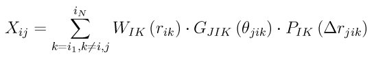
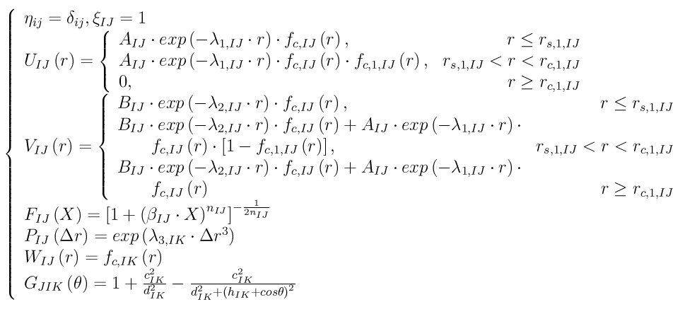

.. index:: pair\_style polymorphic

pair\_style polymorphic command
===============================

Syntax
""""""

.. parsed-literal::

   pair_style polymorphic

style = *polymorphic*

Examples
""""""""

.. parsed-literal::

   pair_style polymorphic
   pair_coeff \* \* TlBr_msw.polymorphic Tl Br
   pair_coeff \* \* AlCu_eam.polymorphic Al Cu
   pair_coeff \* \* GaN_tersoff.polymorphic Ga N
   pair_coeff \* \* GaN_sw.polymorphic GaN

Description
"""""""""""

The *polymorphic* pair style computes a 3-body free-form potential
(:ref:`Zhou <Zhou3>`) for the energy E of a system of atoms as

.. image:: Eqs/polymorphic1.jpg
   :align: center

.. image:: Eqs/polymorphic3.jpg
   :align: center

where I, J, K represent species of atoms i, j, and k, i\_1, ..., i\_N
represents a list of i's neighbors, delta\_ij is a Direc constant
(i.e., delta\_ij = 1 when i = j, and delta\_ij = 0 otherwise), eta\_ij is
similar constant that can be set either to eta\_ij = delta\_ij or eta\_ij
= 1 - delta\_ij depending on the potential type, U\_IJ(r\_ij),
V\_IJ(r\_ij), W\_IK(r\_ik) are pair functions, G\_JIK(cos(theta)) is an
angular function, P\_IK(delta r\_jik) is a function of atomic spacing
differential delta r\_jik = r\_ij - xi\_IJ\*r\_ik with xi\_IJ being a
pair-dependent parameter, and F\_IJ(X\_ij) is a function of the local
environment variable X\_ij. This generic potential is fully defined
once the constants eta\_ij and xi\_IJ, and the six functions U\_IJ(r\_ij),
V\_IJ(r\_ij), W\_IK(r\_ik), G\_JIK(cos(theta)), P\_IK(delta r\_jik), and
F\_IJ(X\_ij) are given. Note that these six functions are all one
dimensional, and hence can be provided in an analytic or tabular
form. This allows users to design different potentials solely based on
a manipulation of these functions. For instance, the potential reduces
to Stillinger-Weber potential (:ref:`SW <SW>`) if we set

.. image:: Eqs/polymorphic4.jpg
   :align: center

The potential reduces to Tersoff types of potential
(:ref:`Tersoff <Tersoff>` or :ref:`Albe <poly-Albe>`) if we set

.. image:: Eqs/polymorphic5.jpg
   :align: center

.. image:: Eqs/polymorphic6.jpg
   :align: center

The potential reduces to Rockett-Tersoff (:ref:`Wang <Wang3>`) type if we set

.. image:: Eqs/polymorphic6.jpg
   :align: center

.. image:: Eqs/polymorphic8.jpg
   :align: center

The potential becomes embedded atom method (:ref:`Daw <poly-Daw>`) if we set

.. image:: Eqs/polymorphic9.jpg
   :align: center

In the embedded atom method case, phi\_IJ(r\_ij) is the pair energy,
F\_I(X) is the embedding energy, X is the local electron density, and
f\_K(r) is the atomic electron density function.

If the tabulated functions are created using the parameters of sw,
tersoff, and eam potentials, the polymorphic pair style will produce
the same global properties (energies and stresses) and the same forces
as the sw, tersoff, and eam pair styles. The polymorphic pair style
also produces the same atom properties (energies and stresses) as the
corresponding tersoff and eam pair styles. However, due to a different
partition of global properties to atom properties, the polymorphic
pair style will produce different atom properties (energies and
stresses) as the sw pair style. This does not mean that polymorphic
pair style is different from the sw pair style in this case. It just
means that the definitions of the atom energies and atom stresses are
different.

Only a single pair\_coeff command is used with the polymorphic style
which specifies an potential file for all needed elements. These are
mapped to LAMMPS atom types by specifying N additional arguments after
the filename in the pair\_coeff command, where N is the number of
LAMMPS atom types:

* filename
* N element names = mapping of Tersoff elements to atom types

See the pair\_coeff doc page for alternate ways to specify the path for
the potential file.  Several files for polymorphic potentials are
included in the potentials dir of the LAMMPS distribution.  They have a
"poly" suffix.

As an example, imagine the SiC\_tersoff.polymorphic file has tabulated
functions for Si-C tersoff potential. If your LAMMPS simulation has 4
atoms types and you want the 1st 3 to be Si, and the 4th to be C, you
would use the following pair\_coeff command:

.. parsed-literal::

   pair_coeff \* \* SiC_tersoff.polymorphic Si Si Si C

The 1st 2 arguments must be \* \* so as to span all LAMMPS atom
types. The first three Si arguments map LAMMPS atom types 1,2,3 to the
Si element in the polymorphic file. The final C argument maps LAMMPS
atom type 4 to the C element in the polymorphic file. If a mapping
value is specified as NULL, the mapping is not performed. This can be
used when an polymorphic potential is used as part of the hybrid pair
style. The NULL values are placeholders for atom types that will be
used with other potentials.

Potential files in the potentials directory of the LAMMPS distribution
have a ".poly" suffix. At the beginning of the files, an unlimited
number of lines starting with '#' are used to describe the potential
and are ignored by LAMMPS. The next line lists two numbers:

.. parsed-literal::

   ntypes eta

Here ntypes represent total number of species defined in the potential
file, and eta = 0 or 1. The number ntypes must equal the total number
of different species defined in the pair\_coeff command. When eta = 1,
eta\_ij defined in the potential functions above is set to 1 -
delta\_ij, otherwise eta\_ij is set to delta\_ij. The next ntypes lines
each lists two numbers and a character string representing atomic
number, atomic mass, and name of the species of the ntypes elements:

.. parsed-literal::

   atomic_number atomic-mass element (1)
   atomic_number atomic-mass element (2)
   ...
   atomic_number atomic-mass element (ntypes)

The next ntypes\*(ntypes+1)/2 lines contain two numbers:

.. parsed-literal::

   cut xi (1)
   cut xi (2)
   ...
   cut xi (ntypes\*(ntypes+1)/2)

Here cut means the cutoff distance of the pair functions, xi is the
same as defined in the potential functions above. The
ntypes\*(ntypes+1)/2 lines are related to the pairs according to the
sequence of first ii (self) pairs, i = 1, 2, ..., ntypes, and then
then ij (cross) pairs, i = 1, 2, ..., ntypes-1, and j = i+1, i+2, ...,
ntypes (i.e., the sequence of the ij pairs follows 11, 22, ..., 12,
13, 14, ..., 23, 24, ...).

The final blocks of the potential file are the U, V, W, P, G, and F
functions are listed sequentially. First, U functions are given for
each of the ntypes\*(ntypes+1)/2 pairs according to the sequence
described above. For each of the pairs, nr values are listed. Next,
similar arrays are given for V, W, and P functions. Then G functions
are given for all the ntypes\*ntypes\*ntypes ijk triplets in a natural
sequence i from 1 to ntypes, j from 1 to ntypes, and k from 1 to
ntypes (i.e., ijk = 111, 112, 113, ..., 121, 122, 123 ..., 211, 212,
...). Each of the ijk functions contains ng values. Finally, the F
functions are listed for all ntypes\*(ntypes+1)/2 pairs, each
containing nx values. Either analytic or tabulated functions can be
specified. Currently, constant, exponential, sine and cosine analytic
functions are available which are specified with: constant c1 , where
f(x) = c1 exponential c1 c2 , where f(x) = c1 exp(c2\*x) sine c1 c2 ,
where f(x) = c1 sin(c2\*x) cos c1 c2 , where f(x) = c1 cos(c2\*x)
Tabulated functions are specified by spline n x1 x2, where n=number of
point, (x1,x2)=range and then followed by n values evaluated uniformly
over these argument ranges.  The valid argument ranges of the
functions are between 0 <= r <= cut for the U(r), V(r), W(r)
functions, -cutmax <= delta\_r <= cutmax for the P(delta\_r) functions,
-1 <= costheta <= 1 for the G(costheta) functions, and 0 <= X <= maxX
for the F(X) functions.

**Mixing, shift, table tail correction, restart**\ :

This pair styles does not support the :doc:`pair_modify <pair_modify>`
shift, table, and tail options.

This pair style does not write their information to :doc:`binary restart files <restart>`, since it is stored in potential files. Thus, you
need to re-specify the pair\_style and pair\_coeff commands in an input
script that reads a restart file.

----------

Restrictions
""""""""""""

If using create\_atoms command, atomic masses must be defined in the
input script. If using read\_data, atomic masses must be defined in the
atomic structure data file.

This pair style is part of the MANYBODY package. It is only enabled if
LAMMPS was built with that package. See the :doc:`Build package <Build_package>` doc page for more info.

This pair potential requires the :doc:`newtion <newton>` setting to be
"on" for pair interactions.

The potential files provided with LAMMPS (see the potentials
directory) are parameterized for metal :doc:`units <units>`. You can use
any LAMMPS units, but you would need to create your own potential
files.

Related commands
""""""""""""""""

:doc:`pair_coeff <pair_coeff>`

----------

.. _Zhou3:

**(Zhou)** X. W. Zhou, M. E. Foster, R. E. Jones, P. Yang, H. Fan, and
F. P. Doty, J. Mater. Sci. Res., 4, 15 (2015).

.. _SW:

**(SW)** F. H. Stillinger-Weber, and T. A. Weber, Phys. Rev. B, 31, 5262 (1985).

.. _Tersoff:

**(Tersoff)** J. Tersoff, Phys. Rev. B, 39, 5566 (1989).

.. _poly-Albe:

**(Albe)** K. Albe, K. Nordlund, J. Nord, and A. Kuronen, Phys. Rev. B,
66, 035205 (2002).

.. _Wang3:

**(Wang)** J. Wang, and A. Rockett, Phys. Rev. B, 43, 12571 (1991).

.. _poly-Daw:

**(Daw)** M. S. Daw, and M. I. Baskes, Phys. Rev. B, 29, 6443 (1984).
