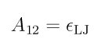

.. index:: pair\_style resquared

pair\_style resquared command
=============================

pair\_style resquared/gpu command
=================================

pair\_style resquared/omp command
=================================

Syntax
""""""

.. parsed-literal::

   pair_style resquared cutoff

* cutoff = global cutoff for interactions (distance units)

Examples
""""""""

.. parsed-literal::

   pair_style resquared 10.0
   pair_coeff \* \* 1.0 1.0 1.7 3.4 3.4 1.0 1.0 1.0

Description
"""""""""""

Style *resquared* computes the RE-squared anisotropic interaction
:ref:`(Everaers) <Everaers3>`, :ref:`(Babadi) <Babadi>` between pairs of
ellipsoidal and/or spherical Lennard-Jones particles.  For ellipsoidal
interactions, the potential considers the ellipsoid as being comprised
of small spheres of size sigma.  LJ particles are a single sphere of
size sigma.  The distinction is made to allow the pair style to make
efficient calculations of ellipsoid/solvent interactions.

Details for the equations used are given in the references below and
in `this supplementary document <PDF/pair_resquared_extra.pdf>`_.

Use of this pair style requires the NVE, NVT, or NPT fixes with the
*asphere* extension (e.g. :doc:`fix nve/asphere <fix_nve_asphere>`) in
order to integrate particle rotation.  Additionally, :doc:`atom_style ellipsoid <atom_style>` should be used since it defines the
rotational state and the size and shape of each ellipsoidal particle.

The following coefficients must be defined for each pair of atoms
types via the :doc:`pair_coeff <pair_coeff>` command as in the examples
above, or in the data file or restart files read by the
:doc:`read_data <read_data>` or :doc:`read_restart <read_restart>`
commands:

* A12 = Energy Prefactor/Hamaker constant (energy units)
* sigma = atomic interaction diameter (distance units)
* epsilon\_i_a = relative well depth of type I for side-to-side interactions
* epsilon\_i_b = relative well depth of type I for face-to-face interactions
* epsilon\_i_c = relative well depth of type I for end-to-end interactions
* epsilon\_j_a = relative well depth of type J for side-to-side interactions
* epsilon\_j_b = relative well depth of type J for face-to-face interactions
* epsilon\_j_c = relative well depth of type J for end-to-end interactions
* cutoff (distance units)

The parameters used depend on the type of the interacting particles,
i.e. ellipsoids or LJ spheres.  The type of a particle is determined
by the diameters specified for its 3 shape parameters.  If all 3 shape
parameters = 0.0, then the particle is treated as an LJ sphere.  The
epsilon\_i_\* or epsilon\_j_\* parameters are ignored for LJ spheres.  If
the 3 shape parameters are > 0.0, then the particle is treated as an
ellipsoid (even if the 3 parameters are equal to each other).

A12 specifies the energy prefactor which depends on the types of the
two interacting particles.

For ellipsoid/ellipsoid interactions, the interaction is computed by
the formulas in the supplementary document referenced above.  A12 is
the Hamaker constant as described in :ref:`(Everaers) <Everaers3>`. In LJ
units:

.. image:: Eqs/pair_resquared.jpg
   :align: center

where rho gives the number density of the spherical particles
composing the ellipsoids and epsilon\_LJ determines the interaction
strength of the spherical particles.

For ellipsoid/LJ sphere interactions, the interaction is also computed
by the formulas in the supplementary document referenced above.  A12
has a modified form (see `here <PDF/pair_resquared_extra.pdf>`_ for
details):

.. image:: Eqs/pair_resquared2.jpg
   :align: center

For ellipsoid/LJ sphere interactions, a correction to the distance-
of-closest approach equation has been implemented to reduce the error
from two particles of disparate sizes; see `this supplementary document <PDF/pair_resquared_extra.pdf>`_.

For LJ sphere/LJ sphere interactions, the interaction is computed
using the standard Lennard-Jones formula, which is much cheaper to
compute than the ellipsoidal formulas.  A12 is used as epsilon in the
standard LJ formula:

and the specified *sigma* is used as the sigma in the standard LJ
formula.

When one of both of the interacting particles are ellipsoids, then
*sigma* specifies the diameter of the continuous distribution of
constituent particles within each ellipsoid used to model the
RE-squared potential.  Note that this is a different meaning for
*sigma* than the :doc:`pair_style gayberne <pair_gayberne>` potential
uses.

The epsilon\_i and epsilon\_j coefficients are defined for atom types,
not for pairs of atom types.  Thus, in a series of pair\_coeff
commands, they only need to be specified once for each atom type.

Specifically, if any of epsilon\_i_a, epsilon\_i_b, epsilon\_i_c are
non-zero, the three values are assigned to atom type I.  If all the
epsilon\_i values are zero, they are ignored.  If any of epsilon\_j_a,
epsilon\_j_b, epsilon\_j_c are non-zero, the three values are assigned
to atom type J.  If all three epsilon\_i values are zero, they are
ignored.  Thus the typical way to define the epsilon\_i and epsilon\_j
coefficients is to list their values in "pair\_coeff I J" commands when
I = J, but set them to 0.0 when I != J.  If you do list them when I !=
J, you should insure they are consistent with their values in other
pair\_coeff commands.

Note that if this potential is being used as a sub-style of
:doc:`pair_style hybrid <pair_hybrid>`, and there is no "pair\_coeff I I"
setting made for RE-squared for a particular type I (because I-I
interactions are computed by another hybrid pair potential), then you
still need to insure the epsilon a,b,c coefficients are assigned to
that type in a "pair\_coeff I J" command.

For large uniform molecules it has been shown that the epsilon\_\*\_\*
energy parameters are approximately representable in terms of local
contact curvatures :ref:`(Everaers) <Everaers3>`:

.. image:: Eqs/pair_resquared4.jpg
   :align: center

where a, b, and c give the particle diameters.

The last coefficient is optional.  If not specified, the global cutoff
specified in the pair\_style command is used.

----------

Styles with a *gpu*\ , *intel*\ , *kk*\ , *omp*\ , or *opt* suffix are
functionally the same as the corresponding style without the suffix.
They have been optimized to run faster, depending on your available
hardware, as discussed on the :doc:`Speed packages <Speed_packages>` doc
page.  The accelerated styles take the same arguments and should
produce the same results, except for round-off and precision issues.

These accelerated styles are part of the GPU, USER-INTEL, KOKKOS,
USER-OMP and OPT packages, respectively.  They are only enabled if
LAMMPS was built with those packages.  See the :doc:`Build package <Build_package>` doc page for more info.

You can specify the accelerated styles explicitly in your input script
by including their suffix, or you can use the :doc:`-suffix command-line switch <Run_options>` when you invoke LAMMPS, or you can use the
:doc:`suffix <suffix>` command in your input script.

See the :doc:`Speed packages <Speed_packages>` doc page for more
instructions on how to use the accelerated styles effectively.

----------

**Mixing, shift, table, tail correction, restart, rRESPA info**\ :

For atom type pairs I,J and I != J, the epsilon and sigma coefficients
and cutoff distance can be mixed, but only for sphere pairs.  The
default mix value is *geometric*\ .  See the "pair\_modify" command for
details.  Other type pairs cannot be mixed, due to the different
meanings of the energy prefactors used to calculate the interactions
and the implicit dependence of the ellipsoid-sphere interaction on the
equation for the Hamaker constant presented here.  Mixing of sigma and
epsilon followed by calculation of the energy prefactors using the
equations above is recommended.

This pair styles supports the :doc:`pair_modify <pair_modify>` shift
option for the energy of the Lennard-Jones portion of the pair
interaction, but only for sphere-sphere interactions.  There is no
shifting performed for ellipsoidal interactions due to the anisotropic
dependence of the interaction.

The :doc:`pair_modify <pair_modify>` table option is not relevant
for this pair style.

This pair style does not support the :doc:`pair_modify <pair_modify>`
tail option for adding long-range tail corrections to energy and
pressure.

This pair style writes its information to :doc:`binary restart files <restart>`, so pair\_style and pair\_coeff commands do not need
to be specified in an input script that reads a restart file.

This pair style can only be used via the *pair* keyword of the
:doc:`run_style respa <run_style>` command.  It does not support the
*inner*\ , *middle*\ , *outer* keywords of the :doc:`run_style command <run_style>`.

----------

Restrictions
""""""""""""

This style is part of the ASPHERE package.  It is only enabled if
LAMMPS was built with that package.  See the :doc:`Build package <Build_package>` doc page for more info.

This pair style requires that atoms be ellipsoids as defined by the
:doc:`atom_style ellipsoid <atom_style>` command.

Particles acted on by the potential can be finite-size aspherical or
spherical particles, or point particles.  Spherical particles have all
3 of their shape parameters equal to each other.  Point particles have
all 3 of their shape parameters equal to 0.0.

The distance-of-closest-approach approximation used by LAMMPS becomes
less accurate when high-aspect ratio ellipsoids are used.

Related commands
""""""""""""""""

:doc:`pair_coeff <pair_coeff>`, :doc:`fix nve/asphere <fix_nve_asphere>`,
:doc:`compute temp/asphere <compute_temp_asphere>`, :doc:`pair_style gayberne <pair_gayberne>`

**Default:** none

----------

.. _Everaers3:

**(Everaers)** Everaers and Ejtehadi, Phys Rev E, 67, 041710 (2003).

.. _Babadi:

**(Berardi)** Babadi, Ejtehadi, Everaers, J Comp Phys, 219, 770-779 (2006).

.. _lws: http://lammps.sandia.gov
.. _ld: Manual.html
.. _lc: Commands_all.html
