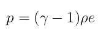

.. index:: pair\_style sph/idealgas

pair\_style sph/idealgas command
================================

Syntax
""""""

.. parsed-literal::

   pair_style sph/idealgas

Examples
""""""""

.. parsed-literal::

   pair_style sph/idealgas
   pair_coeff \* \* 1.0 2.4

Description
"""""""""""

The sph/idealgas style computes pressure forces between particles
according to the ideal gas equation of state:

where gamma = 1.4 is the heat capacity ratio, rho is the local
density, and e is the internal energy per unit mass.  This pair style
also computes Monaghan's artificial viscosity to prevent particles
from interpenetrating :ref:`(Monaghan) <ideal-Monoghan>`.

See `this PDF guide <USER/sph/SPH_LAMMPS_userguide.pdf>`_ to using SPH in
LAMMPS.

The following coefficients must be defined for each pair of atoms
types via the :doc:`pair_coeff <pair_coeff>` command as in the examples
above.

* nu artificial viscosity (no units)
* h kernel function cutoff (distance units)

----------

**Mixing, shift, table, tail correction, restart, rRESPA info**\ :

This style does not support mixing.  Thus, coefficients for all
I,J pairs must be specified explicitly.

This style does not support the :doc:`pair_modify <pair_modify>`
shift, table, and tail options.

This style does not write information to :doc:`binary restart files <restart>`.  Thus, you need to re-specify the pair\_style and
pair\_coeff commands in an input script that reads a restart file.

This style can only be used via the *pair* keyword of the :doc:`run_style respa <run_style>` command.  It does not support the *inner*\ ,
*middle*\ , *outer* keywords.

Restrictions
""""""""""""

This pair style is part of the USER-SPH package.  It is only enabled
if LAMMPS was built with that package.  See the :doc:`Build package <Build_package>` doc page for more info.

Related commands
""""""""""""""""

:doc:`pair_coeff <pair_coeff>`, pair\_sph/rhosum

**Default:** none

----------

.. _ideal-Monoghan:

**(Monaghan)** Monaghan and Gingold, Journal of Computational Physics,
52, 374-389 (1983).
