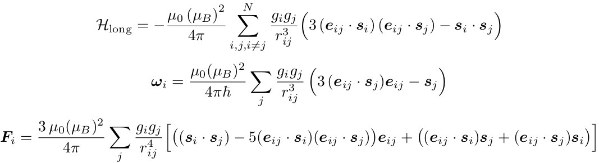

.. index:: pair\_style spin/dipole/cut

pair\_style spin/dipole/cut command
===================================

pair\_style spin/dipole/long command
====================================

Syntax
""""""

.. parsed-literal::

   pair_style spin/dipole/cut cutoff
   pair_style spin/dipole/long cutoff

* cutoff = global cutoff for magnetic dipole energy and forces
  (optional) (distance units)

Examples
""""""""

.. parsed-literal::

   pair_style spin/dipole/cut 10.0
   pair_coeff \* \* 10.0
   pair_coeff 2 3 8.0

   pair_style spin/dipole/long 9.0
   pair_coeff \* \* 10.0
   pair_coeff 2 3 6.0

Description
"""""""""""

Style *spin/dipole/cut* computes a short-range dipole-dipole
interaction between pairs of magnetic particles that each
have a magnetic spin.
The magnetic dipole-dipole interactions are computed by the
following formulas for the magnetic energy, magnetic precession
vector omega and mechanical force between particles I and J.

where si and sj are the spin on two magnetic particles,
r is their separation distance, and the vector e = (Ri - Rj)/\|Ri - Rj\|
is the direction vector between the two particles.

Style *spin/dipole/long* computes long-range magnetic dipole-dipole
interaction.
A :doc:`kspace_style <kspace_style>` must be defined to
use this pair style.  Currently, :doc:`kspace_style ewald/dipole/spin <kspace_style>` and :doc:`kspace_style pppm/dipole/spin <kspace_style>` support long-range magnetic
dipole-dipole interactions.

----------

The :doc:`pair_modify <pair_modify>` table option is not relevant
for this pair style.

This pair style does not support the :doc:`pair_modify <pair_modify>`
tail option for adding long-range tail corrections to energy and
pressure.

This pair style writes its information to :doc:`binary restart files <restart>`, so pair\_style and pair\_coeff commands do not need
to be specified in an input script that reads a restart file.

Restrictions
""""""""""""

The *spin/dipole/cut* and *spin/dipole/long* styles are part of
the SPIN package.  They are only enabled if LAMMPS was built with that
package.  See the :doc:`Build package <Build_package>` doc page for more
info.

Using dipole/spin pair styles with *electron* :doc:`units <units>` is not
currently supported.

Related commands
""""""""""""""""

:doc:`pair_coeff <pair_coeff>`, :doc:`kspace_style <kspace_style>`
:doc:`fix nve/spin <fix_nve_spin>`

**Default:** none
