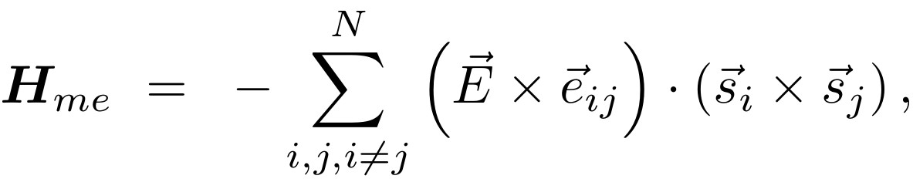
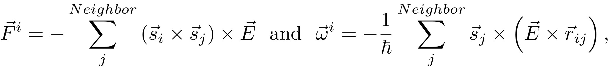

.. index:: pair\_style spin/magelec

pair\_style spin/magelec command
================================

Syntax
""""""

.. parsed-literal::

   pair_style spin/magelec cutoff

* cutoff = global cutoff pair (distance in metal units)

Examples
""""""""

.. parsed-literal::

   pair_style spin/magelec 4.5
   pair_coeff \* \* magelec 4.5 0.00109 1.0 1.0 1.0

Description
"""""""""""

Style *spin/me* computes a magneto-electric interaction between
pairs of magnetic spins. According to the derivation reported in
:ref:`(Katsura) <Katsura1>`, this interaction is defined as:

where si and sj are neighboring magnetic spins of two particles,
eij = (ri - rj)/\|ri-rj\| is the normalized separation vector between the
two particles, and E is an electric polarization vector.
The norm and direction of E are giving the intensity and the
direction of a screened dielectric atomic polarization (in eV).

From this magneto-electric interaction, each spin i will be submitted
to a magnetic torque omega, and its associated atom can be submitted to a
force F for spin-lattice calculations (see :doc:`fix nve/spin <fix_nve_spin>`),
such as:

with h the Planck constant (in metal units).

More details about the derivation of these torques/forces are reported in
:ref:`(Tranchida) <Tranchida4>`.

----------

Restrictions
""""""""""""

All the *pair/spin* styles are part of the SPIN package.  These styles
are only enabled if LAMMPS was built with this package, and if the
atom\_style "spin" was declared.  See the :doc:`Build package <Build_package>` doc page for more info.

Related commands
""""""""""""""""

:doc:`atom_style spin <atom_style>`, :doc:`pair_coeff <pair_coeff>`,
:doc:`pair_style spin/exchange <pair_spin_exchange>`, :doc:`pair_eam <pair_eam>`,

**Default:** none

----------

.. _Katsura1:

**(Katsura)** H. Katsura, N. Nagaosa, A.V. Balatsky. Phys. Rev. Lett., 95(5), 057205. (2005)

.. _Tranchida4:

**(Tranchida)** Tranchida, Plimpton, Thibaudeau, and Thompson,
Journal of Computational Physics, 372, 406-425, (2018).

