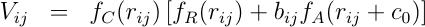

.. index:: pair\_style tersoff/mod

pair\_style tersoff/mod command
===============================

pair\_style tersoff/mod/c command
=================================

pair\_style tersoff/mod/gpu command
===================================

pair\_style tersoff/mod/kk command
==================================

pair\_style tersoff/mod/omp command
===================================

pair\_style tersoff/mod/c/omp command
=====================================

Syntax
""""""

.. parsed-literal::

   pair_style tersoff/mod

   pair_style tersoff/mod/c

Examples
""""""""

.. parsed-literal::

   pair_style tersoff/mod
   pair_coeff \* \* Si.tersoff.mod Si Si

   pair_style tersoff/mod/c
   pair_coeff \* \* Si.tersoff.modc Si Si

Description
"""""""""""

The *tersoff/mod* and *tersoff/mod/c* styles computes a bond-order type
interatomic potential :ref:`(Kumagai) <Kumagai>` based on a 3-body Tersoff
potential :ref:`(Tersoff\_1) <Tersoff_12>`, :ref:`(Tersoff\_2) <Tersoff_22>` with
modified cutoff function and angular-dependent term, giving the energy
E of a system of atoms as

.. image:: Eqs/pair_tersoff_mod.jpg
   :align: center

where f\_R is a two-body term and f\_A includes three-body interactions.
The summations in the formula are over all neighbors J and K of atom I
within a cutoff distance = R + D.
The *tersoff/mod/c* style differs from *tersoff/mod* only in the
formulation of the V\_ij term, where it contains an additional c0 term.

The modified cutoff function f\_C proposed by :ref:`(Murty) <Murty>` and
having a continuous second-order differential is employed. The
angular-dependent term g(theta) was modified to increase the
flexibility of the potential.

The *tersoff/mod* potential is fitted to both the elastic constants
and melting point by employing the modified Tersoff potential function
form in which the angular-dependent term is improved. The model
performs extremely well in describing the crystalline, liquid, and
amorphous phases :ref:`(Schelling) <Schelling>`.

Only a single pair\_coeff command is used with the *tersoff/mod* style
which specifies a Tersoff/MOD potential file with parameters for all
needed elements.  These are mapped to LAMMPS atom types by specifying
N additional arguments after the filename in the pair\_coeff command,
where N is the number of LAMMPS atom types:

* filename
* N element names = mapping of Tersoff/MOD elements to atom types

As an example, imagine the Si.tersoff\_mod file has Tersoff values for Si.
If your LAMMPS simulation has 3 Si atoms types, you would use the following
pair\_coeff command:

.. parsed-literal::

   pair_coeff \* \* Si.tersoff_mod Si Si Si

The 1st 2 arguments must be \* \* so as to span all LAMMPS atom types.
The three Si arguments map LAMMPS atom types 1,2,3 to the Si element
in the Tersoff/MOD file. If a mapping value is specified as NULL, the
mapping is not performed.  This can be used when a *tersoff/mod*
potential is used as part of the *hybrid* pair style. The NULL values
are placeholders for atom types that will be used with other
potentials.

Tersoff/MOD file in the *potentials* directory of the LAMMPS
distribution have a ".tersoff.mod" suffix. Potential files for the
*tersoff/mod/c* style have the suffix ".tersoff.modc". Lines that are
not blank or comments (starting with #) define parameters for a triplet
of elements.  The parameters in a single entry correspond to
coefficients in the formulae above:

element 1 (the center atom in a 3-body interaction)
element 2 (the atom bonded to the center atom)
element 3 (the atom influencing the 1-2 bond in a bond-order sense)
beta
alpha
h
eta
beta\_ters = 1 (dummy parameter)
lambda2 (1/distance units)
B (energy units)
R (distance units)
D (distance units)
lambda1 (1/distance units)
A (energy units)
n
c1
c2
c3
c4
c5
c0 (energy units, tersoff/mod/c only):ul

The n, eta, lambda2, B, lambda1, and A parameters are only used for
two-body interactions.  The beta, alpha, c1, c2, c3, c4, c5, h
parameters are only used for three-body interactions. The R and D
parameters are used for both two-body and three-body interactions.
The c0 term applies to *tersoff/mod/c* only. The non-annotated
parameters are unitless.

The Tersoff/MOD potential file must contain entries for all the elements
listed in the pair\_coeff command.  It can also contain entries for
additional elements not being used in a particular simulation; LAMMPS
ignores those entries.

For a single-element simulation, only a single entry is required
(e.g. SiSiSi). As annotated above, the first element in the entry is
the center atom in a three-body interaction and it is bonded to the
2nd atom and the bond is influenced by the 3rd atom.  Thus an entry
for SiSiSi means Si bonded to a Si with another Si atom influencing the bond.

----------

Styles with a *gpu*\ , *intel*\ , *kk*\ , *omp*\ , or *opt* suffix are
functionally the same as the corresponding style without the suffix.
They have been optimized to run faster, depending on your available
hardware, as discussed on the :doc:`Speed packages <Speed_packages>` doc
page.  The accelerated styles take the same arguments and should
produce the same results, except for round-off and precision issues.

These accelerated styles are part of the GPU, USER-INTEL, KOKKOS,
USER-OMP and OPT packages, respectively.  They are only enabled if
LAMMPS was built with those packages.  See the :doc:`Build package <Build_package>` doc page for more info.

You can specify the accelerated styles explicitly in your input script
by including their suffix, or you can use the :doc:`-suffix command-line switch <Run_options>` when you invoke LAMMPS, or you can use the
:doc:`suffix <suffix>` command in your input script.

See the :doc:`Speed packages <Speed_packages>` doc page for more
instructions on how to use the accelerated styles effectively.

----------

**Mixing, shift, table, tail correction, restart, rRESPA info**\ :

This pair style does not support the :doc:`pair\_modify <pair_modify>`
shift, table, and tail options.

This pair style does not write its information to :doc:`binary restart files <restart>`, since it is stored in potential files.  Thus, you
need to re-specify the pair\_style and pair\_coeff commands in an input
script that reads a restart file.

This pair style can only be used via the *pair* keyword of the
:doc:`run\_style respa <run_style>` command.  It does not support the
*inner*\ , *middle*\ , *outer* keywords.

----------

Restrictions
""""""""""""

This pair style is part of the MANYBODY package.  It is only enabled
if LAMMPS was built with that package.  See the :doc:`Build package <Build_package>` doc page for more info.

This pair style requires the :doc:`newton <newton>` setting to be "on"
for pair interactions.

The Tersoff/MOD potential files provided with LAMMPS (see the potentials
directory) are parameterized for metal :doc:`units <units>`.  You can
use the Tersoff/MOD potential with any LAMMPS units, but you would need to
create your own Tersoff/MOD potential file with coefficients listed in the
appropriate units if your simulation doesn't use "metal" units.

Related commands
""""""""""""""""

:doc:`pair\_coeff <pair_coeff>`

**Default:** none

----------

.. _Kumagai:

**(Kumagai)** T. Kumagai, S. Izumi, S. Hara, S. Sakai,
Comp. Mat. Science, 39, 457 (2007).

.. _Tersoff\_12:

**(Tersoff\_1)** J. Tersoff, Phys Rev B, 37, 6991 (1988).

.. _Tersoff\_22:

**(Tersoff\_2)** J. Tersoff, Phys Rev B, 38, 9902 (1988).

.. _Murty:

**(Murty)** M.V.R. Murty, H.A. Atwater, Phys Rev B, 51, 4889 (1995).

.. _Schelling:

**(Schelling)** Patrick K. Schelling, Comp. Mat. Science, 44, 274 (2008).

.. _lws: http://lammps.sandia.gov
.. _ld: Manual.html
.. _lc: Commands_all.html
