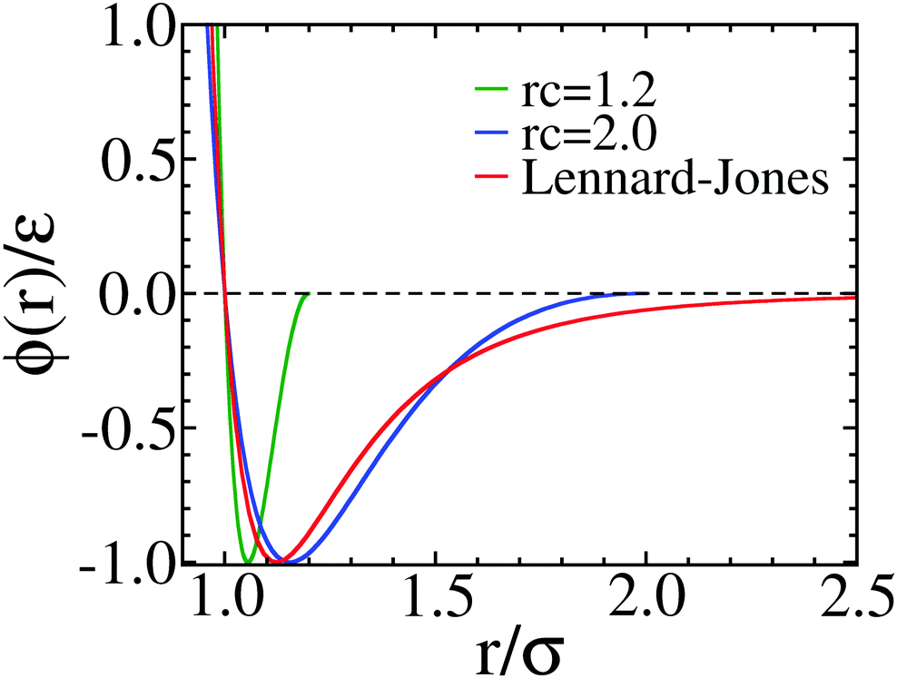

.. index:: pair_style wf/cut

pair_style wf/cut command
===========================

Syntax
""""""

.. code-block:: LAMMPS

   pair_style wf/cut cutoff

* cutoff = cutoff for wf interactions (distance units)

Examples
""""""""

.. code-block:: LAMMPS

   pair_style        wf/cut 2.0
   pair_coeff        1 1 1.0 1.0 1 1  2.0

Description
"""""""""""

The *wf/cut* (Wang-Frenkel) style computes LJ-like potentials as
described in :ref:`Wang2020 <Wang2020>`. This potential is by
construction finite ranged and it vanishes quadratically at the cutoff
distance, avoiding truncation, shifting, interpolation and other typical
procedures with the LJ potential. The *wf/cut* can be used when a
typical short-ranged potential with attraction is required. The
potential is given by which is given by:

.. math::
  \phi(r)= \epsilon \alpha \left(\left[{\sigma\over r}\right]^{2\mu} -1 \right)\left(\left[{r_c\over r}\right]^{2\mu}-1\right)^{2\nu}

with

.. math::
  \alpha=2\nu\left(\frac{r_c}{\sigma}\right)^{2\mu}\left[\frac{1+2\nu}{2\nu\left[(r_c/\sigma)^{2\mu}-1\right]}\right]^{2\nu+1}

and

.. math::
  r_{min}=r_c\left[\frac{1+2\nu}{1+2\nu(r_c/\sigma)^{2\nu}}\right]^{1/{2\nu}}

:math:`r_c` is the cutoff.

Comparison of the non-truncated Lennard-Jones 12-6 potential (red curve),
and the WF potentials with :math:`\mu=1` and :math:`\nu=1` are shown in
the figure below. The blue curve has :math:`r_c =2.0` and the green
curve has :math:`r_c =1.2` and can be used to describe colloidal
interactions.

The following coefficients must be defined for each pair of atoms
types via the :doc:`pair_coeff <pair_coeff>` command as in the example
above, or in the data file or restart files read by the
:doc:`read_data <read_data>` or :doc:`read_restart <read_restart>`
commands:

* :math:`\epsilon` (energy units)
* :math:`\sigma` (distance units)
* :math:`\nu`
* :math:`\mu`
* :math:`r_c` (distance units)

The last coefficient is optional. If not specified, the global cutoff
given in the pair_style command is used.  The exponents :math:`\nu` and
:math:`\mu` are positive integers, usually set to 1. There is usually
little to be gained by choosing other values of :math:`\nu` and
:math:`\mu` (See discussion in :ref:`Wang2020 <Wang2020>`)

----------

**Mixing, shift, table, tail correction, restart, rRESPA info**\ :

This pair style does not support the :doc:`pair_modify <pair_modify>`
mixing and table options.

The :doc:`pair_modify <pair_modify>` tail option is not relevant
for this pair style as it goes to zero at the cut-off radius.

This pair style writes its information to :doc:`binary restart files
<restart>`, so pair_style and pair_coeff commands do not need to be
specified in an input script that reads a restart file.

This pair style does not support the use of the *inner*, *middle*,
and *outer* keywords of the :doc:`run_style respa <run_style>` command.

----------

Restrictions
""""""""""""
This pair style can only be used if LAMMPS was built with the
EXTRA-PAIR package.  See the :doc:`Build package <Build_package>` doc
page for more info.

Related commands
""""""""""""""""

:doc:`pair_coeff <pair_coeff>`

**Default:** none

----------

.. _Wang2020:

**(Wang2020)** X. Wang, S. Ramirez-Hinestrosa, J. Dobnikar, and D. Frenkel, Phys. Chem. Chem. Phys. 22, 10624 (2020).
