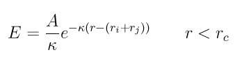

.. index:: pair\_style yukawa/colloid

pair\_style yukawa/colloid command
==================================

pair\_style yukawa/colloid/gpu command
======================================

pair\_style yukawa/colloid/omp command
======================================

Syntax
""""""

.. parsed-literal::

   pair_style yukawa/colloid kappa cutoff

* kappa = screening length (inverse distance units)
* cutoff = global cutoff for colloidal Yukawa interactions (distance units)

Examples
""""""""

.. parsed-literal::

   pair_style yukawa/colloid 2.0 2.5
   pair_coeff 1 1 100.0 2.3
   pair_coeff \* \* 100.0

Description
"""""""""""

Style *yukawa/colloid* computes pairwise interactions with the formula

where Ri and Rj are the radii of the two particles and Rc is the
cutoff.

In contrast to :doc:`pair_style yukawa <pair_yukawa>`, this functional
form arises from the Coulombic interaction between two colloid
particles, screened due to the presence of an electrolyte, see the
book by :ref:`Safran <Safran>` for a derivation in the context of DLVO
theory.  :doc:`Pair\_style yukawa <pair_yukawa>` is a screened Coulombic
potential between two point-charges and uses no such approximation.

This potential applies to nearby particle pairs for which the Derjagin
approximation holds, meaning h << Ri + Rj, where h is the
surface-to-surface separation of the two particles.

When used in combination with :doc:`pair_style colloid <pair_colloid>`,
the two terms become the so-called DLVO potential, which combines
electrostatic repulsion and van der Waals attraction.

The following coefficients must be defined for each pair of atoms
types via the :doc:`pair_coeff <pair_coeff>` command as in the examples
above, or in the data file or restart files read by the
:doc:`read_data <read_data>` or :doc:`read_restart <read_restart>`
commands, or by mixing as described below:

* A (energy/distance units)
* cutoff (distance units)

The prefactor A is determined from the relationship between surface
charge and surface potential due to the presence of electrolyte.  Note
that the A for this potential style has different units than the A
used in :doc:`pair_style yukawa <pair_yukawa>`.  For low surface
potentials, i.e. less than about 25 mV, A can be written as:

.. parsed-literal::

   A = 2 \* PI \* R\*eps\*eps0 \* kappa \* psi\^2

where

* R = colloid radius (distance units)
* eps0 = permittivity of free space (charge\^2/energy/distance units)
* eps = relative permittivity of fluid medium (dimensionless)
* kappa = inverse screening length (1/distance units)
* psi = surface potential (energy/charge units)

The last coefficient is optional.  If not specified, the global
yukawa/colloid cutoff is used.

----------

Styles with a *gpu*\ , *intel*\ , *kk*\ , *omp*\ , or *opt* suffix are
functionally the same as the corresponding style without the suffix.
They have been optimized to run faster, depending on your available
hardware, as discussed on the :doc:`Speed packages <Speed_packages>` doc
page.  The accelerated styles take the same arguments and should
produce the same results, except for round-off and precision issues.

These accelerated styles are part of the GPU, USER-INTEL, KOKKOS,
USER-OMP and OPT packages, respectively.  They are only enabled if
LAMMPS was built with those packages.  See the :doc:`Build package <Build_package>` doc page for more info.

You can specify the accelerated styles explicitly in your input script
by including their suffix, or you can use the :doc:`-suffix command-line switch <Run_options>` when you invoke LAMMPS, or you can use the
:doc:`suffix <suffix>` command in your input script.

See the :doc:`Speed packages <Speed_packages>` doc page for more
instructions on how to use the accelerated styles effectively.

----------

**Mixing, shift, table, tail correction, restart, rRESPA info**\ :

For atom type pairs I,J and I != J, the A coefficient and cutoff
distance for this pair style can be mixed.  A is an energy value mixed
like a LJ epsilon.  The default mix value is *geometric*\ .  See the
"pair\_modify" command for details.

This pair style supports the :doc:`pair_modify <pair_modify>` shift
option for the energy of the pair interaction.

The :doc:`pair_modify <pair_modify>` table option is not relevant
for this pair style.

This pair style does not support the :doc:`pair_modify <pair_modify>`
tail option for adding long-range tail corrections to energy and
pressure.

This pair style writes its information to :doc:`binary restart files <restart>`, so pair\_style and pair\_coeff commands do not need
to be specified in an input script that reads a restart file.

This pair style can only be used via the *pair* keyword of the
:doc:`run_style respa <run_style>` command.  It does not support the
*inner*\ , *middle*\ , *outer* keywords.

----------

Restrictions
""""""""""""

This style is part of the COLLOID package.  It is only enabled if
LAMMPS was built with that package.  See the :doc:`Build package <Build_package>` doc page for more info.

This pair style requires that atoms be finite-size spheres with a
diameter, as defined by the :doc:`atom_style sphere <atom_style>`
command.

Per-particle polydispersity is not yet supported by this pair style;
per-type polydispersity is allowed.  This means all particles of the
same type must have the same diameter.  Each type can have a different
diameter.

Related commands
""""""""""""""""

:doc:`pair_coeff <pair_coeff>`

**Default:** none

----------

.. _Safran:

**(Safran)** Safran, Statistical Thermodynamics of Surfaces, Interfaces,
And Membranes, Westview Press, ISBN: 978-0813340791 (2003).

.. _lws: http://lammps.sandia.gov
.. _ld: Manual.html
.. _lc: Commands_all.html
