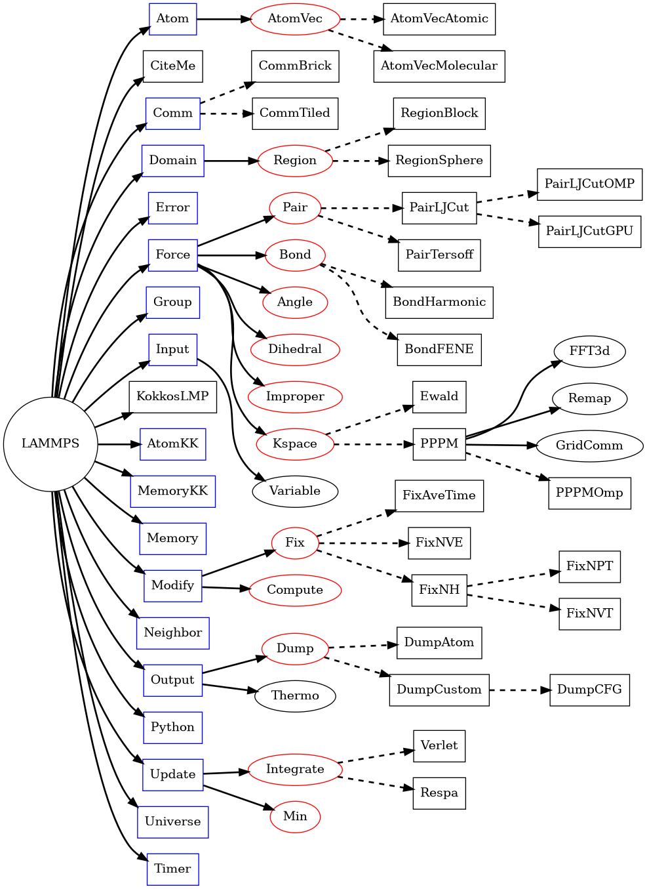

LAMMPS C++ base classes
***********************

LAMMPS is designed to be used as a C++ class library where one can set
up and drive a simulation through creating a class instance and then
calling some abstract operations or commands on that class or its member
class instances.  These are interfaced to the :doc:`C library API
<pg_library>`, which providing an additional level of abstraction
simplification for common operations. The C API is also the basis for
calling LAMMPS from Python or Fortran.

When used from a C++ program, most of the symbols and functions in
LAMMPS are wrapped into the ``LAMMPS_NS`` namespace so they will not
collide with your own classes or other libraries. This, however, does
not extend to the additional libraries bundled with LAMMPS in the lib
folder and some of the low-level code of some packages.

Behind the scenes this is implemented through inheritance and
polymorphism where base classes define the abstract interface and
derived classes provide the specialized implementation for specific
models or optimizations or ports to accelerator platforms.  This
document will provide an outline of the fundamental class hierarchy and
some selected examples for derived classes of specific models.

.. note::

   Please see the :ref:`note about thread-safety <thread-safety>`
   in the library Howto doc page.

Overview of LAMMPS class topology
=================================

   LAMMPS class topology

   This figure shows some of the relations of the base classes of the
   LAMMPS simulation package.  Full lines indicate that a class holds an
   instance of the class it is pointing to; dashed lines point to
   derived classes that are given as examples of what classes may be
   instantiated during a LAMMPS run based on the input commands and
   accessed through the API define by their respective base classes.  At
   the core is the :cpp:class:`LAMMPS <LAMMPS_NS::LAMMPS>` class, which
   holds pointers to class instances with specific purposes.  Those may
   hold instances of other classes, sometimes directly, or only
   temporarily, sometimes as derived classes or derived classes or
   derived classes, which may also hold instances of other classes.

-----------------------------------

.. toctree::
   :caption: Individual Base Classes
   :name: lammpsbase

   pg_lammps
   pg_pointers
   pg_atom
   pg_command
   pg_region
