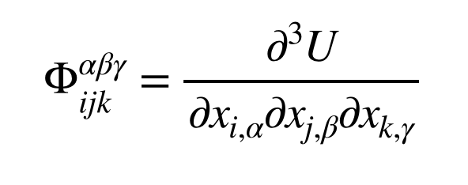

.. index:: third\_order

third\_order command
====================

Syntax
""""""

.. parsed-literal::

   third_order group-ID style delta args keyword value ...

* group-ID = ID of group of atoms to displace
* style = *regular* or *eskm*
* delta = finite different displacement length (distance units)
* one or more keyword/arg pairs may be appended
  
  .. parsed-literal::
  
       keyword = *file* or *binary*
         *file* name = name of output file for the third order tensor
         *binary* arg = *yes* or *no* or *gzip*

Examples
""""""""

.. parsed-literal::

   third_order 1 regular 0.000001
   third_order 1 eskm 0.000001
   third_order 3 regular 0.00004 file third_order.dat
   third_order 5 eskm 0.00000001 file third_order.dat binary yes

Description
"""""""""""

Calculate the third order force constant tensor by finite difference of the selected group,

where Phi is the third order force constant tensor.

The output of the command is the tensor, three elements at a time. The
three elements correspond to the three gamma elements for a specific i/alpha/j/beta/k.
The initial five numbers are i, alpha, j, beta, and k respectively.

If the style eskm is selected, the tensor will be using energy units of 10 J/mol.
These units conform to eskm style from the dynamical\_matrix command, which
will simplify operations using dynamical matrices with third order tensors.

Restrictions
""""""""""""

The command collects a 9 times the number of atoms in the group on every single MPI rank,
so the memory requirements can be very significant for large systems.

This command is part of the USER-PHONON package.  It is only enabled if
LAMMPS was built with that package.  See the :doc:`Build package <Build_package>` doc page for more info.

Related commands
""""""""""""""""

:doc:`fix phonon <fix_phonon>` :doc:`dynamical_matrix <dynamical_matrix>`

Default
"""""""

The default settings are file = "third\_order.dat", binary = no

.. _lws: http://lammps.sandia.gov
.. _ld: Manual.html
.. _lc: Commands_all.html
